# Joystick:bit V2

## 简介
---
Joystick:bit V2是一款基于micro:bit 的游戏手柄。它包含可控制4个方向的手柄和4个未定义的按钮。同时也搭配了蜂鸣器和振动马达，增强了游戏体验。它外观小巧，手感舒适，可远程遥控。

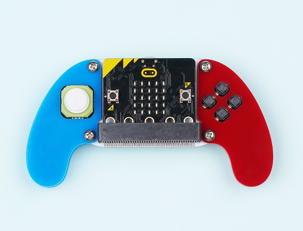

注意：joystick_bit_v2有两个版本

### 简装版

### 加强版

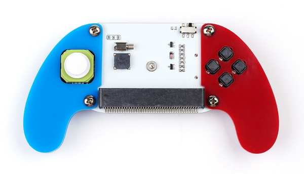

## 特点
---
- 编程语言：Javascript / Makecode / Microsoft Touch Develop / Python.

- 板载蜂鸣器。

- 震动反馈带来极致游戏体验。

- 可使用makecode扩展包，简单易用。

- 拔出micro:bit 后自动断电。

## 外形与尺寸定位

---

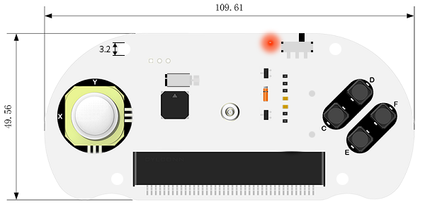

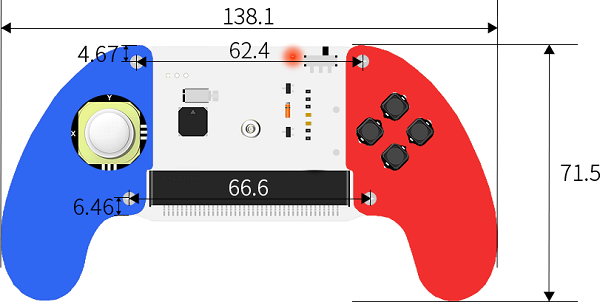

## 功能性模块介绍
---

### 手柄

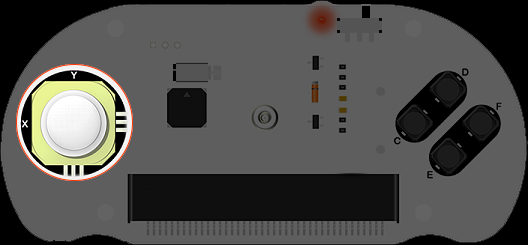

 X & Y分别连接至micro:bit 主板的P1,P2接口。

### 蜂鸣器

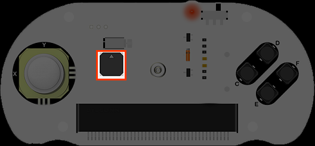

无源蜂鸣器连接至micro:bit 的P0 接口。

### 振动马达

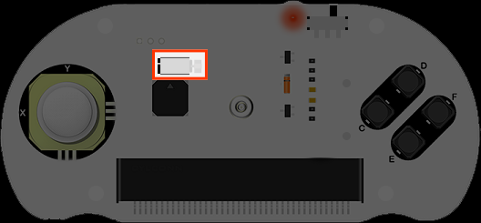

振动马达连接至P16接口。

### 按钮

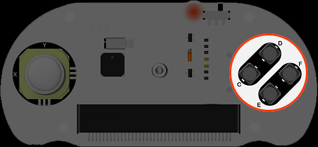

 C、D、E、F 按钮相应的连接至micro:bit 的P12、P13、P14、P15 接口。

---
### 安装

装入2节 3A 电池并插入micro:bit 主板。

添加“joystick:bit” 扩展包。

进入makecode并且创建一个新项目，点击扩展。 

搜索“ joystickbit” 并添加对应的扩展包。

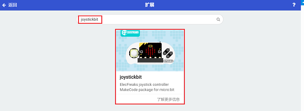

## 编程
---

开始编程，一旦按下你的游戏手柄上的按钮，它就会产生振动反馈和显示按钮标志。

程序链接: [https://makecode.microbit.org/_YUaM2rdcFFYx](https://makecode.microbit.org/_YUaM2rdcFFYx)

或通过以下界面直接下载:

<iframe style="position:absolute;top:0;left:0;width:100%;height:100%;" src="https://makecode.microbit.org/#pub:_YUaM2rdcFFYx" frameborder="0" sandbox="allow-popups allow-forms allow-scripts allow-same-origin"></iframe>

## 结果

当下载完成后，打开电源开关，系统提示音响起。

按下C，D,  E 或F按钮，手柄都会振动一次。

## 案例一 电子琴
---

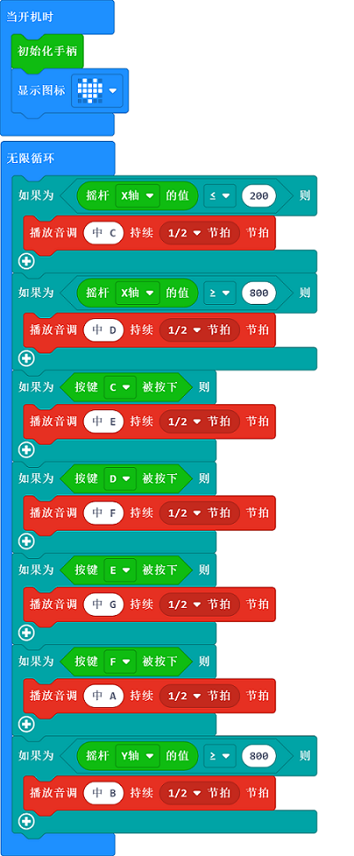

程序链接: [https://makecode.microbit.org/_DHgcRfb6oJp5](https://makecode.microbit.org/_DHgcRfb6oJp5)

或通过以下界面直接下载:

<iframe style="position:absolute;top:0;left:0;width:100%;height:100%;" src="https://makecode.microbit.org/#pub:_DHgcRfb6oJp5" frameborder="0" sandbox="allow-popups allow-forms allow-scripts allow-same-origin"></iframe>

## 结果

通过摇杆和按键控制joystick:bit发出音调。

## 案例二 方向指示器
---

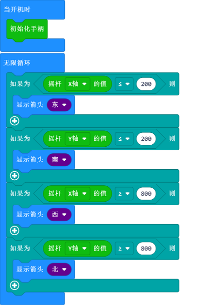

程序链接: [https://makecode.microbit.org/_YVdggwifHWEm](https://makecode.microbit.org/_YVdggwifHWEm)

或通过以下界面直接下载:

<iframe style="position:absolute;top:0;left:0;width:100%;height:100%;" src="https://makecode.microbit.org/#pub:_YVdggwifHWEm" frameborder="0" sandbox="allow-popups allow-forms allow-scripts allow-same-origin"></iframe>

## 结果

通过摇杆控制micro:bit的LED矩阵显示的箭头方向。

## 案例三 LED控制器
---

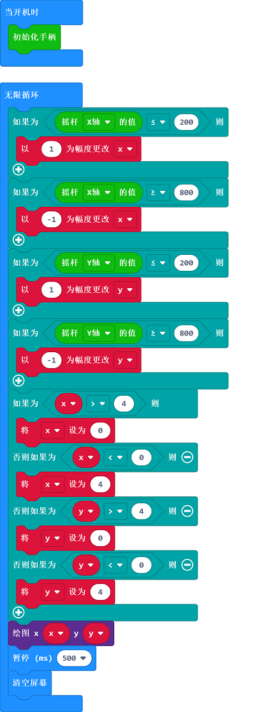

程序链接: [https://makecode.microbit.org/_KPMW36Pq0aLm](https://makecode.microbit.org/_KPMW36Pq0aLm)

或通过以下界面直接下载:

<iframe style="position:absolute;top:0;left:0;width:100%;height:100%;" src="https://makecode.microbit.org/#pub:_KPMW36Pq0aLm" frameborder="0" sandbox="allow-popups allow-forms allow-scripts allow-same-origin"></iframe>

## 结果

通过摇杆控制micro:bit的LED显示位置。

## 遥控小车案例请参照以下链接：

[遥控cutebot小车](https://www.elecfreaks.com/learn-cn/microbitKit/smart_cutebot/cutebot_case13.html)

[遥控天蓬智能车](https://www.elecfreaks.com/learn-cn/microbitKit/TPbot_tianpeng/TPBot_tianpeng_case_14.html)

[遥控麦克纳姆轮小车](https://www.elecfreaks.com/learn-cn/microbitKit/Mecanum_wheel_car_kit/Mecanum_wheel_car_kit_case_07.html)

## 更多信息
---

若想获取更多信息，请查看：http://www.elecfreaks.com
