# Robit扩展板

## 简介
---

Robit是一款基于micro:bit的智能小车主板，它能完全兼容mBot的车架与传感器，除了继承了mBot上简单方便的RJ25接线端口、电机接口和传感器之外，我们还扩展4路直流电机接口、2路步进电机接口（步进电机接口与直流电机接口复用），8路PWM信号输出接口，可以驱动舵机等PWM信号驱动的设备，板载10路G-5V-S数字信号OCTOPUS电子积木接口，4路G-5V-S模拟信号OCTOPUS电子积木接口。Robit除了可以实现所有mBot的基本功能，还能扩展更多的传感器、电机、舵机、步进电机等。

## 特性
---

- 完全兼容mBot的车架与传感器。
- 支持4路直流电机驱动，2路步进电机驱动。
- 8路PWM信号输出接口。
- 扩展出10路G-5V-S数字信号OCTOPUS电子积木接口。
- 扩展出4路G-5V-S模拟信号OCTOPUS电子积木接口。
- 集成蜂鸣器、光敏传感器、彩虹LED、红外发射、红外接收等常用功能。

## 参数
---

- 直流电源供电输入电压：DC 3.7-6V
- 锂电池供电输入电压：DC 3.7-4.2V
- USB充电电流：500mA
- 可扩展模拟IO口数量：4
- 可扩展的数字IO口数量：10
- 舵机接口数量：8
- 直流电机驱动：4路
- 步进电机驱动：2路
- 可编程LED灯珠数：2颗
- 无源蜂鸣器：支持
- 光敏传感器：支持
- 红外接收：支持
- 红外发射：支持
- 尺寸:90mm X 74mm
- 净重:46g

### 外形与安装定位尺寸

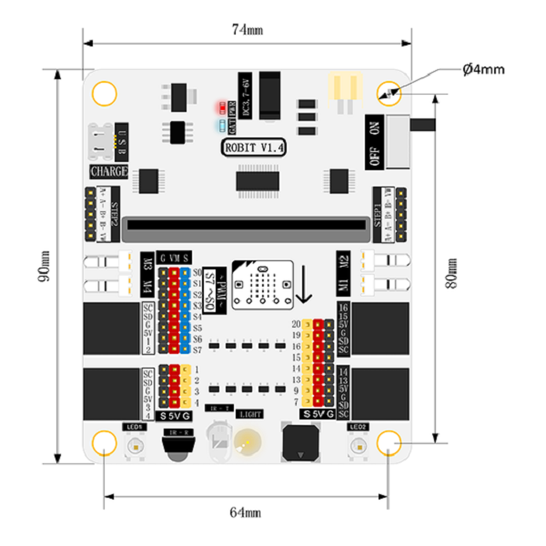

## 引脚接口框图
---

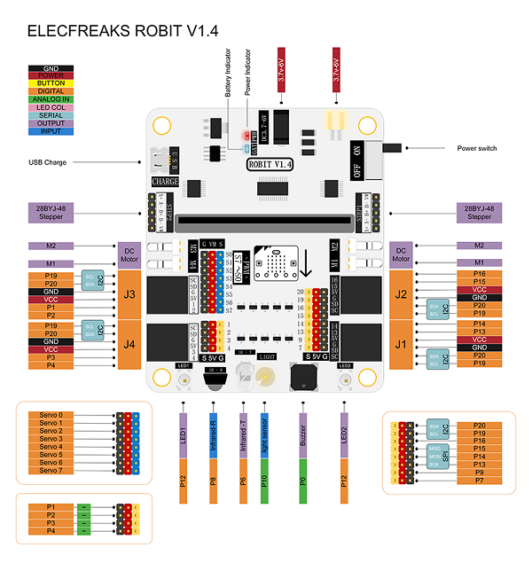

## 主要功能模块介绍
---

### RJ25接口

robit有4组RJ25接口，每个RJ25接口包含6个出点，分别对应了电源、两个IO口与IIC接口，兼容mBot部分传感器。  
J1的6个触点分别对应micro:bit的SCL(P19)、SDA(P20)、GND、5V、P13、P14。  
J2的6个触点分别对应micro:bit的SCL(P19)、SDA(P20)、GND、5V、P15、P16。  
J3的6个触点分别对应micro:bit的SCL(P19)、SDA(P20)、GND、5V、P1、P2，支持5V的模拟输入传感器。  
J4的6个触点分别对应micro:bit的SCL(P19)、SDA(P20)、GND、5V、P3、P4，支持5V的模拟输入传感器。  

### GVS标准电子积木接口

micro:bit的IO口除了引出至RJ25接口外，还以GVS的形式引出，支持5V的器件，其中P1、P2、P3、P4支持5V的模拟输入传感器。

### GVS标准舵机接口

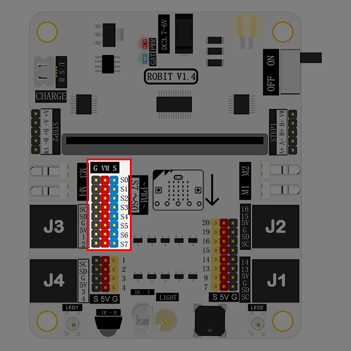

S0~S7，最多可同时接入8路舵机。该接口从PCA9685芯片引出，通过micro:bit的IIC接口扩展而来，不占用普通I/O口。

### 直流电机接口

M1~M4，最多可同时接入4路直流电机。电机通过PCA9685芯片进行PWM控制，该芯片使用micro:bit的IIC接口，不占用普通I/O口。

### 步进电机接口

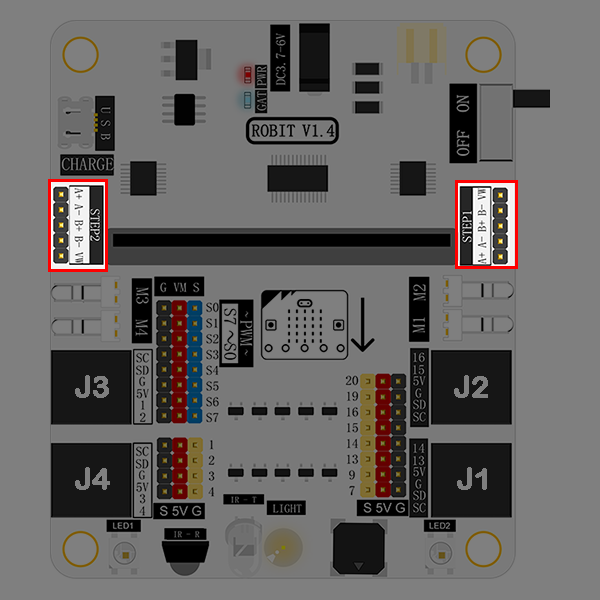

STEP1与STEP2，最多可同时接入两路28BYJ-48-5V步进电机。

### 蜂鸣器

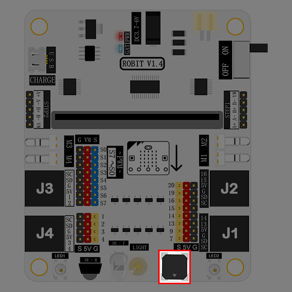

板载蜂鸣器，连接在micro:bit的P0口。

### 光线传感器
  
  

板载光线传感器，连接在micro:bit的P10口。  

### 红外发射管  

  

板载红外发射管，连接在micro:bit的P6口。  

### 红外接收管

  

板载红外接收管，连接在micro:bit的P8口。 

### 彩虹LED

板载两颗彩虹LED，连接在micro:bit的P12。

### DC电源接口  

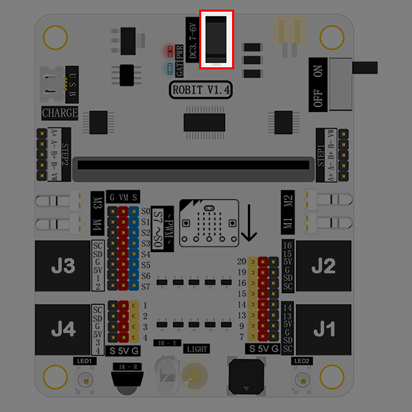  

DC电源接口，可支持3.7V~4.2V直流电源，通常接入4节AAA电池盒。  

### 锂电池接口  

  

锂电池接口，可支持3.7V~4.2V锂电池。  

### 锂电池电量指示灯  

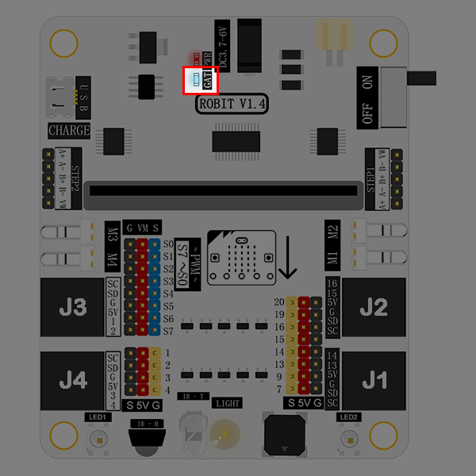  

锂电池电量指示灯，为闪烁状态，满电为4格电，闪烁一次表示1格电，满电为连续闪烁4次。  

### USB充电接口  

  

该USB接口仅用于为锂电池充电，不支持数据传输，充电电流为500mA。  

## 快速上手
---
### 硬件连接  
将robit固定在mbot小车上；  
将左轮电机接入M1口，将右轮电机接入M2口；  
连接好后如图所示：  
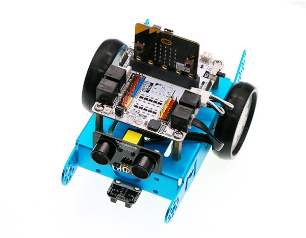  

### 软件编程  
打开[makecode](https://makecode.microbit.org/)，搜索关键词`robit`添加robit package。

编写程序，让robit小车先前进3秒，再后退3秒，往返运行，详细代码如下：

程序代码链接：[https://makecode.microbit.org/_aXVAyx3dm585](https://makecode.microbit.org/_aXVAyx3dm585)

你也能通过下列窗口直接下载代码：

<iframe style="position:absolute;top:0;left:0;width:100%;height:100%;" src="https://makecode.microbit.org/#pub:_aXVAyx3dm585" frameborder="0" sandbox="allow-popups allow-forms allow-scripts allow-same-origin"></iframe>

### 结果
robit小车先前进3秒，再后退3秒，往返运行。

---

## 案例01 超声波测距

### 目的
---

- 了解什么是超声波，如何用超声波测距。
- 使用Robit主板控制的mBot迷你小车上的超声波模块来测距。

### 使用材料
---

- 1 x Robit智能小车主板
- 1 x Mbot Car

### 背景知识
---

#### 什么是超声波

[超声波](https://zh.wikipedia.org/wiki/%E8%B6%85%E8%81%B2%E6%B3%A2)是一种频率高于20000赫兹的声波，它的方向性好，穿透能力强，易于获得较集中的声能，在水中传播距离远，可用于测距、测速、清洗、焊接、碎石、杀菌消毒等。超声波因其频率下限大于人的听觉上限而得名。

#### 超声波测距原理

超声波发射器向某一方向发射超声波，在发射时刻的同时开始计时，超声波在空气中传播，途中碰到障碍物就立即返回来，超声波接收器收到反射波就立即停止计时。根据接收器接到超声波时的时间计算距离，与雷达测距原理相似。

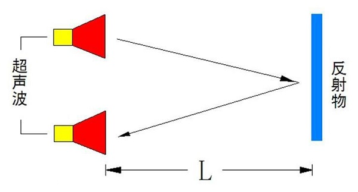

### 硬件连接图
---

如图所示，将超声波模块与Robit主板J1口使用RJ25接线链接

### 软件
---

[微软makecode](https://makecode.microbit.org/#)

### 编程
---

#### 步骤 1
在MakeCode的代码抽屉中点击Advanced，查看更多代码选项。

为了给超声波模块编程，我们需要添加一个代码库。在代码抽屉底部找到“Add Package”，并点击它。这时会弹出一个对话框。搜索`Robit`，然后点击下载这个代码库。

注意：如果你得到一个提示说一些代码库因为不兼容的原因将被删除，你可以根据提示继续操作，或者在项目菜单栏里面新建一个项目。

#### 步骤 2

在`Basic`中拖出一个`forever`积木块，在其中插入`show number`积木块。

在Robit中拖出Ultrasonic pin积木块，选择J1(P13,P14)。这条语句作用为读取超声波模块返回参数。

#### 程序

请参考程序连接：[https://makecode.microbit.org/_3ktFD2gabF7J](https://makecode.microbit.org/_3ktFD2gabF7J)

你也可以通过以下网页直接下载程序。

<iframe style="position:absolute;top:0;left:0;width:100%;height:100%;" src="https://makecode.microbit.org/#pub:_3ktFD2gabF7J" frameborder="0" sandbox="allow-popups allow-forms allow-scripts allow-same-origin"></iframe>
  

**注意：** 该超声波模块检测的最大距离大约为400cm。

#### 现象

超声波模块会实时返回距离，并且显示在Micro:bit的5X5点阵上，距离单位为厘米CM。

### 思考
---
超声波测距显示距离为0有几种情况？

---

## 案例02 超声波避障

### 目的
---

使用Robit主板控制mBot迷你小车实现避障功能。

### 使用材料
---

- 1 x Robit智能小车主板
- 1 x Mbot Car

### 知识提要
---
在上一节：超声波测距中我们实现了使用超声波模块实时检测距离，在本节教程中，我们使用超声波模块实现mBot迷你小车的避障功能。

### 硬件连接
---
将左轮电机接入M1端口，右轮电机接入M2端口，超声波模块如上节教程一样接入J1端口。

### 软件
---
[微软makecode](https://makecode.microbit.org/#)

### 编程
---
#### 步骤 1
在MakeCode的代码抽屉中点击Advanced，查看更多代码选项。

为了给超声波模块编程，我们需要添加一个代码库。在代码抽屉底部找到“Add Package”，并点击它。这时会弹出一个对话框。搜索`Robit`，然后点击下载这个代码库。

注意：如果你得到一个提示说一些代码库因为不兼容的原因将被删除，你可以根据提示继续操作，或者在项目菜单栏里面新建一个项目。

#### 步骤 2
程序初始化时，定义了一个away变量，用来表示检测到障碍物的距离，并将它置为0。

设置左轮电机M1、右轮电机M2速度均为20。

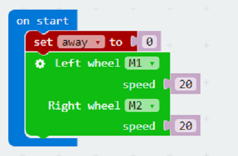

#### 步骤3

创建一个forever循环，实时的从J1口读取超声波模块返回的数据，并且赋值给away。

##### 防撞停车
当检测距离(away)距离小于8cm时，停车，暂停300ms后，设置M1，M2为负数实现倒车，延时600ms。

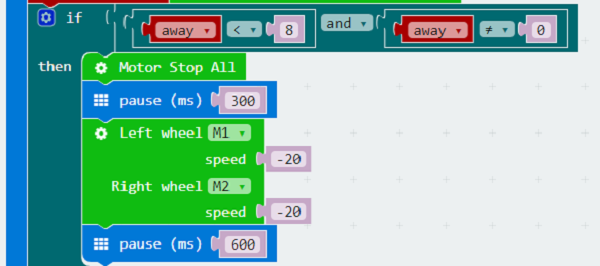
##### 转向避障
当检测距离(away)距离小于15cm时，生成一个0到100的随机数。

当随机数小于50的时候M1电机赋负值，左轮倒转完成左转。

当随机数大于50的时候M2电机赋负值，右轮倒转完成左转。

如果检测距离(away)大于10cm而且不等于0，设置M1和M2速度20前进。

#### 参考程序
参考程序连接：[https://makecode.microbit.org/_X2g8PfeebXqv](https://makecode.microbit.org/_X2g8PfeebXqv)

你也可以通过下方网页直接下载程序。

<iframe style="position:absolute;top:0;left:0;width:100%;height:100%;" src="https://makecode.microbit.org/#pub:_X2g8PfeebXqv" frameborder="0" sandbox="allow-popups allow-forms allow-scripts allow-same-origin"></iframe>
  

**注意：** 设置速度过低时会造成电机运转不正常。

#### 现象
mBot小车在检测到障碍物距离还有20cm时自动转向，转向后如距离障碍物太近自动倒车。

### 思考
---
为什么在防撞停车中要判断距离是否为0？

### 常见问题
---
**问：为什么开启5X5点阵屏后，会导致无法避障？**

答：LED点阵显示会严重拖慢程序运行速度，导致小车检测障碍物不及时，要使程序流畅运行，建议禁用5x5显示屏。

---

## 案例03 永不坠落的小车

### 目的
---

- 了解巡迹模块，认识巡迹模块。
- 使用Robit主板控制的mBot迷你小车上的巡迹模块实现边缘检测。

### 使用材料
---

- 1 x Robit智能小车主板
- 1 x Mbot Car

### 背景知识
---
#### 巡迹模块原理

- 该巡迹模块使用的为[红外线传感器](https://baike.baidu.com/item/%E7%BA%A2%E5%A4%96%E7%BA%BF%E4%BC%A0%E6%84%9F%E5%99%A8/9007351?fr=aladdin),模块由一个**发射端**和一个**接收端**组成，发射端发射红外线由地面反射回来由接收端接收。
- 遇到黑色地面或者其他吸收红外光材质的物品时，接收端无法接收到红外线，巡迹模块返回1。

### 硬件连接图
---
如上节所示将左右轮电机介入M1，M2端口。
如图所示，将巡迹与Robit主板J2口使用RJ25接线连接。

### 软件
---
[微软makecode](https://makecode.microbit.org/#)

### 编程
---
#### 步骤 1
在MakeCode的代码抽屉中点击Advanced，查看更多代码选项。

为了给超声波模块编程，我们需要添加一个代码库。在代码抽屉底部找到“Add Package”，并点击它。这时会弹出一个对话框。搜索`Robit`，然后点击下载这个代码库。

注意：如果你得到一个提示说一些代码库因为不兼容的原因将被删除，你可以根据提示继续操作，或者在项目菜单栏里面新建一个项目。

#### 步骤 2
在开机启动时初始化巡迹模块端口为J2(P15,P16)，设置左右轮电机到M1，M2端口速度为15。

设置左右两个红外线传感器的返回值变量Left和right，读取左右红外线传感器的返回参数。

如果左右红外线中至少有一个没收到反馈(检测到边缘)，设置左右电机速度为负数倒车。
随机生成一个0到100的数，如果小于50，停止电机M1完成右转向，如果大于50，停止电机M2完成左转向。

如果左右红外线传感器均未检测到，设置左右电机速度为15继续前进。

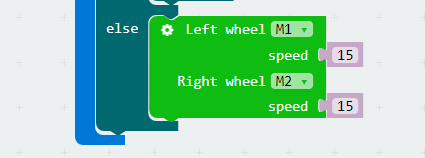

#### 程序
请参考程序连接：[https://makecode.microbit.org/_1mCg9TgVxJ5K](https://makecode.microbit.org/_1mCg9TgVxJ5K)

你也可以通过以下网页直接下载程序。

<iframe style="position:absolute;top:0;left:0;width:100%;height:100%;" src="https://makecode.microbit.org/#pub:_1mCg9TgVxJ5K" frameborder="0" sandbox="allow-popups allow-forms allow-scripts allow-same-origin"></iframe>
  

**注意：** 可吸收红外光物体均视为黑线。

### 现象
---
mBot小车会检测到桌面边缘后退防止掉落。

---

## 案例04 巡线

### 目的
---
- 使用Robit主板控制的mBot迷你小车上的巡迹模块实现沿线跑圈。

### 使用材料
---

- 1 x Robit智能小车主板
- 1 x Mbot Car

### 硬件连接图
---
如上节所示将左右轮电机介入M1，M2端口。
如图所示，将巡迹与Robit主板J2口使用RJ25接线连接。

### 软件
---
[微软makecode](https://makecode.microbit.org/#)

### 编程
---
#### 步骤 1
在MakeCode的代码抽屉中点击Advanced，查看更多代码选项。

为了给超声波模块编程，我们需要添加一个代码库。在代码抽屉底部找到“Add Package”，并点击它。这时会弹出一个对话框。搜索`Robit`，然后点击下载这个代码库。

注意：如果你得到一个提示说一些代码库因为不兼容的原因将被删除，你可以根据提示继续操作，或者在项目菜单栏里面新建一个项目。

#### 步骤 2
在开机启动时初始化巡迹模块端口为J2(P15,P16)，设置左右轮电机到M1，M2端口速度为15。

设置左右两个红外线传感器的返回值变量Left和right，读取左右红外线传感器的返回参数。

如果右侧红外线传感器检测到脱离黑线，设置左轮速度为5右轮速度为25，向左转。之后设置一个循环，检测小车是否回归到黑线，如果没有就继续向左转直到回到黑线。

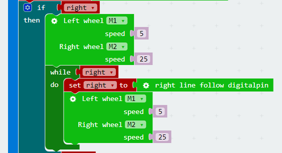

如果左侧红外线传感器检测到脱离黑线，同理向右转回归黑线。

#### 程序
请参考程序连接：[https://makecode.microbit.org/_9WECsHJmpDxM](https://makecode.microbit.org/_9WECsHJmpDxM)

你也可以通过以下网页直接下载程序。

<iframe style="position:absolute;top:0;left:0;width:100%;height:100%;" src="https://makecode.microbit.org/#pub:_9WECsHJmpDxM" frameborder="0" sandbox="allow-popups allow-forms allow-scripts allow-same-origin"></iframe>
  
---
**注意：** 可吸收红外光物体均视为黑线。

### 结论
---
mBot小车会沿着预定画好的黑线前进。

---

## 案例05 倒车报警

### 目的
---

- 使用Robit主板控制mBot迷你小车实现倒车报警功能。

### 使用材料
---

- 1 x Robit智能小车主板
- 1 x Mbot Car

### 背景知识
---
#### 蜂鸣器

- 蜂鸣器是一种发声器件，它由振动装置和谐振装置组成。按照控制方式分类，可把蜂鸣器又分为有源型与无源型。

- 有源型蜂鸣器的工作发声原理是：蜂鸣器内部集成振荡系统与放大取样电路，当有直流电源通过蜂鸣器时会使谐振装置产生声音信号，有源型蜂鸣器的工作发声原理图如下：

- 无源型蜂鸣器的工作发声原理是：方波信号输入谐振装置转换为声音信号输出，无源型蜂鸣器的工作发声原理图如下：

**注意：**本次实验，我们使用的是无源蜂鸣器。

#### 教程目的
- 在超声波避障中我们实现了使用超声波模块实时检测障碍物，在本节教程中，我们使用超声波模块和蜂鸣器模块实现mBot迷你小车带有声音提醒的倒车雷达功能。

### 硬件连接
---
将左轮电机接入M1端口，右轮电机接入M2端口。

超声波模块接入J1端口，本案例我们需要实现倒车雷达的功能，所以需要把超声波模块安装在小车尾部。

蜂鸣器所处位置如图所示，接入Micro:Bit的P0端口。

### 软件
---
[微软makecode](https://makecode.microbit.org/#)

### 编程
---
#### 步骤 1
在MakeCode的代码抽屉中点击Advanced，查看更多代码选项。

为了给超声波模块编程，我们需要添加一个代码库。在代码抽屉底部找到“Add Package”，并点击它。这时会弹出一个对话框。搜索`Robit`，然后点击下载这个代码库。

注意：如果你得到一个提示说一些代码库因为不兼容的原因将被删除，你可以根据提示继续操作，或者在项目菜单栏里面新建一个项目。

#### 步骤 2
开机初始化设置距离变量为away，设置蜂鸣器频率为400Hz，设置左右轮电机分别为M1，M2端口速度为-30。

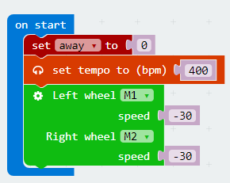

#### 步骤3

创建一个forever循环，接收超声波模块返回的数据存入away变量。

如果小车距离墙面是否小于10cm，蜂鸣器长鸣，同时两侧电机都停止。

如果小车距离墙面大于10cm且小于50cm，蜂鸣器以1/2节拍蜂鸣，同时设置电机转速为-15。

如果小车距离墙面大于50cm，蜂鸣器以4节拍蜂鸣，同时设置电机转速为-30。

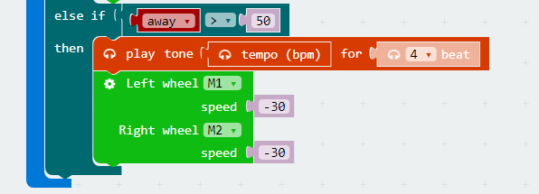

#### 参考程序
参考程序连接：[https://makecode.microbit.org/_gFiciE4PLF37](https://makecode.microbit.org/_gFiciE4PLF37)

你也可以通过下方网页直接下载程序。

<iframe style="position:absolute;top:0;left:0;width:100%;height:100%;" src="https://makecode.microbit.org/#pub:_gFiciE4PLF37" frameborder="0" sandbox="allow-popups allow-forms allow-scripts allow-same-origin"></iframe>
  
---
**注意：** 设置速度过低时会造成电机运转不正常。

#### 现象
mBot小车在检测到墙面距离大于50cm，蜂鸣器以4节拍蜂鸣，电机全速。

小于50cm大于10cm时，蜂鸣器以1/2节拍蜂鸣，电机速度降低一半慢速前进。

小于10cm，蜂鸣器长鸣，电机停止。

### 思考
---
为什么在停车中要判断距离是否为0？

### 常见问题
---
**问：为什么开启5X5点阵屏后，会导致无法避障？**

答：LED点阵显示会严重拖慢程序运行速度，导致小车检测障碍物不及时，要使程序流畅运行，建议禁用5x5显示屏。