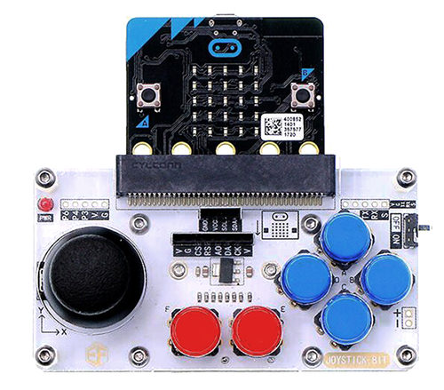
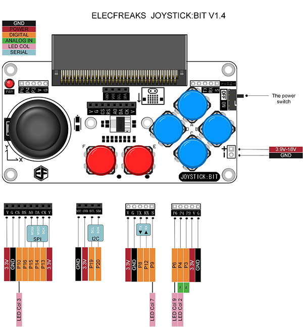
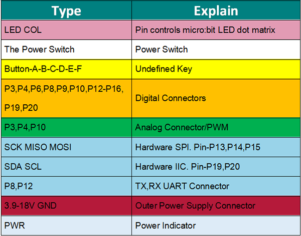
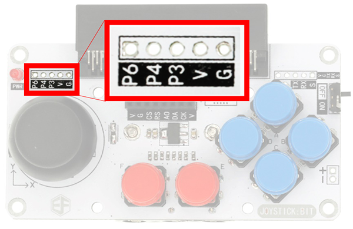
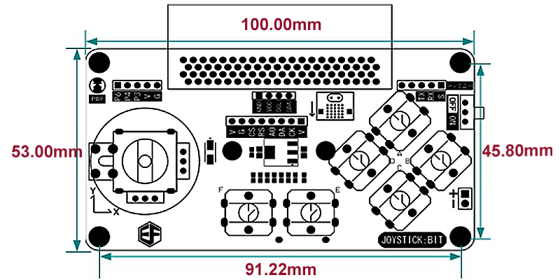

# Joystick:bit V1

## 简介
---
Joystick:bit是一款基于micro:bit 的游戏手柄。它包含了一个操纵杆手柄和6个可定义的按钮，同时内置GVS, IIC, SPI, UART接口，可实现多种功能。另外板载电源开关和外接电源接口，使用非常方便。

## 包装清单
---

1 x [Joystick:bit](http://www.elecfreaks.com/estore/elecfreaks-joystick-bit-for-micro-bit.html)

## 特点
---
- 编程语言：Javascript / Makecode / Microsoft Touch Develop / Python.
- 支持 UART 串行接口。
- 支持 GVS-Octopus 电子积木块。
- 板载一个手柄操纵杆和9个可定义的按钮。 
- 支持IIC 模块扩展。
- 内部输入电压： DC 3.9V-4.5V
- 外部输入电压： DC 3.9V-18V
- 尺寸：103 X 64 mm
- 重量：54 g

## 应用
---
- 支持蓝牙4.0设备（基于micro:bit)
- 支持GVS接口模块，与Elecfreaks Octopus系列的电子积木块兼容。
- 可远程遥控智能小车，平衡车等。
- 可扩展遥控机器人，机械臂等。

## 引脚定义
---

### 引脚接口详情

1. CVS电子积木块的对应接口是G / V(3.3V) / P3 / P4 / P6。其中， P3 / P4对应的是模拟/PWM/数字接口，可以控制连接舵机和其他多种传感器。

2. UART 接口： V (3.3V) / G / TX / RX 是串行接口，可以兼容普通的无线通信模块，如HC08 / HC11。

3.I2C 通信接口：GND / VCC(3.3V) / SCL / SDA是标准的I2C 接口，兼容3.3V 的I2C 传感器和设备等。

4. SPI 通信接口：V / G / CS / RS / AO / DA / CK 接口兼容TFT 1.8英寸 LCD 模块，包括micro:bit主板上的SPI通信接口。

## 尺寸
---

## 编程
---

示例：

按下按钮“1”， LED 显示“1”

按下按钮“2”， LED 显示“2”

按下按钮“3”， LED 显示“3”

按下按钮“4”， LED 显示“4”

按下按钮“5”， LED 显示“5”

按下按钮“6”， LED 显示“6”

沿“Y”轴方向向上推动手柄，LED 显示“+Y”

沿“Y”轴方向向下推动手柄，LED 显示“-Y”

沿“X”轴方向向左推动手柄，LED 显示“+X”

沿“X”轴方向向右推动手柄，LED 显示“-X”

- - - -

参考链接: [https://makecode.microbit.org/_ibCFsHHWUFKh](https://makecode.microbit.org/_ibCFsHHWUFKh) .

或通过以下界面直接下载：

<iframe style="position:absolute;top:0;left:0;width:100%;height:100%;" src="https://makecode.microbit.org/#pub:_ibCFsHHWUFKh" frameborder="0" sandbox="allow-popups allow-forms allow-scripts allow-same-origin"></iframe>
  

## 更多信息  
---

若想获取更多信息，请查看： [http://www.elecfreaks.com](http://www.elecfreaks.com).
