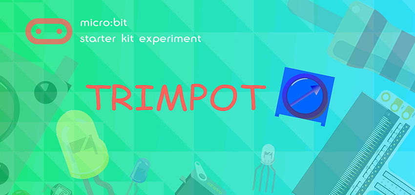
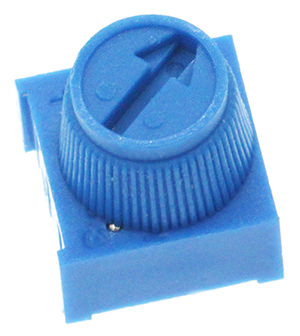
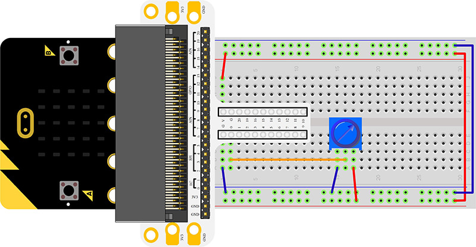
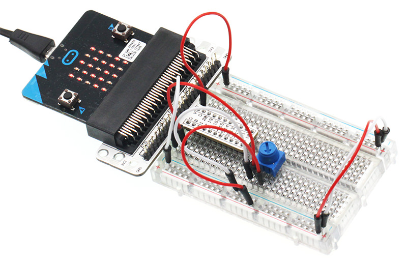
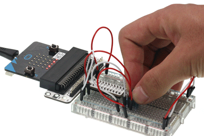

# 课程_03 电位器

## 介绍
---

电位器是一种普通的压力调节元件。在下面的实验中，我们将要读取电位器上的输出电压，并用柱形图的方式将它显示在micro:bit 5* 5 的LED屏幕上。 

## 元件：
---

### 硬件：
- 1 x micro:bit  
- 1 x USB线  
- 1 x micro:bit面包板扩展板
- 1 x 面包板83 x 55 mm
- 1 x 10欧姆电位器  
- 1 x 跳线

**温馨提示：如果你需要以上所有元件，你可以购买我们的[Elecfreaks小小科学家套件](https://item.taobao.com/item.htm?ft=t&id=597096675822)。**

### 软件：

[微软Makecode在线编辑器](https://makecode.microbit.org/)

## 主要元件介绍
---

### 电位器

电位器是一种压力调节的元件。它包括了一个电阻和一个旋钮或者滑动系统。当添加一个外部的电压到电阻的两个固定接触点，通过使用旋钮或者滑动系统来改变电阻上的接触点的位置，一个和可移动的触点位置有特殊关系的电压就在可移动的触点和两个固定触点之间形成了。大部分时间，它就像一个分压器一样工作。 

## 硬件连接
---

按照下面的图片，将你的元件连接：

这是连接完成后的样子：

旋转电位器的按钮，然后输出电压会随着按钮的旋转在0V和3V之间变化。

## 编程
---

打开[Makecode在线编辑器](https://makecode.microbit.org/)，在代码编辑器中编写你的代码。建议你先自己尝试着去编程。

程序完整代码的链接:[https://makecode.microbit.org/_XFPgfzd0Xi08](https://makecode.microbit.org/_XFPgfzd0Xi08)

当然，你也可以通过下面这个链接下载程序的完整代码。只要点击右上角的“编辑”，然后再点击右下角的“下载”，你就可以将程序下载到你的micro:bit中。

<iframe style="position: absolute; top: 0; left: 0; width: 100%; height: 100%;" src="https://makecode.microbit.org/#pub:_XFPgfzd0Xi08" width="300" height="150" frameborder="0" sandbox="allow-popups allow-forms allow-scripts allow-same-origin"></iframe>

## 代码解释：
---

**plot bar graph**

显示指定的数字的柱形图。柱形图是一种图表，它可以用不同长度的线条来显示数字。

**analog read**

读取指定引脚的一个模拟信号（0~1023）。

## 实验结果
---

旋转定位器，电压的数值将会以柱形图的形式显示在micro:bit的5x5的LED屏幕上。当读取的电压为“0”，LED屏幕上只显示一个像素点。当电压变成3.3V的时候，LED屏幕将会被全部点亮。 

## 思考
---

如果我们想用电位器来调节LED灯的亮度，那么我们该如何设计电路和编程呢？欢迎和我们进行进一步讨论或给我们评论。

## 常见问题
--- 

## 更多信息，欢迎访问：
---
[micro:bit知识库地址](https://www.elecfreaks.com/learn-cn/)       
micro:bit官方推荐供应商：[恩孚科技淘宝店](https://shop69086944.taobao.com/?spm=a230r.7195193.1997079397.2.RSthR0)    
QQ技术交流群：570756726     

