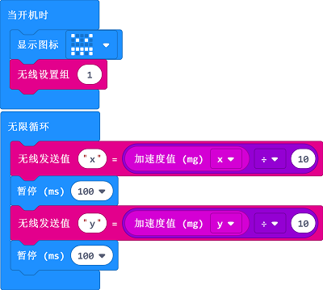
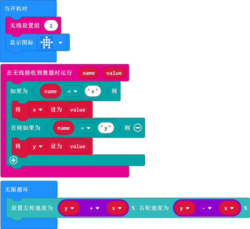

# 案例13：micro:bit加速度计控制天蓬智能车

## 目的
---
- 使用micro:bit的加速度计控制天蓬智能车行驶。

## 使用材料
---

- 1 x [天蓬智能车](https://item.taobao.com/item.htm?spm=a1z10.5-c-s.w4002-18602834185.41.68d15ccfBFHNPy&id=618758535761)

## 软件
---
[微软makecode](https://makecode.microbit.org/#)

## 编程
---

- 在MakeCode的代码抽屉中点击`高级`，查看更多代码选项。

- 为了给天蓬智能车编程，我们需要添加一个扩展库。在代码抽屉底部找到`扩展`，并点击它。这时会弹出一个对话框，搜索`tpbot`，然后点击下载这个代码库。

##示例程序
### 遥控端
- `当开机时`设置micro:bit的LED矩阵显示设定图标，设置无线设置组为`1`。
- 在`无限循环`中，无线发送数据x，它的值为x轴加速度值整除10。
- 在`无限循环`中，无线发送数据y，它的值为y轴加速度值整除10。
- 

### 程序
- 请参考程序连接：[https://makecode.microbit.org/_YzzEesUvv9Lu](https://makecode.microbit.org/_YzzEesUvv9Lu)

- 你也可以通过以下网页直接下载程序。

<iframe style="position:absolute;top:0;left:0;width:100%;height:100%;" src="https://makecode.microbit.org/#pub:_YzzEesUvv9Lu" frameborder="0" sandbox="allow-popups allow-forms allow-scripts allow-same-origin"></iframe>
  
---
### 接收端
- `当开机时`设置micro:bit的LED矩阵显示设定图标，设置无线设置组为`1`。
- 当无线接收到数据积木块中插入两次判断语句，分别判断无线电接收值name是否为x或者y；
- 当无线电收到的name值为`x`时，为加速度计X轴数据，将value值保存到变量`x`；
- 当无线电收到的name值为`y`时，为加速度计Y轴数据，将value值保存到变量`y`；
- 在`无限循环`中，设置左轮速度为y+x，右轮速度为y-x。

### 程序
- 请参考程序连接：[https://makecode.microbit.org/_9KTDucTv91Wc](https://makecode.microbit.org/_9KTDucTv91Wc)

- 你也可以通过以下网页直接下载程序。

<iframe style="position:absolute;top:0;left:0;width:100%;height:100%;" src="https://makecode.microbit.org/#pub:_9KTDucTv91Wc" frameborder="0" sandbox="allow-popups allow-forms allow-scripts allow-same-origin"></iframe>
  
---
## 结论
---

- 开机时micro:bit的LED矩阵显示设定图案，通过调整遥控端的micro:bit的角度控制小车行驶轨迹。

## 思考
---

## 常见问题
---

## 相关阅读  
---

