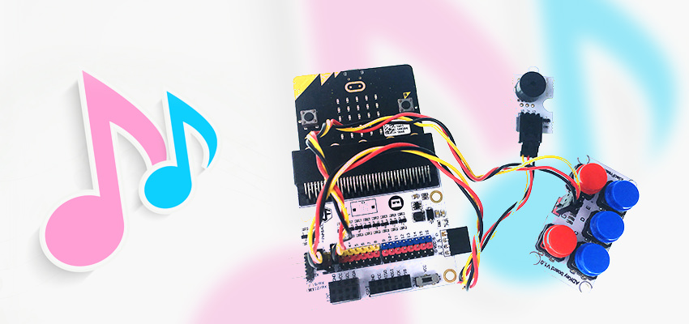
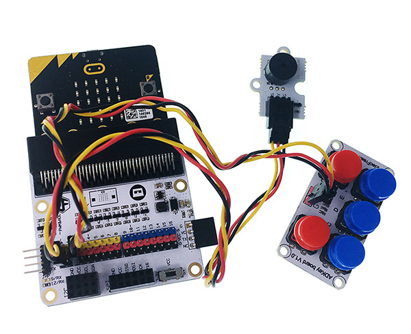
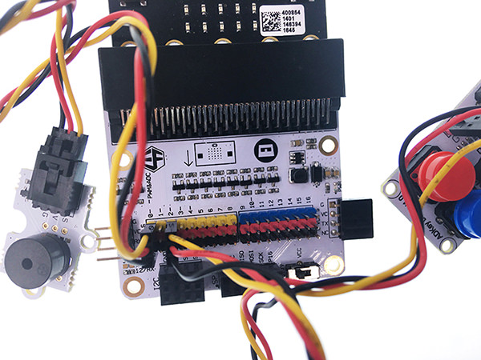
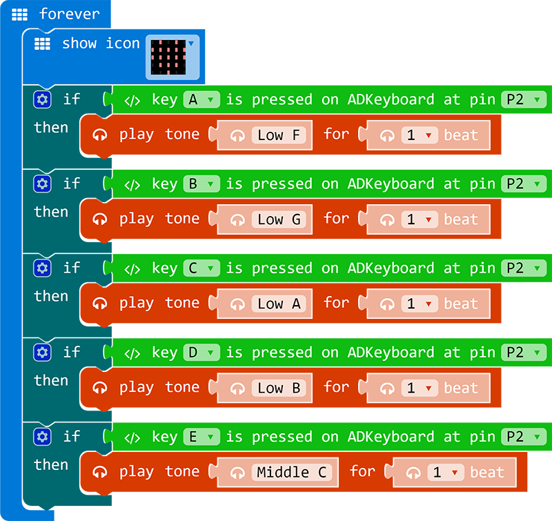

# 课程_01 音乐播放器

  

## 目标
---

• 了解ADKeypad的使用方法。
• 用ADKeypad和蜂鸣器模块制作一个小装置。

## 所需材料
---

- 1 x BBC Micro:bit Board
- 1 x USB线
- 1 x Micro:bit扩展板
- 1 x 无源蜂鸣器模块
- 1 x ADKeypad

**温馨提示: 如果你想要以上所有这些元器件，你可以购买我们的[micro:bit小小发明家套件](https://item.taobao.com/item.htm?spm=a230r.7195193.1997079397.9.z3IMPf&id=564707672256&abbucket=5)。**

## 制作过程
---

### 步骤 1  

如图所示，将USB线的一端连接电脑，另一端连接micro:bit。然后把micro:bit插入扩展板。 

### 步骤 2  

将蜂鸣器模块插入扩展板上的引脚P0。
将ADKepad插入扩展板上的引脚P2。
确保蜂鸣器和ADKeypad的接线颜色和扩展板上引脚的颜色一致。 
 

### 步骤 3  

在MakeCode的代码抽屉中点击Advanced，查看更多代码选项。

为了给套件中的ADKeypad和蜂鸣器模块编程，我们需要添加一个代码库。在代码抽屉底部找到“Add Package”，并点击它。这时会弹出一个对话框。搜索“tinker kit"，然后点击下载这个代码库。

注意：如果你得到一个提示说一些代码库因为不兼容的原因将被删除，你可以根据提示继续操作，或者在项目菜单栏里面新建一个项目。

### 步骤 4  

接下来，让我们一起来创建图中所示的一个条件语句。这个“if-then”积木块位于MakeCode代码抽屉中“logic”的项下。下面所示的代码的意思是：在ADKeypad被插入扩展板上的引脚P2的情况下，当我们按下ADKeypad上的A按钮，蜂鸣器将会发出175赫兹的声音。

 
因为ADKeypad上有5个按钮，所以我们需要编辑5个类似的条件语句。每个按钮控制一种指定的音调。因此按下不同的按钮，我们就能得到不同音调的音乐。

如果你不想自己动手编写这些代码的话，你可以从下面这个链接下载程序的完整代码：

[https://makecode.microbit.org/_3VaHYtgxqRb9](https://makecode.microbit.org/_3VaHYtgxqRb9)

或者，你也可以从下面这个页面下载代码：

<iframe style="position:absolute;top:0;left:0;width:100%;height:100%;" src="https://makecode.microbit.org/#pub:_3VaHYtgxqRb9" frameborder="0" sandbox="allow-popups allow-forms allow-scripts allow-same-origin"></iframe>

终于完成啦!现在你已经拥有了一个属于你的micro:bit音乐播放器了哦！

## 常见问题
---
