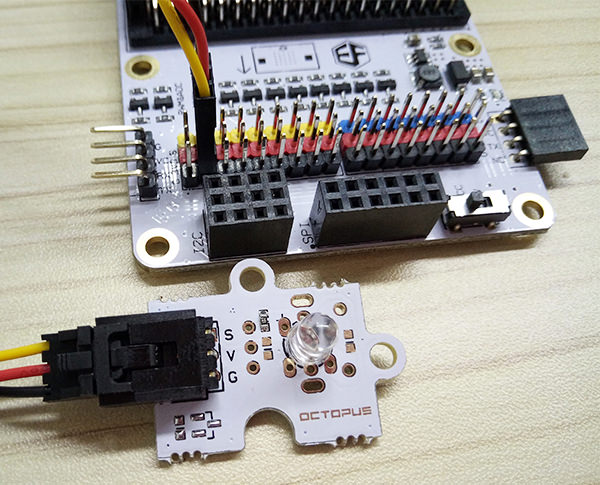
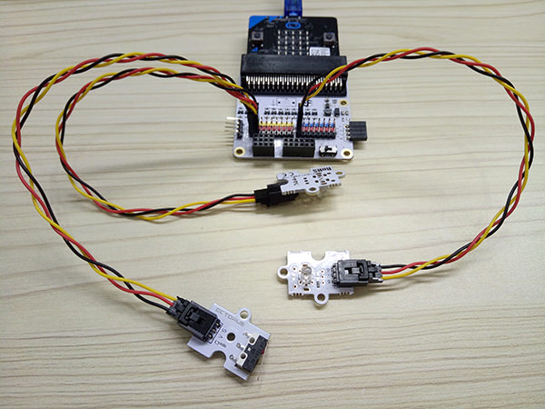
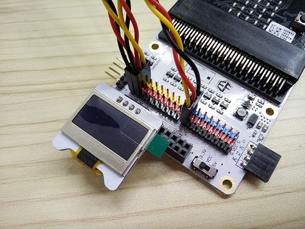
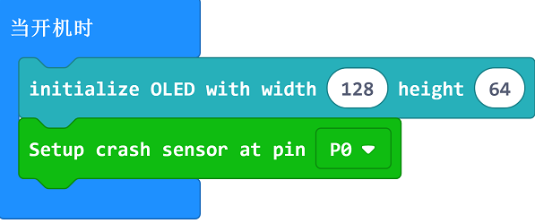
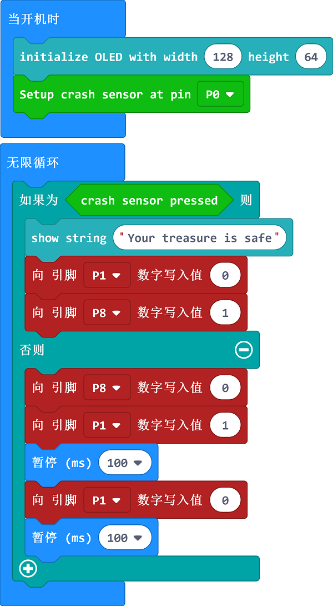
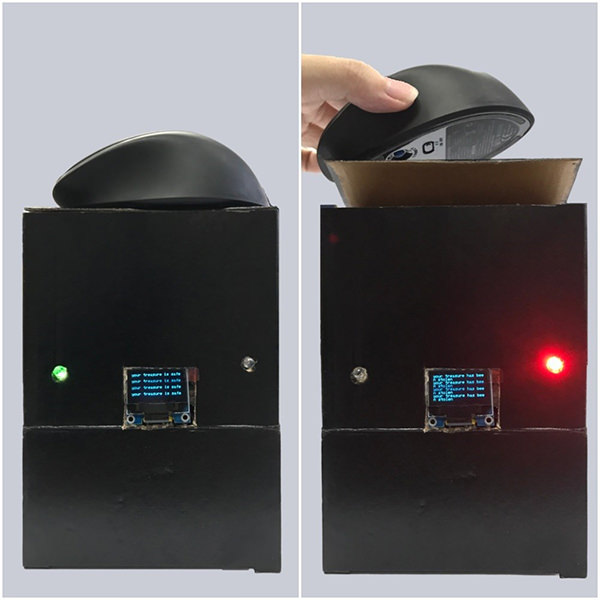

# 课程_04 报警装置

## 目标: 
制作一个简易的报警装置

## 步骤 0: 项目简介  
---  

在这个项目中，我们将会制作一个简易的报警装置来提醒屋主有人偷东西。当碰撞传感器检测到物体被拿走，红色的LED将会闪烁。如果没有检测到物体被拿走，绿色的LED将会一直亮着。我们可以在 OLED 屏幕上看到这个装置的状态。

## 所需材料:  
---  

- 1 x BBC micro:bit
- 1 x USB线
- 1 x 扩展板
- 1 x LED模块
- 1 x 碰撞传感器 
- 1 x OLED
- 1 x LED
- 2 x 母对母跳线

**温馨提示: 如果你想要以上所有这些元器件，你可以购买我们的[micro:bit小小发明家套件](https://item.taobao.com/item.htm?spm=a230r.7195193.1997079397.9.z3IMPf&id=564707672256&abbucket=5)。**

## 目标:  
---

- 认识LED模块、普通的LED灯、碰撞传感器以及OLED模块。 
- 用不同类型的LED来进行创作。
- 用碰撞传感器和OLED来进行创作。

## 制作过程  
---

### 步骤 1 – 元器件连接  

把LED模块连接到P1。

如上图所示，用USB线连接micro:bit，再把micro:bit插入到扩展板上。然后，将碰撞传感器连接扩展板上的P0，LED模块连接P8。确保线的颜色和扩展板上的颜色一致。
最后，将OLED模块插入扩展板上3排排针的任意一排插孔。

### 步骤 2 – 编程前的准备  
我们需要添加代码库来方便我们使用准备好的元器件。点击代码抽屉中的"高级"，查看更多的代码选项，并在下拉菜单底部点击"扩展"。

此时，将弹出一个对话框。在对话框中搜索“tinker kit”， 然后点击下载这个代码库。

注意：如果你收到提示说一些代码库因为不兼容的问题将被删除，你可以选择根据提示操作，或者在项目文件的菜单中选择新建一个新项目。

### 步骤 3 – 编程  

接下来，使用Tinkercademy项下的积木块来初始化OLED和碰撞传感器。如上图所示。

这个部分的代码可以使红色的LED灯持续闪烁。你可以通过改变暂停的间隔时间来调整LED灯闪烁的速度。

因为这里只有2个条件，所以我们只需要一个“else-if”语句。当碰撞传感器上被按下，绿色的LED将被点亮。否则，红色的LED灯将会持续闪烁。

如果你不想自己动手编写这些代码的话，你可以从下面这个链接下载程序的完整代码：

[https://makecode.microbit.org/_RxH3Ex9j8UJE](https://makecode.microbit.org/_RxH3Ex9j8UJE)

或者，你也可以从下面这个页面下载代码：

<iframe style="position:absolute;top:0;left:0;width:100%;height:100%;" src="https://makecode.microbit.org/#pub:_RxH3Ex9j8UJE" frameborder="0" sandbox="allow-popups allow-forms allow-scripts allow-same-origin"></iframe>

### 步骤 4 – 成功!  

接下来，让我们一起把代码下载到micro:bit，让代码运行吧！然后，再找本书或者其他什么东西放到装置的顶部，看一看下面会发生什么。我们可以看到绿灯被点亮，正如图中所示。然后，把书或者你放置的其他东西拿走，绿灯熄灭，红灯开始不停地闪烁。

## 常见问题
---
