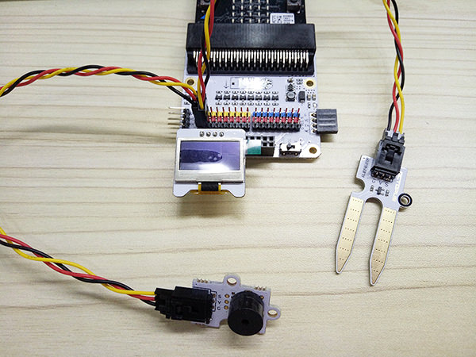
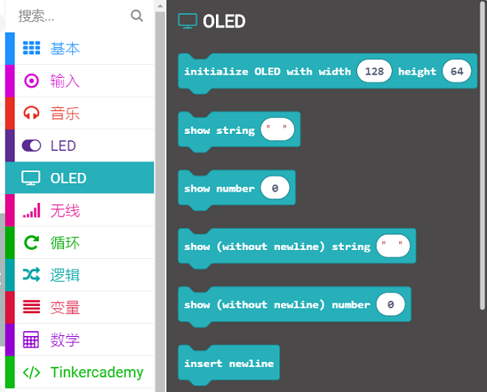
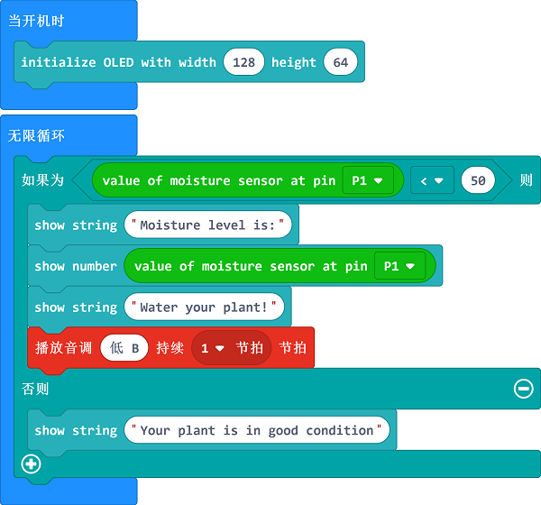
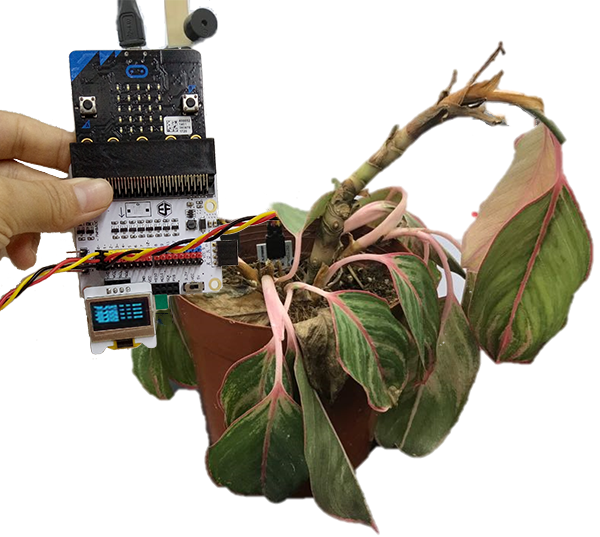

# 课程_05 土壤湿度检测

在这个项目中，我们将用micro:bit、蜂鸣器、OLED以及湿度传感器来制作一个植物土壤湿度检测装置。当土壤水分不足时，蜂鸣器就会响起，OLED屏幕上会显示湿度的信息。

## 目标:  
---

- 1. 认识蜂鸣器、OLED以及湿度传感器。
- 2. 2.用湿度传感器进行创作。

## 所需材料:  
---

- 1 x BBC Micro:bit
- 1 x USB线
- 1 x 扩展板
- 1 x 蜂鸣器
- 1 x OLED
- 1 x 湿度传感器
- 2 x 母对母跳线

**温馨提示: 如果你想要以上所有这些元器件，你可以购买我们的[micro:bit小小发明家套件](https://item.taobao.com/item.htm?spm=a230r.7195193.1997079397.9.z3IMPf&id=564707672256&abbucket=5)。**

## 制作过程  
---

首先，将OLED插入扩展板。
你可以插入3排排针的任意一排。

蜂鸣器连接扩展板上的引脚P0，确保线的颜色和扩展板排针的颜色一致。

湿度传感器连接扩展板上的引脚P1。

我们需要添加代码库来方便我们使用准备好的元器件。点击代码抽屉中的"高级"，查看更多的代码选项，并在下拉菜单底部点击"扩展"。

此时，将弹出一个对话框。在对话框中搜索“tinker kit”， 然后点击下载这个代码库。

点击代码抽屉中的Tinkercademy类目，找到适合我们套件的积木块。

之后，用Tinkercademy类目下方的积木块来初始化OLED。

因为此处只有2个条件，所以我们只需要使用1个else-if语句。micro:bit会不断地从湿度传感器上读取数值。 
当湿度小于50，这表明花盆里面的土壤水分不足。因此，蜂鸣器就会响起，OLED屏幕上就会显示“给植物浇水”。
但是当湿度大于50，蜂鸣器就不会响起，OLED屏幕上就会显示“植物状态良好”。

如果你不想自己亲手编写代码，你可以通过下面的这个链接直接下载程序的所有代码。

[https://makecode.microbit.org/_ebkDfjaVke9o](https://makecode.microbit.org/_ebkDfjaVke9o)

或者，你也可以通过这个页面下载代码：

<iframe style="position:absolute;top:0;left:0;width:100%;height:100%;" src="https://makecode.microbit.org/#pub:_ebkDfjaVke9oJ" frameborder="0" sandbox="allow-popups allow-forms allow-scripts allow-same-origin"></iframe>

终于完成啦！你已经成功地制作出了一个植物土壤湿度检测装置哦！现在，让我们一起来看看看效果吧！

将这些代码下载到micro:bit上。 然后，找到一盆绿色植物，把湿度传感器插入土壤中，看看它的湿度。当土壤水分不足时，蜂鸣器就会响起，告诉你“给你的植物浇水了！”。当土壤水分充足时，OLED屏幕上将显示水分充足，不需要给植物浇水。 

是不是非常有趣呢？

## 常见问题
---
