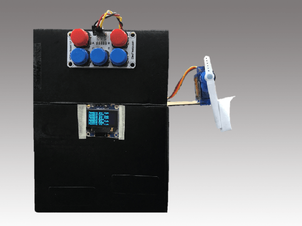
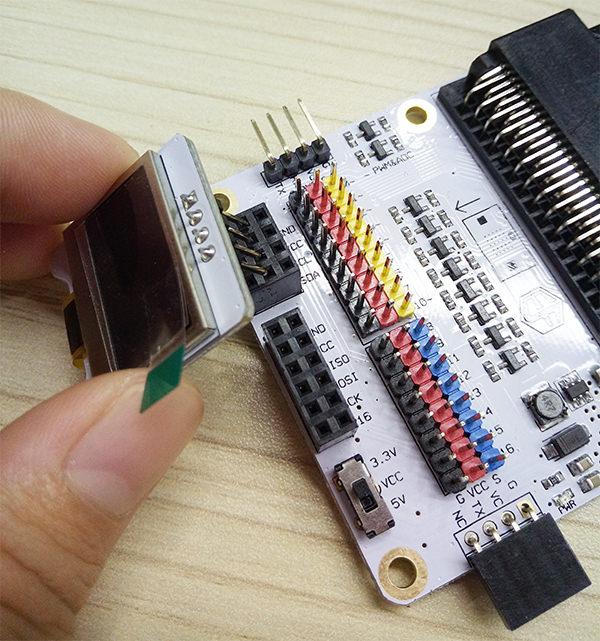
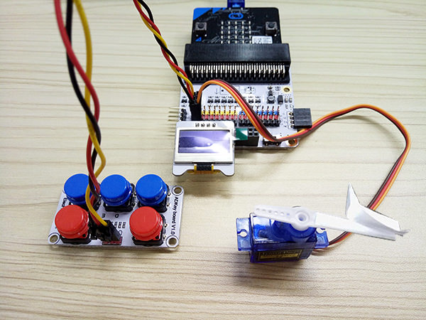

# 课程_07 喂鱼器

> 不想自己亲手喂鱼? 这里刚好有一个适合你的micro:bit项目。在这篇文章中，我们将通过ADKeypad控制舵机的运动来喂鱼。

## 项目简介    
---

  

在这个项目中，我们将会制作一个喂鱼器。我们用ADKeypad上面的2个红色按钮来控制舵机的转动，并通过OLED屏幕上显示的信息得知舵机的状态。    

## 所需材料： 
---
- 1 x BBC micro:bit 
- 1 x USB线  
- 1 x 扩展板  
- 1 x ADKeypad  
- 1 x OLED 
- 1 x 舵机  
- 线  

**温馨提示: 如果你想要以上所有这些元器件，你可以购买我们的[micro:bit小小发明家套件](https://item.taobao.com/item.htm?spm=a230r.7195193.1997079397.9.z3IMPf&id=564707672256&abbucket=5)。**

## 目标：  
---
- 认识ADKeypad、OLED和舵机
- 用舵机来进行创造
- 用OLED来进行创造

## 制作过程  
---
### 步骤 1 – 元器件连接  

如上图所示，将micro:bit插入扩展板，并连接USB线，然后再插入OLED。你可以把OLED插入扩展板上3排排针插孔的任意一排。
将ADKeypad连接到扩展板上的引脚P0，把舵机连接到 Pin 1。确保线的颜色和扩展板上的引脚的颜色一致。

### 步骤 2 – 编程前的准备  

我们需要添加代码库来方便我们使用准备好的元器件。点击代码抽屉中的"高级"，查看更多的代码选项，并在下拉菜单底部点击"扩展"。

此时，将弹出一个对话框。在对话框中搜索“tinker kit”， 然后点击下载这个代码库。

### 步骤 3 – 编程  

点击代码抽屉中的Tinkercademy， 找到与我们套件对应的积木块。

你需要在开始的时候初始化OLED。64和128分别代表了OLED的长度和宽度。

因为这里只有2个条件，所以我们只需要一个“else-if”语句。
如果ADKeypad上的按钮A被按下，舵机将会旋转至70度，OLED上将会显示“Loading food”（加载食物）。 
或者，如果ADKeypad上的按钮B被按下，舵机将会转至20度，OLED上将会显示“Feeding the fish”（喂鱼）。
你可以根据你的需要来调节舵机的角度。

如果你不想自己亲手编写代码，你可以通过下面这个链接下载程序的完整代码：

[https://makecode.microbit.org/_gquLdi2P4Lra](https://makecode.microbit.org/_gquLdi2P4Lra)

或者，你可以从下面这个页面下载：

<iframe style="position:absolute;top:0;left:0;width:100%;height:100%;" src="https://makecode.microbit.org/#pub:_gquLdi2P4Lra" frameborder="0" sandbox="allow-popups allow-forms allow-scripts allow-same-origin"></iframe>

### 步骤 4 – 成功!  

太棒啦！你已经制作好了一个喂鱼器哦!

## 常见问题
---
