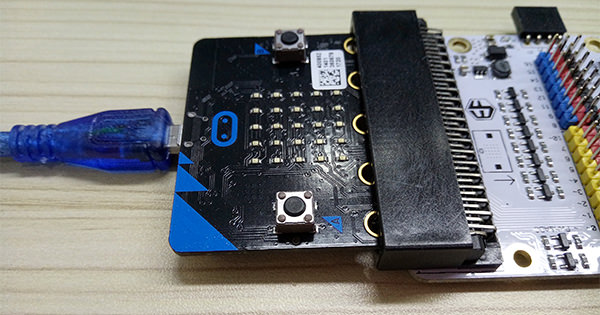
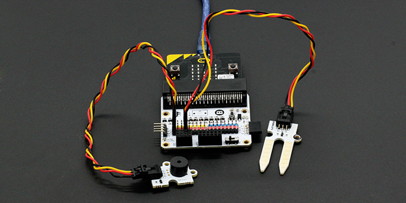
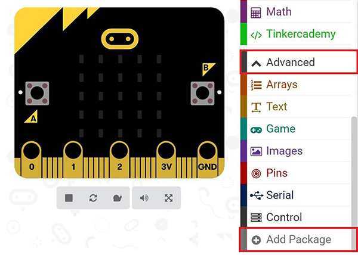
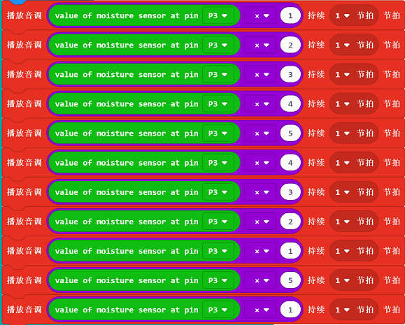

# 课程_08 运动检测

## 案例：
运动检测器

不喜欢别人在你身后偷偷吓唬你？这里刚好有一个适合你的micro:bit项目！在这篇文章中，我们将学习如何使用运动传感器、湿度传感器以及与它们相关的编程知识。

## 目标：
---
- 认识人体红外传感器模块和湿度传感器
- 用人体红外传感器模块进行创作
- 用湿度传感器进行创作

## 所需材料：  
---  

- 1 x BBC micro:bit
- 1 x USB线
- 1 x 扩展板
- 1 X 蜂鸣器
- 1 X 人体红外传感器模块
- 1 X 湿度传感器
- 2 X 母对母的跳线

**温馨提示: 如果你想要以上所有这些元器件，你可以购买我们的[micro:bit小小发明家套件](https://item.taobao.com/item.htm?spm=a230r.7195193.1997079397.9.z3IMPf&id=564707672256&abbucket=5)。**

## 制作过程
---
### 步骤 1  
如图所示，在将USB线的一端连接到电脑后，将USB线的另一端连接到micro:bit。然后将micro:bit插入扩展板。

### 步骤 2  

将蜂鸣器连接扩展板上的引脚P0(即扩展板上数字0旁边的引脚）。将湿度传感器连接引脚P3，运动传感器连接引脚P1。确保接线的颜色和扩展板上引脚的颜色一致。

### 步骤 3  
点击代码抽屉中的Advanced来查看更多代码选项。
为了使用我们之前准备好的元器件（ADKeypad和蜂鸣器），我们需要添加一个代码库。

在代码抽屉底部找到Add Package，点击后会弹出一个对话框。在对话框中搜索“tinker kit”，并点击下载这个代码库。

注意：如果你收到提示说一些代码库因为不兼容的问题将被删除，你可以根据提示继续操作，或者是在项目文件菜单中新建一个项目。

点击代码抽屉中的Tinkercademy，找到与我们套件元件相对应的积木块。

在这个项目中，我们将用blocks（积木块）读取湿度传感器和运动传感器的数值。 

### 步骤 4  
在这一步，我们将使用Block（积木块）编辑器给micro:bit编程。首先，我们需要设置开机显示。如下图所示，将**Show Icon**（显示图标）的积木块放在**On Start**（启动）积木块下方。每次micro:bit开机启动，这个图标就会显示在micro:bit屏幕上。

### 步骤 5  
接下来，让我们用湿度传感器的值来创建一些音乐。选择Music代码区域下方的**Play Tone**（播放音调）这个积木块，并将积木块**value of Moisture Sensor**（湿度传感器的数值）放入其中。如下图所示，我们将传感器的数值乘以不同的数字来调节音高。

### 步骤 6
最后，当运动传感器检测到运动时，蜂鸣器就会响起。如果没有物体运动，micro:bit屏幕上就只会显示一个图标。
这可以通过一个if-then-else的条件语句来实现。如下图所示，在合适的地方插入相应的代码块。

如果你不想自己亲手编写代码，你可以通过下面这个链接下载程序的完整代码：

[https://makecode.microbit.org/_fuPDcb1VhJCW](https://makecode.microbit.org/_fuPDcb1VhJCW)

或者，你可以从下面这个页面下载：

<iframe style="position:absolute;top:0;left:0;width:100%;height:100%;" src="https://makecode.microbit.org/#pub:_fuPDcb1VhJCW" frameborder="0" sandbox="allow-popups allow-forms allow-scripts allow-same-origin"></iframe>

现在将这些代码下载到你的micro:bit来试一试吧！
成功！现在你已经有了一个属于你的micro:bit运动检测装置了哦！

## 常见问题
---
