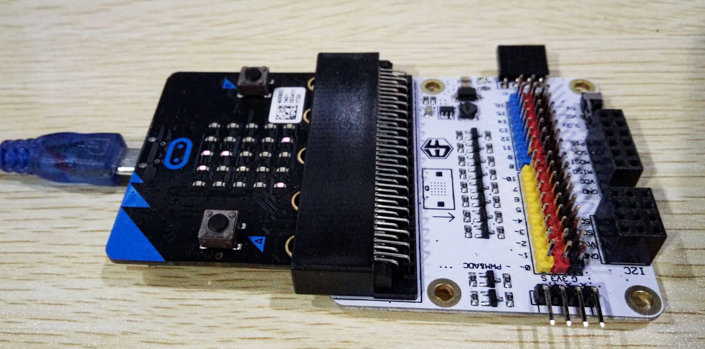
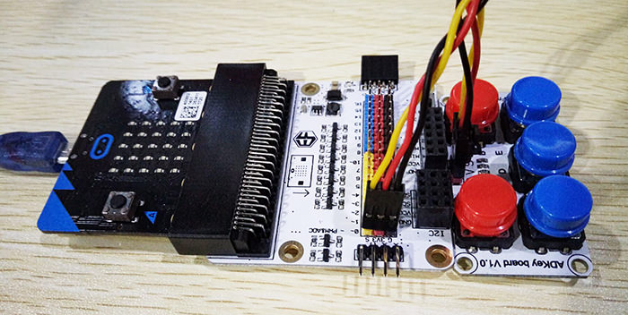
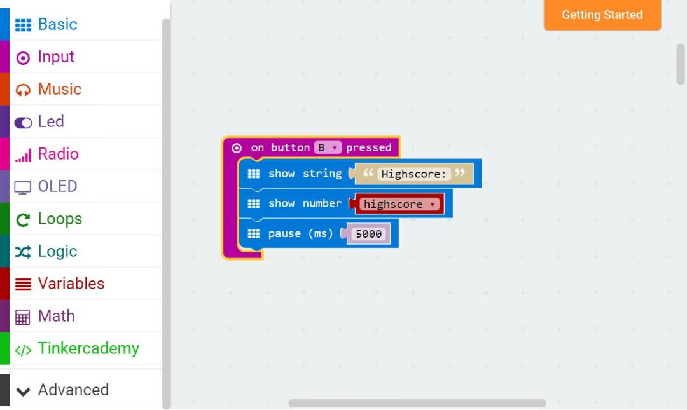
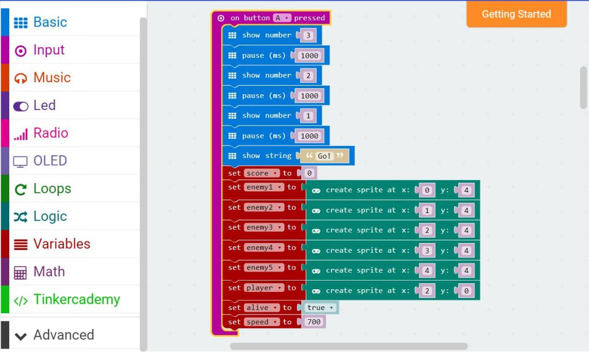
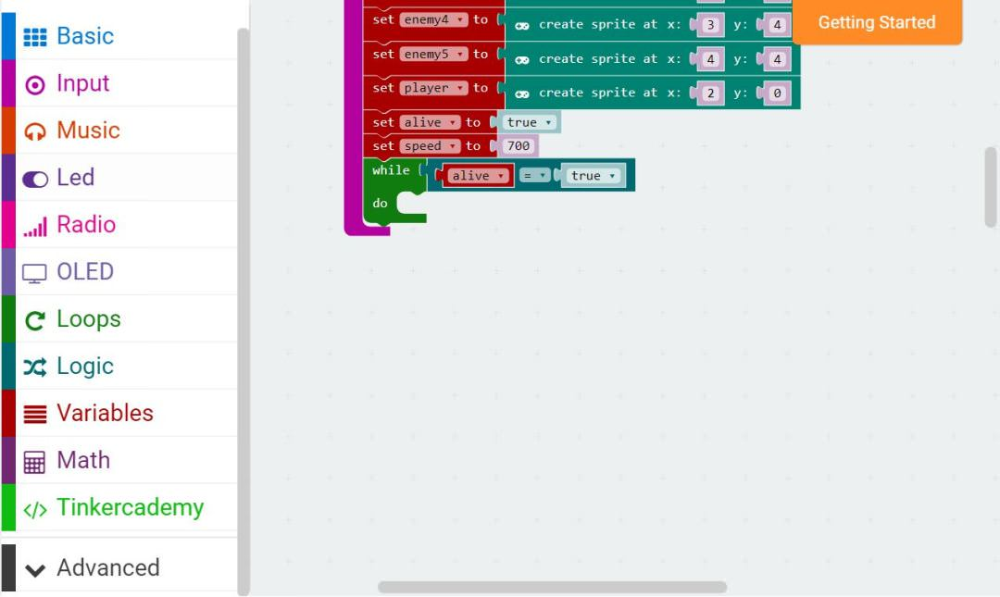
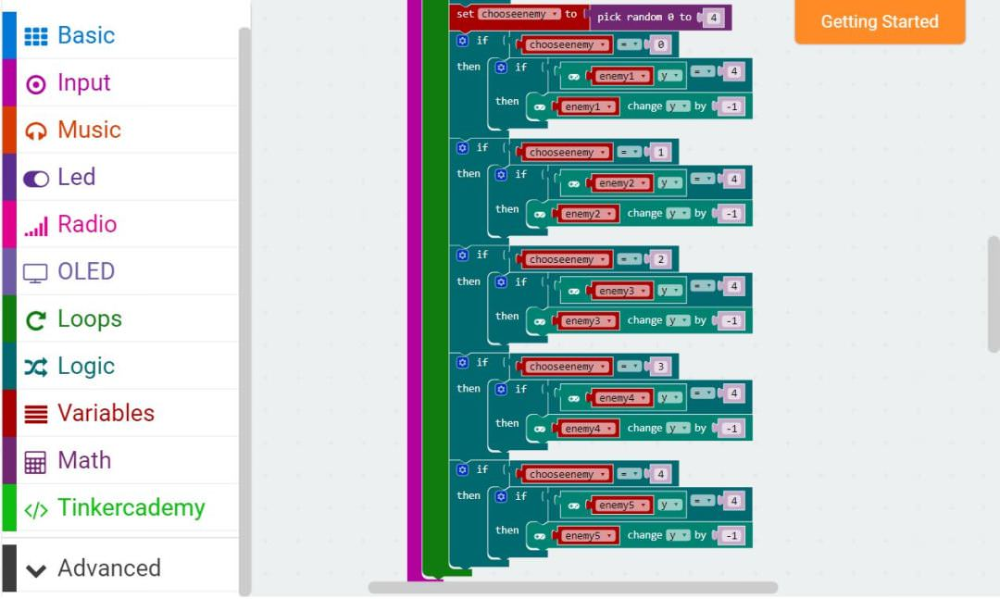
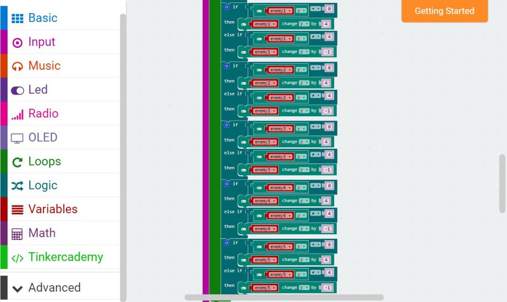
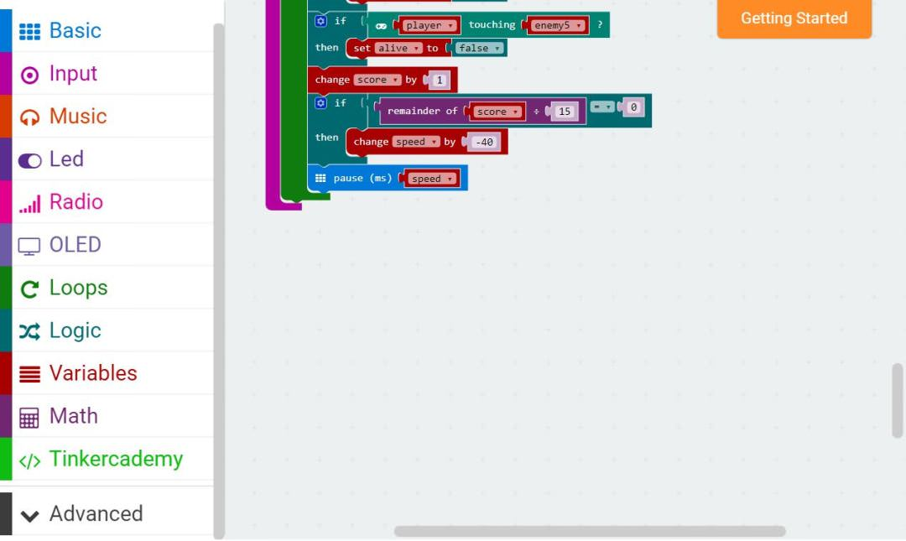
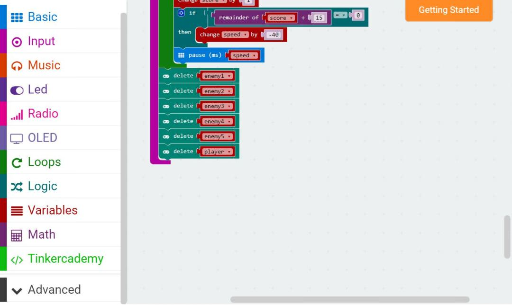
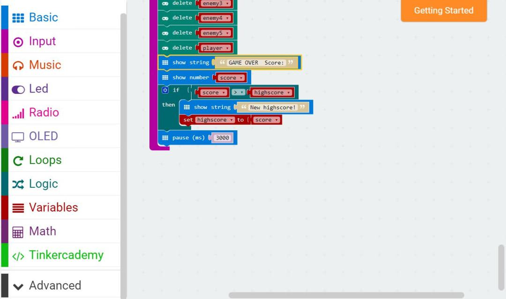

# 课程_11 躲避小行星

用micro:bit制作一个属于你自己的小游戏。一起来欣赏5x5像素的光荣之战吧！

## 项目简介  
---

在此项目中，我们将使用micro:bit和ADKeypad来制作一个小游戏。这个游戏的目的是躲避不断袭来的小行星。当游戏进行到后面，小行星的速度会越来越快。你要做的是尽可能的延长时间，躲避更多的小行星。Micro:bit上的LED点阵将作为屏幕，而ADKeypad将用来做控制器。  

## 所需材料：  
---

- 1 x BBC Micro:bit 
- 1 x USB线  
- 1 x 扩展板  
- 1 x ADKeyboard

**温馨提示: 如果你想要以上所有这些元器件，你可以购买我们的[micro:bit小小发明家套件](https://item.taobao.com/item.htm?spm=a230r.7195193.1997079397.9.z3IMPf&id=564707672256&abbucket=5)。** 

  

## 目标:  
---

- 用micro:bit制作一个小游戏
- 学习更高阶的编程逻辑

## 制作过程
---

### 步骤1–元器件连接  

在此项目中，ADKeypad是唯一的一个外接部件。在连接ADKeypad之前，先把micro:bit插入扩展板。确保线的颜色和扩展板上引脚的颜色一致。真是太简单啦!   

### 步骤2–编程前的准备  

我们需要添加代码库来方便我们使用准备好的元器件。点击代码抽屉中的"高级"，查看更多的代码选项，并在下拉菜单底部点击"扩展"。

此时，将弹出一个对话框。在对话框中搜索“tinker kit”， 然后点击下载这个代码库。

注意：如果你收到一个提示说一些代码库因为不兼容的原因将被删除，你可以根据提示继续操作，或者在项目菜单栏里面新建一个项目。  

### 步骤3 - 编程  

变量可以让我们在程序中存储数据。我们将用变量来存储游戏得分。  

  

当游戏停止，我们用micro:bit上的一个按钮（按钮B)来显示得分情况。“On button B pressed”（当按钮B被按下）积木块满足了这个条件，在积木块内部，变量“highscore”（高分）将会被显示出来。  

  

我们用按钮A来启动游戏。这将会触发倒计时。在所有这些发生之前，我们必须初始化游戏中的精灵。通常情况下，精灵的实体一般是由Micro:bit屏幕上的一颗LED灯来代表的。使用MakeCode提供的积木块，可以让它们向四周移动并改变方向。同时，我们也会初始化变量“alive”（一个布尔变量，用于查看玩家是否依然还活着）以及变量“speed”（用于判断小行星移动得多快）。与主观想象的相反，数值越低，小行星移动得越快。  

  

接下来，我们将会添加一个while循环。只要条件满足，while循环将会持续不断地运行下去。在这种情况下，只要玩家还活着，游戏将会继续进行下去。  

  

注意：这里要小心啦！while循环可能会损坏你的micro:bit哦！  

在循环里面，我们将会添加一个ADKeypad的代码组来控制游戏。当红色的按钮A被按下，精灵将会向左移动。当红色的按钮B被按下，精灵将会向右移动。当蓝色的按钮D被按下，游戏会立即停止。  

  

在这之后，我们将给敌方（小行星）的运动编程。首先，我们用Math选项中的pick random(选择随机）积木块选择一个随机数。这个数将会决定哪颗小行星向上移动1步。但是，这仅仅适用于小行星全部都位于底部的那排LED灯的位置。当小行星离开底部的那排LED灯，我们需要用更多的代码来控制小行星的运动。

这部分的代码用于控制运动中的小行星。如果它们在中间的3排，加1，它们就会往上移动一步。如果它们已经在最顶部的一排，那么它们就会返回到最底部的那一排。  

  

同时，我们还要检查精灵是否碰触到了玩家，因此我们可以知道玩家的飞行器什么时候坠毁。如果飞行器坠毁了，变量“alive” 就会变为“False”, while循环就会停止循环，游戏也会终止。   

  

最后，我们需要给每个循环加1分。每满15分，变量“speed”（速度）将会减小40，小行星的运动速度加快。Pause(暂停）控制小行星已有的速度。 
  

在游戏结束后，我们必须删除这些精灵，让它们不会填充满整个LED屏幕。  

  

LED屏幕上显示“Game Over”（游戏结束）和得分。如果得分高于目前的highscore（高分）, 那么highscore（高分）将会被重置。  

  

如果你不想自己动手编程，你可以直接下载下面的完整代码：

[https://makecode.microbit.org/_i92YKmDhr9Tf](https://makecode.microbit.org/_i92YKmDhr9Tf) 

或者，你也可以从下面这个页面下载：  

<iframe style="position:absolute;top:0;left:0;width:100%;height:100%;" src="https://makecode.microbit.org/#pub:_VvPPKaDEHAj7" frameborder="0" sandbox="allow-popups allow-forms allow-scripts allow-same-origin"></iframe>
  

### 步骤4 - 成功！  

太棒啦！你已经用micro:bit制作出了一个属于你自己的迷你视频游戏了哦！现在你可以把你的小游戏向你的小伙伴们展示一下，看看谁是真正的boss!  

## 常见问题
---
