# 课程_16 速算游戏

速算游戏是一种测试你的心算速度的游戏。如果你的计算速度太慢，你就会输；如果你的计算速度太快，你可能会出错。在本文中，我们将用micro:bit来制作一个速算游戏。

## 目标
---

1.学习蜂鸣器，OLED和micro:bit的使用。
2.使用if-else条件语句来判断条件。
3.用MakeCode自制函数。 

## 所需材料
---

- 1 x BBC micro:bit
- 1 x USB线
- 1 x Buzzer
- 1 x 扩展板
- 1 x OLED

**温馨提示: 如果你想要以上所有这些元器件，你可以购买我们的[micro:bit小小发明家套件](https://item.taobao.com/item.htm?spm=a230r.7195193.1997079397.9.z3IMPf&id=564707672256&abbucket=5)。**

## 制作过程
---

### 步骤 1 – 硬件连接

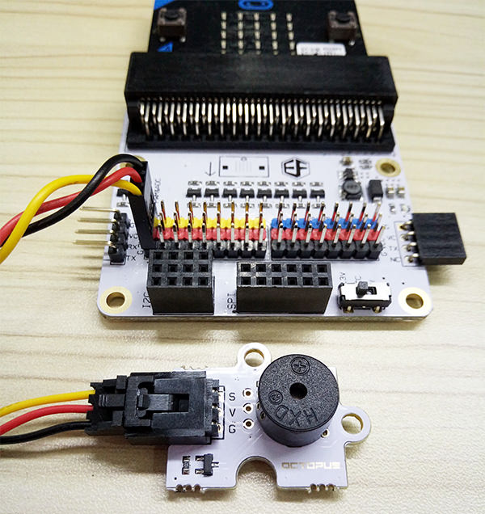
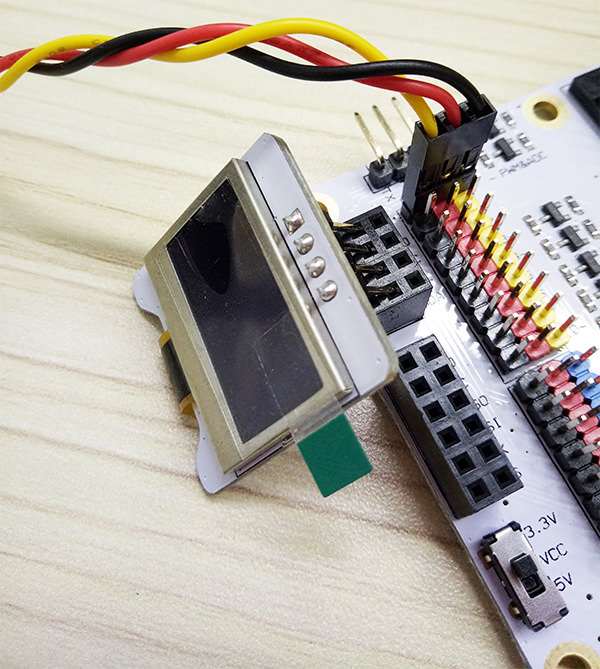

将蜂鸣器连接至扩展板上的P0。

如图所示，将OLED模块插入扩展板上面的3排的排针.你可以选择3排中的任意一排。

### 步骤 2 – 编程前的准备

为了使用我们之前准备好的元器件，我们需要添加一个代码库。在代码抽屉中点击Advanced来获取更多代码选项。 选择代码抽屉底部的Add Package来添加代码库。

这时会弹出一个对话框。在对话框中输入LED，点击搜索按钮或按下Enter键，然后选择oled-ssd1306。

### 步骤 3 – 初始化OLED屏幕

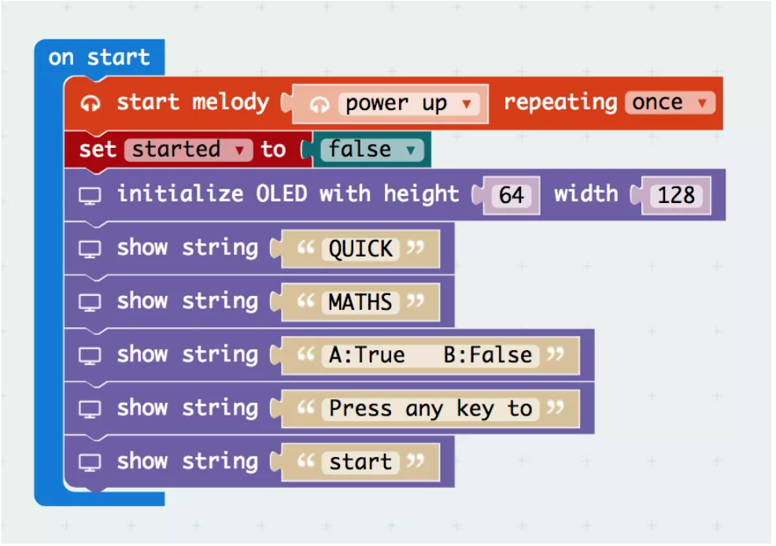

在代码抽屉的音乐选择区域选择初始音乐。
之后，创建一个变量，把它命名为started。因为游戏还没开始，所以我们把它设置成false。
最后，使用Tinkercademy项下的积木块来初始化OLED，并且显示上图所示的消息。

### 步骤 4: 编辑randomiser（随机）函数

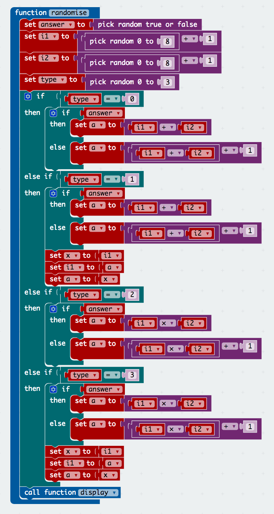

在这个步骤中，我们将使问题随机显示。
首先，创建一个变量，命名为answer（回答）。此处，无论answer是对还是错，我们都将保存它。用Math（数学）项下的randomiser（随机）积木块来判断对错。

接下来，我们需要创建3个变量：i1、 i2 和 a。
关于这些变量的用法，你可以参考下面这个例子：
i1 + i2 = a 。

之后，我们给i1和i2随机地赋上从1到9的值。稍后设置a的值。

然后，创建一个名为type（类型）的变量。这个变量将被用于存储问题的类型。
(0代表加法, 1代表减法, 2代表乘法, 3代表除法)
用Math项下的积木块给type随机地赋上从0到3的值。 

在这里，为了生成一个答案，我们用一个if-else语句来判断问题的类型。

在加法 (0)中,如果答案是对的，把a设置成为i1和i2之和. 但是, 如果答案是错的, 需要加1来获取正确答案。
在减法(1)中,如果答案是对的, 把a设置成为i1和i2之和, 之后把a和i1的值调换一下。但是，如果答案是错的，需要给i1加1。 
在乘法(2)中, 如果答案是对的, 把a 设置成i1和i2的乘积。但是，如果答案是错误的，需要加1来获得正确答案。
在出发(3)中, 如果答案是对的, 把a 设置成i1和i2的乘积, 之后把a和i1的值调换一下.但是，如果答案是错的，需要给i1加1。

### 步骤 5: 编辑显示函数

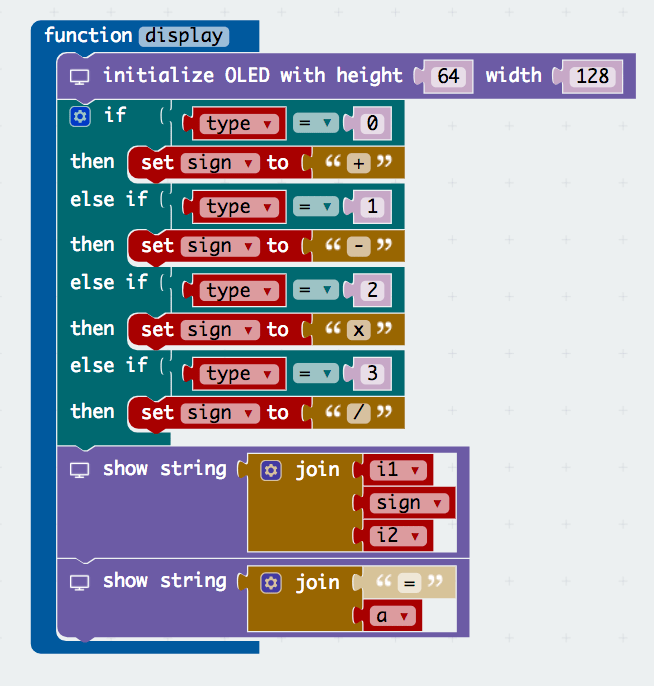

在这个步骤中，我们将创建一个函数，把问题显示在OLED屏幕上。 
首先，如图所示初始化OLED。
接下来，我们需要决定使用哪些符号。因此，我们创建了一个变量，命名为sign。
之后，根据if-else条件语句问题类型的判断，给sign赋值。
(0代表 +, 1代表 -, 2代表 x, 3代表 /)
现在，我们已经有了展示方程式的符号。 
在OLED项下, 选择 show string（显示字符串）积木块并添加变量i1, sign 和 i2。
显示函数就创建完成了。如果你想在这些值被打乱的情况下显示问题，则需要在随机函数的末尾引用此函数。

### 步骤 6: 编写起始动作

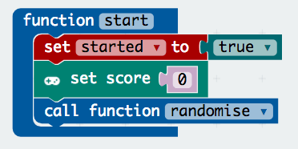

现在，我们可以随机显示问题了，接下来需要编写游戏开始的程序。
首先，创建一个start（开始）函数。在这个函数中，把初始值设置为true并且引用randomise（随机）函数。之后, 在**advanced**项下的game选区中, 添加**set score**（设置得分）积木块，把它的值设置为0。
既然这个函数创建完成了，我们需要在Input项下添加2个button pressed（按钮按下）的积木块，代表按钮A和按钮B。在这2个积木块中，创建一个if-else语句来判断游戏是否已经开始。如果游戏没有开始，就引用start函数。

### 步骤 7: 编写Check（检查）函数

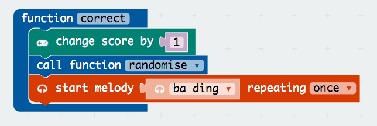

接着步骤6，现在我们将继续编写游戏开始的这部分代码。
首先，创建2个函数-correct（正确）和 wrong（错误）。在correct函数中，选择游戏选项底部的积木块“change score"(改变得分），并通过1来改变score（得分）。接下来调用函数randomise（随机）来获取下一个问题，并在最后播放一段音乐“ba ding”来作为额外添加的音效。
接着就是wrong函数了。起始音乐wawawawaa运行一次，并显示图标X来表示玩家选择了错误的答案。
毕竟，图中已经显示了初始化OLED。
最后，我们想要检查高分。通过创建一个high score（高分）变量来开始。接下来创建一个if-else语句（如上图所示）。在这个逻辑门中，我们正在检验score（得分）是否高于玩家的high score（高分）。如果高于玩家的高分，那么这个高分将会被设置成为当前的得分。
别忘了在游戏结束的时候将变量start设置为false（假）。
现在，我们已经完成了函数correct和wrong。我们需要调用它们，正如图中所示的一样。

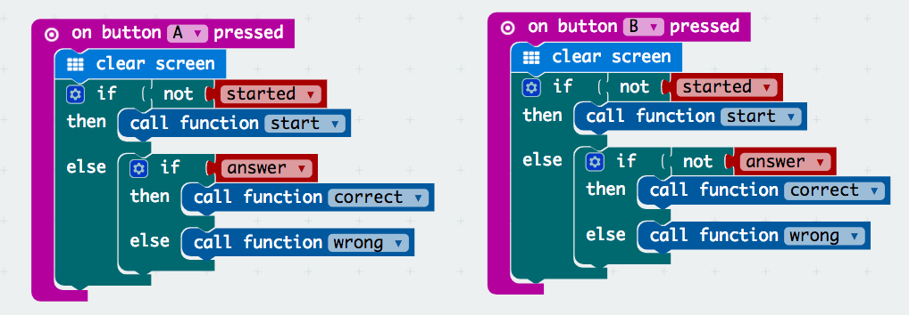

### 步骤 8: 计时器编程

现在你已经有了一个有效的游戏。但是，为了让游戏更加刺激，我们应该添加一个计时器。在添加计时器之前，我们需要做一些准备工作。
首先，创建一个end（结束）函数。在函数中进行相应的设置。这可能看起来和wrong函数的最后部分相似。
你可以通过引用这个函数来替换那个部分。这个函数将会被再次引用来防止二次编程。

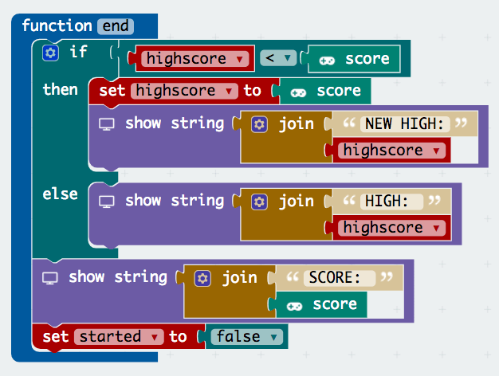

接下来，创建一个slow（慢）函数。如果玩家没有及时回答，这个函数就会被调用。创建图中所示的积木块。

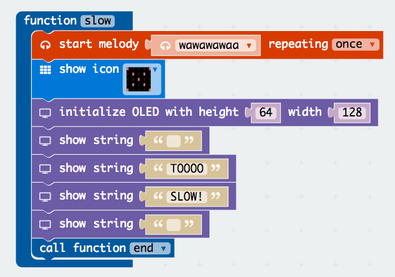

接下来，我们需要创建一个新变量，叫做time（时间）。然后，我们需要创建一个新的变量time（时间）。当玩家开始了一个特定的问题时，就开始存储时间。之后，将它的数值设置到积木块running time (ms)（运行时间）中。你可以在代码菜单的Input选项中找到这个积木块。

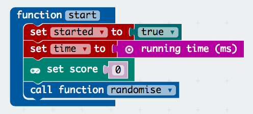

因为micro:bit没有内置的计时器，所以我们需要用micro:bit已有的资源设计一个计时器。现在我们starting time（起始时间）是玩家开始回答问题的时间，以及running time（运行时间）是程序已经运行的时间。在这个基础上，如果我们把这两者相减，则会得到玩家在那个问题上所花费的时间。对于这个游戏的每个问题，我们只允许玩家有2.5秒（2500毫秒）的回答时间。因此，如果玩家解题速度太慢，他们就会输。

最后，在函数correct中添加一个积木块，用来设置当前运行时间的数值。这可以在下一个问题开始的时候，刷新starting time(开始时间）。

这个游戏的制作到此就结束了。你现在已经正式完成了这篇教学博客的学习了哦！

你可以在此下载程序的完整代码：

[https://makecode.microbit.org/_WYi813PuKTAR](https://makecode.microbit.org/_WYi813PuKTAR)

或者通过下面这个页面来下载代码：

<iframe style="position:absolute;top:0;left:0;width:100%;height:100%;" src="https://makecode.microbit.org/#pub:_WYi813PuKTAR " frameborder="0" sandbox="allow-popups allow-forms allow-scripts allow-same-origin"></iframe>

## 常见问题
---
