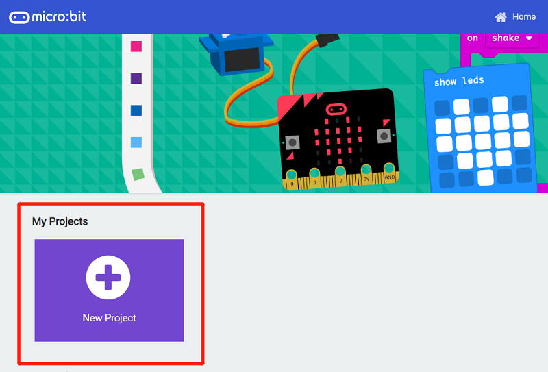

# 软件编程案例04：电位器

## 简介 ##
---
电位器是一种普通的压力调节元件。在下面的实验中，我们将要读取电位器上的输出电压，并用柱形图的方式将它显示在micro:bit 5*5 的LED屏幕上。

## 硬件连线图 ##
---

- 使用香蕉线按如上图连接电路，电池盒内放入2颗7号AAA电池。

## 电路原理图 ##
---

micro:bit插槽的GND端和电池GND相连内部，形成电流回路。

## 主要元件介绍 ##
---
### 电位器 ###
- 电位器是一种压力调节的元件。它包括了一个电阻和一个旋钮或者滑动系统。当添加一个外部的电压到电阻的两个固定接触点，通过使用旋钮或者滑动系统来改变电阻上的接触点的位置，一个和可移动的触点位置有特殊关系的电压就在可移动的触点和两个固定触点之间形成了。
- 在实验箱上板载一个10KΩ 电位器，向左旋转到底为0Ω，向右旋转到底为10KΩ。

## 软件编程设计
---
### 步骤 1

- 点击打开[微软makecode在线积木块编程https://makecode.microbit.org/#](https://makecode.microbit.org/#)。

- 点击New Project按钮，新建一个项目。

### 步骤 2

- 在forever积木块中插入plot bar graph显示指定的数字的柱形图。（柱形图是一种图表，它可以用不同长度的线条来显示数字）

- analog read 读取指定引脚的一个模拟信号（0~1023）。

### 程序

- 请参考程序连接：[https://makecode.microbit.org/_VewWgwe8HVT1](https://makecode.microbit.org/_VewWgwe8HVT1)

- 你也可以通过以下网页直接下载程序。

<iframe style="position:absolute;top:0;left:0;width:100%;height:100%;" src="https://makecode.microbit.org/#pub:_VewWgwe8HVT1" frameborder="0" sandbox="allow-popups allow-forms allow-scripts allow-same-origin"></iframe>
  
---

## 结论
---
- 旋转电位器，柱状图发生高低变化。

## 思考
---
- 电位器可不可以当做固定电阻？

## 常见问题
---

## 相关阅读  
---

