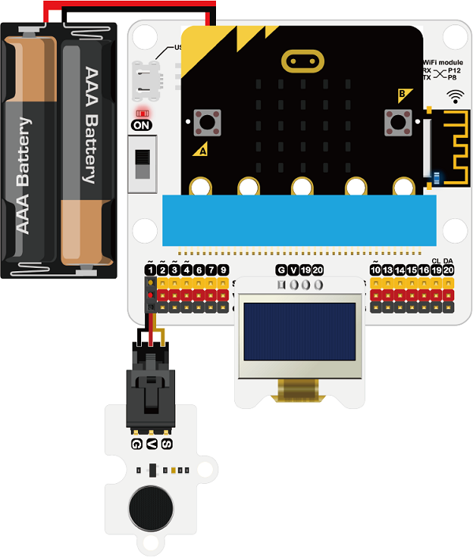

# iot套件案例02：环境噪音监测站

## 目的
---

- 制作一个环境噪音监测站。

## 使用材料
---

- 1 x [IOT:kit(物联网环境科学套件)]()

## 背景知识
---

### 什么是环境噪声

- [环境噪声]()是指在工业生产、建筑施工、交通运输和社会生活中所产生的干扰周围生活环境的声音。
- 环境噪声标准是为保护人群健康和生存环境，对噪声容许范围所作的规定。制定原则，应以保护人的听力、睡眠休息、交谈思考为依据，应具有先进性、科学性和现实性。环境噪声基本标准是环境噪声标准的基本依据。各国大都参照国际标准化组织（ISO）推荐的基数（例如睡眠30分贝），并根据本国和地方的具体情况而制定。

## 硬件连接图
---

如图所示，将噪声传感器模块连接到`P1`口。

OLED屏幕连接`IIC`接口。 

板载RTC时钟模块，已连接到`IIC`总线

## 软件
---

[微软makecode](https://makecode.microbit.org/#)

## 编程
---

### 步骤 1
- 在MakeCode的代码抽屉中点击Advanced，查看更多代码选项。

- 为了给IOT物联网环境科学套件编程，我们需要添加一个扩展库。在代码抽屉底部找到“Extension”，并点击它。这时会弹出一个对话框。搜索“IOT"，然后点击下载这个代码库。

注意：如果你得到一个提示说一些代码库因为不兼容的原因将被删除，你可以根据提示继续操作，或者在项目菜单栏里面新建一个项目。

### 步骤 2

在`on start`中插入`initialize OLED`积木块，参数填入`64*128`。

初始化OLED屏幕为`64`像素*`128`像素。

在它之后插入设定RTC时钟积木块，设置为当前时间的小时和分钟数。（以14:15为例）

### 步骤 2

在`forever`中依次插入`clear OLED display`积木块，`show string`积木块，`show number`积木块。

显示字符`Time:`，以小时分钟数字显示当前时间。

插入`insert newline`积木块，另起一行。

### 步骤 3
再之后插入，`show string`积木块，`show number`积木块。

显示字符`Noise:`，显示噪音模块返回的数值。

暂停1秒。

### 程序

请参考程序连接：[https://makecode.microbit.org/_3y5WWxWUFYtV](https://makecode.microbit.org/_3y5WWxWUFYtV)

你也可以通过以下网页直接下载程序。

<iframe style="position:absolute;top:0;left:0;width:100%;height:100%;" src="https://makecode.microbit.org/#pub:_3y5WWxWUFYtV" frameborder="0" sandbox="allow-popups allow-forms allow-scripts allow-same-origin"></iframe>
  

### 现象
---
每秒钟都会显示当前环境的噪音分贝数。

## 思考
---

如何统计一分钟内平均分贝数。

## 常见问题
---

## 相关阅读  
---

 
