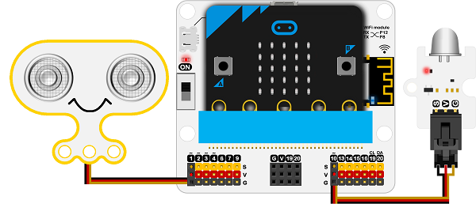

# iot套件案例05：监测站保护装置

## 目的
---

- 制作一个监测站保护装置。

## 使用材料
---

- 1 x IOT:kit(物联网环境科学套件)

## 背景知识
---

### 什么是自防护

- 当你的环境监测站放在室外环境中时，为了防止装置被破坏，测得数据遭到干扰，所以需要设置一个自保护装置，以提醒他人不要靠近。                               

## 硬件连接图
---

如图所示，将超声波模块连接到`P1`口。

人体红外传感器模块连接到`P10`口。

板载蜂鸣器，已经连接到`P0`口。

## 软件
---

[微软makecode](https://makecode.microbit.org/#)

## 编程
---

### 步骤 1
- 在MakeCode的代码抽屉中点击Advanced，查看更多代码选项。

- 为了给IOT物联网环境科学套件编程，我们需要添加一个扩展库。在代码抽屉底部找到“Extension”，并点击它。这时会弹出一个对话框。搜索“IOT"，然后点击下载这个代码库。

注意：如果你得到一个提示说一些代码库因为不兼容的原因将被删除，你可以根据提示继续操作，或者在项目菜单栏里面新建一个项目。

### 步骤 2

在`forever`中插入读取`P1`口数值赋值给`IR`积木块，判断`IR`是否为`1`。

当`IR`参数为`1`的时候，再读取超声波返回值赋值给`ultrasonic`变量。

如果`ultrasonic`变量小于30，播放一声`ba ding`提示请勿靠近。

### 程序

请参考程序连接：[https://makecode.microbit.org/_05sYuyciH93g](https://makecode.microbit.org/_05sYuyciH93g)

你也可以通过以下网页直接下载程序。

<iframe style="position:absolute;top:0;left:0;width:100%;height:100%;" src="https://makecode.microbit.org/#pub:_05sYuyciH93g" frameborder="0" sandbox="allow-popups allow-forms allow-scripts allow-same-origin"></iframe>
  

### 现象
---

## 思考
---

## 常见问题
---

## 相关阅读  
---
