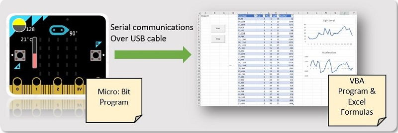
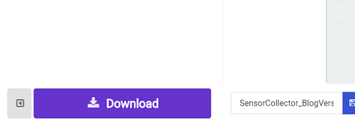
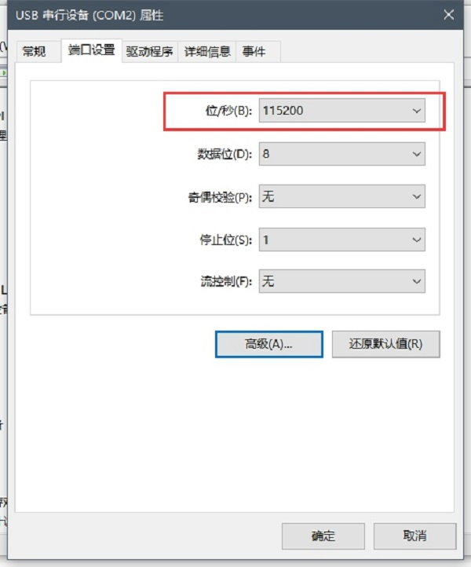
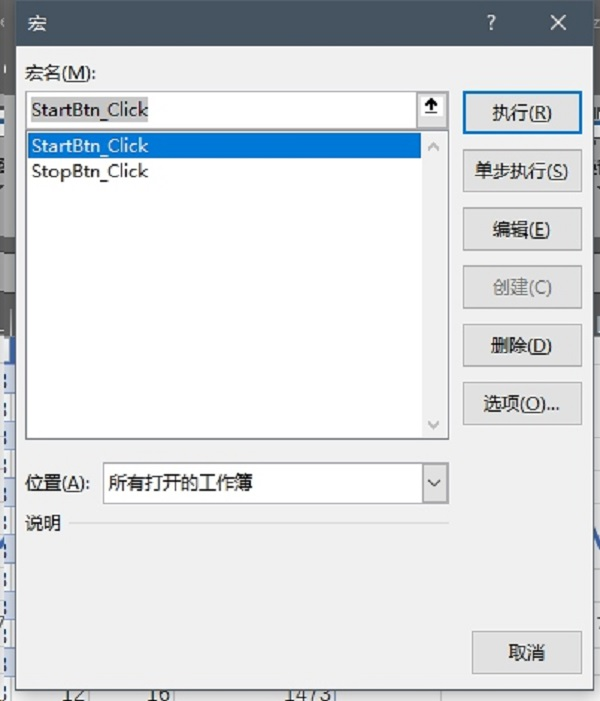

# 第三节：使用Iot套件搭配Excel将数据可视化

## Excel 和 micro:bit - 黑客的乐趣和创造力！
---
我们的目标是使用micro:bit收集一些基本的传感器数据，然后在Excel中进行可视化。

为实现这一目标，我们将通过三个步骤：

1. 我们将对micro:bit进行编程以收集一些传感器数据并通过其内置的串行通信端口发送。
2. 我们将micro:bit连接到PC的串行端口。
3. 我们将在Excel中编写一个小程序，将串行端口中的数据写入Excel。

## 实验流程 - 从micro:bit到Excel ##

### 第一步：编程micro:bit

编程micro:bit是你做过的最简单的事情。Microsoft实际上已经为您准备了基于Web的开发环境（Microsoft是micro:bit的创始合作伙伴之一）。

您所要做的就是，访问[makecode.microbit.org](makecode.microbit.org),使用可视化的“积木块”编程语言编写一个小程序。

我们为这个实验编写的程序相当简单，收集两个传感器的数据 - 加速度值和光照值，并且每隔100ms通过将数据发送到串行通信端口。

### 第二步：下载程序到micro:bit 

现在将程序下载到micro:bit中。

使用USB数据线将micro:bit连接到PC，会在PC我的电脑中显示一个micro:bit盘。

 

然后在MakeCode界面中点击下载，将下载的HEX文件并将其保存到micro:bit盘上。

你也可以点击[此处](https://makecode.microbit.org/_cjvC4RU1CVUD)直接下载程序。
### 第三步：将它连接到PC

现在我们的micro:bit正在运行并发送数据，在我们在Excel中尝试之前，最好验证PC是否确实可以看到传入的数据流。
为此，您需要按照此 页面[https://www.microbit.co.uk/td/serial-library](https://www.microbit.co.uk/td/serial-library), 上的说明操作，这基本上意味着您需要做两件事：

1. 安装一个驱动程序，它将使micro:bit“显示”为PC上的串行端口,可以点击此处[下载驱动程序](https://github.com/elecfreaks/learn-cn/blob/master/microbitKit/iot_kit/file/teraterm-4.102.rar?raw=true)

2. 使用串行通信终端仿真器进行测试。

您需要配置正确的COM端口。在我的环境中，它被配置为COM3。Excel中的示例代码假定，如果您的代码不同，则需要稍后修改Excel代码以反映正确的端口。
完成后，您应该在模拟器中看到类似于此的数据流：

3. 如果在终端仿真器中测试通过，然后进入`设备管理器`—选择`端口`，找到`USB串行设备`。

右键属性，选择端口设置，将第一个数据改为`115200`。

然后点击`高级`，将左下角`COM端口号`设置为`1`或者`2`，依次点击确定完成设置。

***传入的数据流 - 光照水平和加速度

### 第四步：让我们进行Excel编程！ 

现在我们有了一个传入数据流，让我们进入Excel。
电子表格由两部分组成：
第一部分：用于与micro:bit通信的VBA代码。
第二部分：用于将数据变成图表形式的函数代码。

您可以在此博客[https://techcommunity.microsoft.com](https://techcommunity.microsoft.com/gxcuf89792/attachments/gxcuf89792/ExcelBlog/48.6/1/SensorVisualizer_BlogVersion.zip)中找到此Excel的副本。
[也可以点击此处下载](https://github.com/elecfreaks/learn-cn/blob/master/microbitKit/iot_kit/file/SensorVisualizer_BlogVersion.zip?raw=true)

当你打开这个Excel副本时，Excel会提醒`宏已经被禁止`，点击`启动宏`，这对我们来说很重要。

因为micro:bit会发送无穷无尽的数据，为了本实验的目的，我们将通过收集的最后30个数据样本进行迭代。

还有一点：当从VBA中的串行通信端口读取时，最可靠的方法是逐字节而不是整行读取。还有可能丢失一些数据（取决于通信速度，VBA执行速度等），这就是我为每一行添加“D：”前缀的原因。如果我们读取的行不以它开头，则该行将被忽略为垃圾数据。

这是VBA代码中主循环的片段：
 

此代码段中需要注意以下几点：

1. 我们以115,200波特率（micro:bit发送数据的速度）打开COM3：端口。
2. 每次读取一个字节，直到检测到行尾（char（13））。
3. 每当读取一行时，它就会被写入excel网格中，进入固定列的下一行。
4. VBA代码中有一个不同的宏，用于输入停止读取操作。

理解这段代码的最好方法是在调试模式下运行它并逐步执行它，所以继续下载演示工作簿并进行实验！

现在我们已经将数据放入网格中，我们处于Excel公式和图表区域。是时候对我们收集的数据做点什么了！

为了保持通用性，VBA脚本将数据按原样读入网格，因此列“E”包含实际数据，因为它通过网络到达。在我们的例子中，它是两个以逗号分隔的数字。

所以，我们要做的第一件事就是将它分成每行两个不同的值：光照水平和加速度值。使用FIND公式查找输入数据中“，”分隔符的位置，然后使用NUMERVALUE和LEFT和RIGHT公式将字符串分开并将其转换为两个数值。

这里有一些关于我用来分解输入数据字符串中的值的公式：

  ` =FIND(",",E2,1)` : 在单元格E2中查找第一个逗号分隔符的位置（其中包含逗号分隔值的原始传入字符串）。

  ` =NUMBERVALUE(LEFT(E2,F2-1))` : 取字符串的左侧，直到逗号位置，并将其转换为数字值。这给了我们一个代表光传感器值的数字。
micro:bit中的亮度值范围为0到255. 

   `=NUMBERVALUE(RIGHT(E2,LEN(E2)-F2))` : 与上一个公式类似，只取右边数，即加速度值。值可以在X，Y或Z轴上，也可以组合在一起，并 [在此处进行](https://pxt.microbit.org/reference/input/acceleration)说明.

我还添加了一个编号为1-30的固定“行”列，这样我们的图表就会有一个X轴。

从值中创建两个图表。在它们两者中，X轴是行号，Y轴是从传感器进入的数据（光或加速度）。
这就是它的样子：

### 第五步：修改VBA代码

点击`视图`—选择`宏`

选择`StartBtn_Click`宏点击`编辑`

在这行代码中，将`COM`后边的值改为之前设置的端口号，这里的示例是`2`

点击左上角保存，保存Excel，然后重新打开这个Excel副本。

### 最后一步：传入的数据是实时可视化的！

您现在要做的就是点击“开始”，查看正在进行的数据并立即转换为图表！

