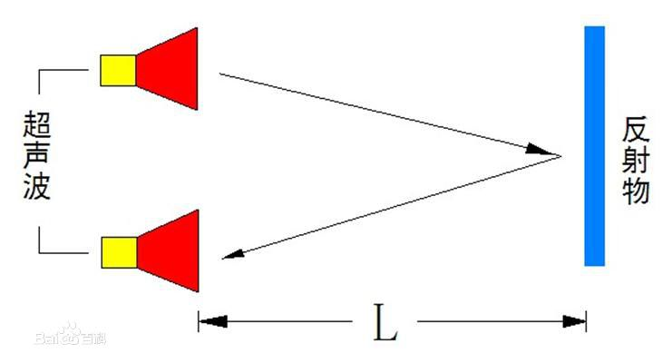
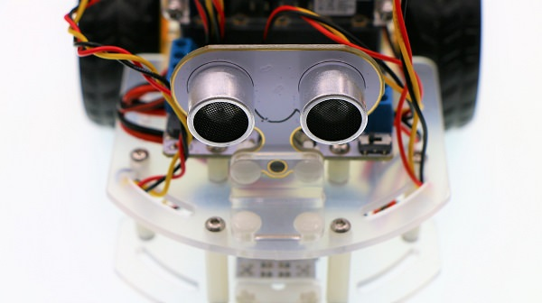
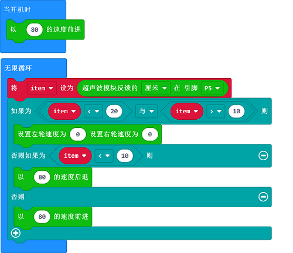

# 案例02 保持距离

## 目的
---

- 使用motor:bit智能车载套件完成保持一定距离功能。

## 使用材料
---

- 1 x motor:bit 智能车载套件

## 背景知识
---
### 什么是超声波
- [超声波](https://zh.wikipedia.org/wiki/%E8%B6%85%E8%81%B2%E6%B3%A2)是一种频率高于20000赫兹的声波，它的方向性好，穿透能力强，易于获得较集中的声能，在水中传播距离远，可用于测距、测速、清洗、焊接、碎石、杀菌消毒等。超声波因其频率下限大于人的听觉上限而得名。

### 超声波测距原理
- 超声波发射器向某一方向发射超声波，在发射时刻的同时开始计时，超声波在空气中传播，途中碰到障碍物就立即返回来，超声波接收器收到反射波就立即停止计时。根据接收器接到超声波时的时间计算距离，与雷达测距原理相似。
- 

## 硬件连接图
---

如图所示，将超声波模块连接到P5引脚。

## 软件
---
[微软makecode](https://makecode.microbit.org/#)在线积木块编程[https://makecode.microbit.org/#](https://makecode.microbit.org/#)

## 编程
---
### 步骤 1
在MakeCode的代码抽屉中点击高级，查看更多代码选项。

为了给motorbit主板编程，我们需要添加一个代码库。在代码抽屉底部找到“扩展”，并点击它。这时会弹出一个对话框。搜索“motorbit"，然后点击下载这个代码库。

注意：如果你得到一个提示说一些代码库因为不兼容的原因将被删除，你可以根据提示继续操作，或者在项目菜单栏里面新建一个项目。

### 步骤 2

- 在`当开机时`积木块中插入`以...的速度前进`积木块，设置参数为80，表示上电时以80的速度前进。
- 将超声波初始化为以厘米为单位，读取P5引脚，返回值赋值给`item`变量。
- 如果返回的参数大于10并且小于20，设置左右电机速度为0，停车。
- 如果返回的参数小于10，设置电机以80的速度倒车。
- 如果返回的参数都不符合，设置电机以80的速度前进。

### 程序
请参考程序连接：[https://makecode.microbit.org/_5uq9T8d0p6hP](https://makecode.microbit.org/_5uq9T8d0p6hP)

你也可以通过以下网页直接下载程序。

<iframe style="position:absolute;top:0;left:0;width:100%;height:100%;" src="https://makecode.microbit.org/#pub:_5uq9T8d0p6hP" frameborder="0" sandbox="allow-popups allow-forms allow-scripts allow-same-origin"></iframe>
  
---

## 结论
---
- 车辆上电以80的速度向前直行，当用手挡住车辆前进方向20cm至10cm之间时，车辆停止运动，当手再次向车辆靠近且距离小于10cm时，车辆往后倒退到距离大于5cm后停止。

## 思考
---

## 常见问题
---

## 相关阅读  
---

