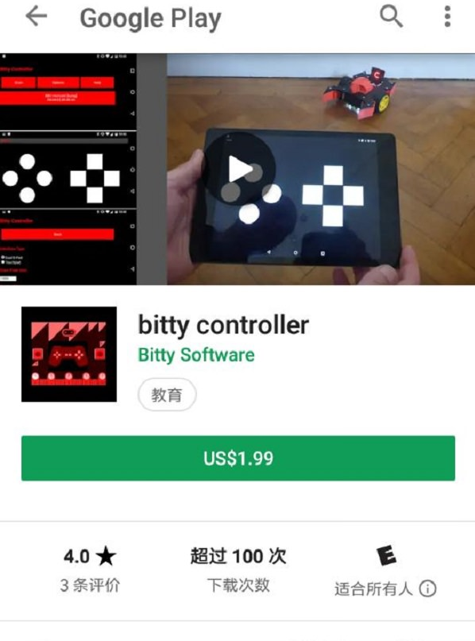
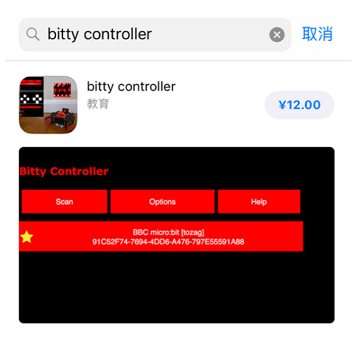
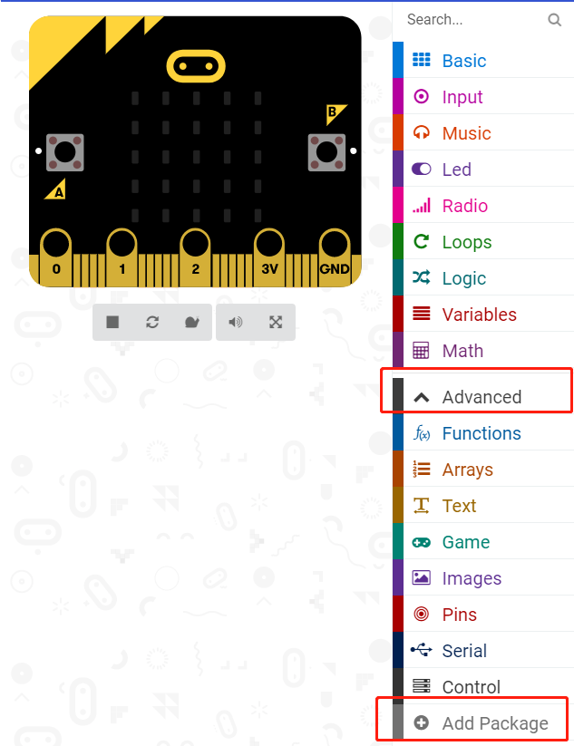
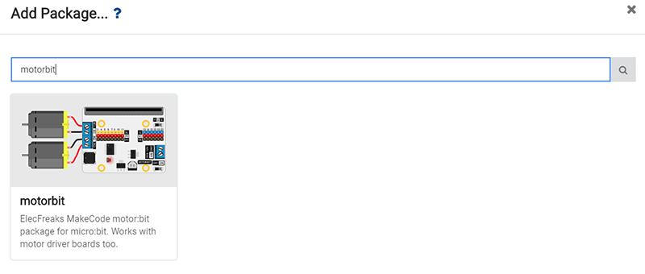
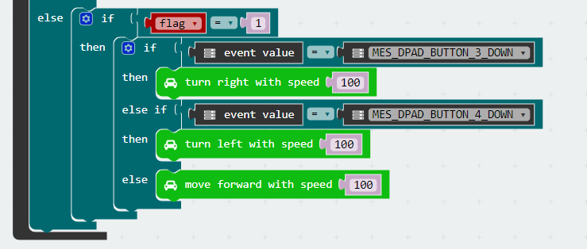
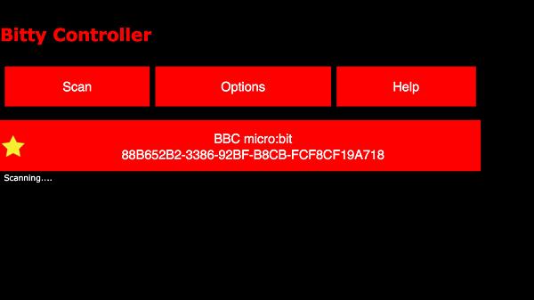

# 案例06 蓝牙控制

基于motor:bit小车，使用手持移动设备通过蓝牙操控小车前进后退转弯。

## 使用材料
---

- 1 x motor：bit套件
- 1 x bitty controller

## 背景知识
---
- [蓝牙（ Bluetooth® ）](https://baike.baidu.com/item/%E8%93%9D%E7%89%99/102670?fr=aladdin)：是一种无线技术标准，可实现固定设备、移动设备和楼宇个人域网之间的短距离数据交换（使用2.4—2.485GHz的ISM波段的UHF无线电波），蓝牙可连接多个设备，克服了数据同步的难题。

- [Bittysoftware](http://www.bittysoftware.com/index.html)：提供与BBC micro：bit等设备配合使用的智能手机应用程序及工具。

### 蓝牙事件信息

每从蓝牙接收到一条数据会引发一个事件，根据事件信息表来判断发生事件后如何处理。

事件分为事件发生来源，和事件值。需要根据事件来源获取事件，根据事件值判断发生了什么事件。

下图为D-Pad控制手柄事件表。

## 软件环境
---
- 使用任意一款常用浏览器打开[微软Makecode](https://makecode.microbit.org/#)在线积木块编程。

## 操作步骤
---
### 步骤 1：准备APP

1. 安卓设备：在Google play下载bitty controller应用软件；

2. IOS 设备：在 APP store 下载bitty controller应用软件。

-  APP界面如图所示：

**注意：** 因IOS系统限制，在IOS系统下连接蓝牙需要使用其他软件。

请参见：《IOS系统下连接micro:bit操作手册》

### 步骤2：设置蓝牙模式

开启micro:bit的蓝牙模式，需要同时按下按键A＋B然后按一下reset键，5X5点阵会显示 **PAIRING MODE！** 和一个特殊符号，特殊符号每个microbit都不同，为蓝牙的特殊标识符。

在IOS设备或者Android设备配对连接蓝牙后，micro:bit点阵显示屏显示一个对勾√。

### 步骤3：添加Package

在MakeCode的代码抽屉中点击Advanced，查看更多代码选项。

为了给蓝牙和Robit编程，我们需要添加一个代码库。在代码抽屉底部找到“Add Package”，并点击它。这时会弹出一个对话框。搜索“bluetooth"和“motorbit”，然后点击下载这两个代码库。

注意：如果你得到一个提示说一些代码库因为不兼容的原因将被删除，你可以根据提示继续操作，或者在项目菜单栏里面新建一个项目。

### 步骤4：编写积木块程序

初始化时显示EF-motorbit标题，在蓝牙连接时在点阵LED显示T，断开蓝牙连接显示F。

同时为了防止误操作导致不良后果，在蓝牙连接和断开的时候设置电机转速为0。

设置事件发生积木块，事件发生来源为`MES_DPAD_CONTROLLER_ID`，也就是手机APP的手柄控制板。

事件信息为`MICROBIT_EVT_ANY`，获取所有信息。

如果事件信息为`MES_DPAD_BUTTON_A_DOWN`，查询蓝牙事件信息表，得知信息为左方向键上箭头按下，故设置运行状态为1(前进状态)，同时设置左右轮电机全速前进。

如果信息事件为`MES_DPAD_BUTTON_A_UP`，查询蓝牙事件信息表，得知信息为左方向键上箭头抬起，故设置运行状态为0(停止状态)，同时设置左右轮电机全部停止。

在flag为1前进状态下的时候，如果事件信息为`MES_DPAD_BUTTON_3_DOWN`，查询蓝牙事件信息表，得知信息为右方向键右按钮按下，故右转

在flag为1前进状态下的时候，如果事件信息为`MES_DPAD_BUTTON_4_DOWN`，查询蓝牙事件信息表，得知信息为右方向键左按钮按下，故左转。

如果在flag为1前进状态下的时候，收到的事件信息不为以上两种，则设置速度为100全速前进。

### 步骤5：蓝牙连接

将micro:bit设置为蓝牙模式后，连接蓝牙，在APP中点击scan获取micro:bit板。

点击获取到的micro:bit板，进入手柄模式，如下图所示。

尽情操控吧！

**温馨提示：** bitty controller详细操作请参考[官方网站](http://www.bittysoftware.com/apps/bitty_controller.html)

### 程序

请参考程序连接：[https://makecode.microbit.org/_2baXF8MeMKmf](https://makecode.microbit.org/_2baXF8MeMKmf)

你也可以通过以下网页直接下载程序。

<iframe style="position:absolute;top:0;left:0;width:100%;height:100%;" src="https://makecode.microbit.org/#pub:_2baXF8MeMKmf" frameborder="0" sandbox="allow-popups allow-forms allow-scripts allow-same-origin"></iframe>
  
---
**注意：** 速度设计过低时可能影响电机转动。

## 结论
---
蓝牙连接点阵显示T，断开连接显示F。

控制板左方向键上按键控制小车前进，右方向键左右按键控制转向。

## 思考
---
如果要倒车和倒车时候左右转弯该如何编写代码？

## 常见问题
---

