# Ring:bit 六合一搭建套件案例03：温控风扇

## 目的
---

- 使用Ringbit_Bricks_Pack套件制作一台温控风扇

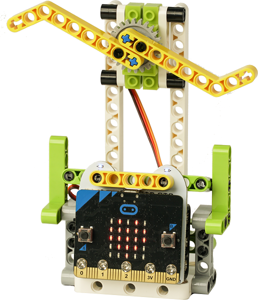

## 使用材料
---

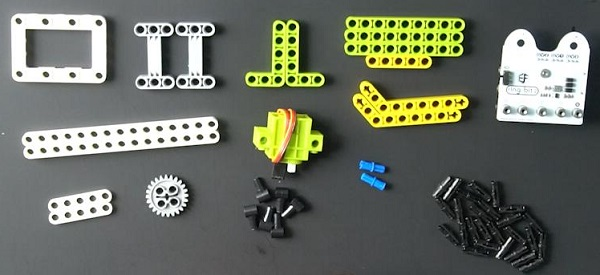

## 背景知识
---

## 积木搭建
---

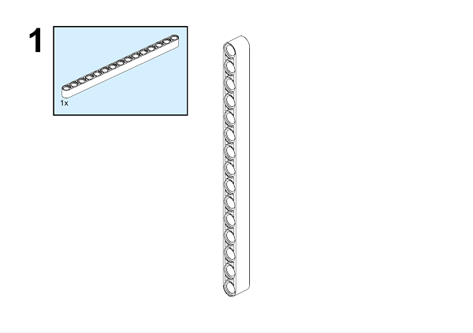

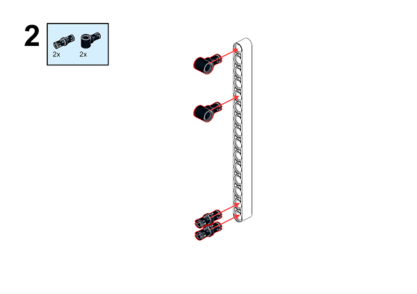

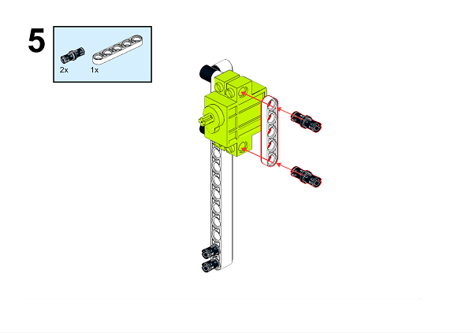

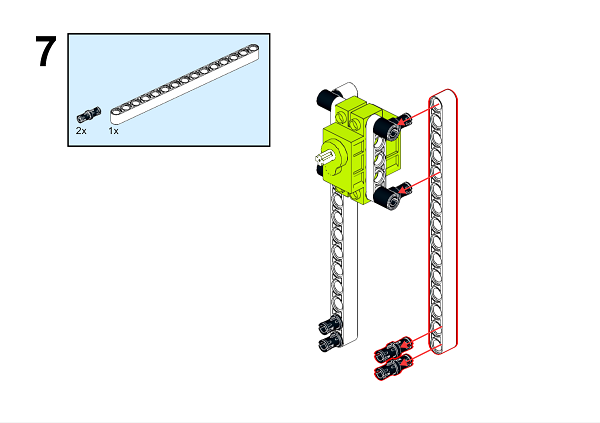

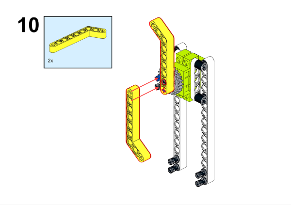

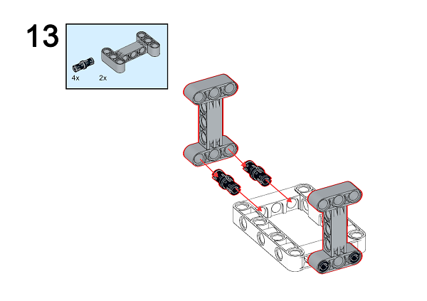

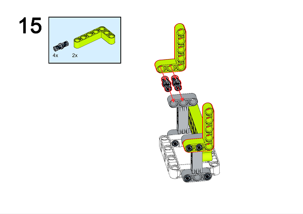

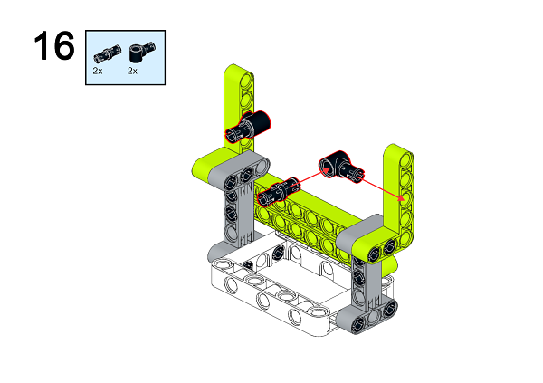

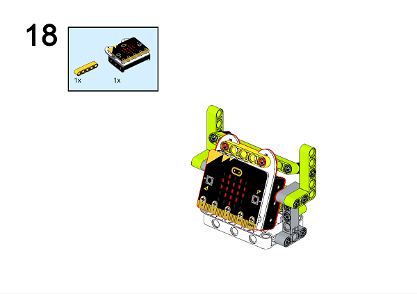

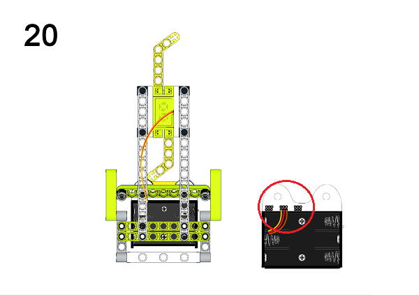

通过下面链接下载PDF文档即可获得详细的搭建步骤图

[Github下载 ](https://github.com/elecfreaks/learn-cn/raw/master/microbitKit/ring_bit_bricks_pack/files/wenkongfengshang.pdf)

## 软件
---

[微软makecode](https://makecode.microbit.org/#)

## 编程
---

### 步骤 1
 在MakeCode的代码抽屉中点击“高级”，查看更多代码选项。

为了给Ringbit_Bricks_Pack套件编程，我们需要添加一个扩展库。在代码抽屉底部找到“扩展”，并点击它。这时会弹出一个对话框，搜索”servo”，然后点击下载这个代码库。

*注意：*如果你得到一个提示说一些代码库因为不兼容的原因将被删除，你可以根据提示继续操作，或者在项目菜单栏里面新建一个项目。

### 步骤 2

在`无限循环`中判断`温度`积木块的返回值，当温度大于28°C时，设置连接到P0的舵机转动，当温度小于26°C时，设置连接到P1的舵机停止转动。

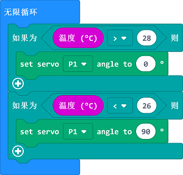

*注意：*由于我们使用的是360°舵机，而Makecode的servo扩展库是适用于180°舵机的，所以在使用360°舵机的时候，设置舵机转动到0°或者180°会使舵机顺时针转动或者逆时针转动，当设置舵机转动到90°时，舵机停止转动。

### 程序

请参考程序连接：[https://makecode.microbit.org/_d04JoJDzj6aX](https://makecode.microbit.org/_d04JoJDzj6aX)

你也可以通过以下网页直接下载程序。

<iframe style="position:absolute;top:0;left:0;width:100%;height:100%;" src="https://makecode.microbit.org/#pub:_d04JoJDzj6aX]" frameborder="0" sandbox="allow-popups allow-forms allow-scripts allow-same-origin"></iframe>
  

### 现象
---
当检测到温度大于28°C时则风扇转动，当检测到温度小于26°C时则风扇停止转动。

## 思考
---

## 常见问题
---
## 相关阅读  
---
机械风扇起源房顶上，1829年，一个叫詹姆斯·拜伦的美国人从钟表的结构中受到启发，发明了一种可以固定在天花板上，用发条驱动的机械风扇。这种风扇转动扇叶带来的徐徐凉风使人感到欣喜，但得爬上梯子去上发条，很麻烦。

1872年，一个叫约瑟夫的法国人又研制出一种靠发条涡轮启动，用齿轮链条装置传动的机械风扇，这个风扇比拜伦发明的机械风扇精致多了，使用也方便一些。

1880年，美国人舒乐首次将叶片直接装在电动机上，再接上电源，叶片飞速转动，阵阵凉风扑面而来，这就是世界上第一台电风扇。
