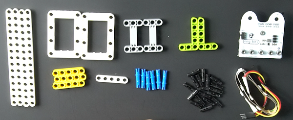
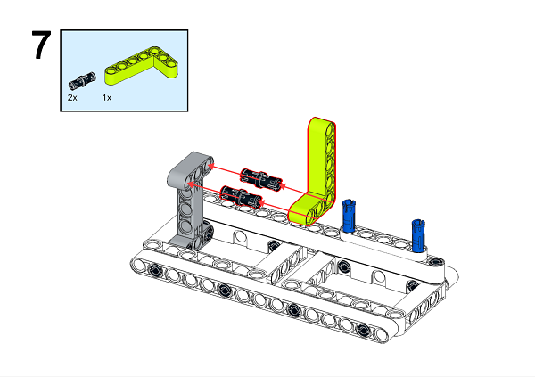
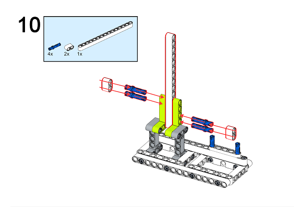
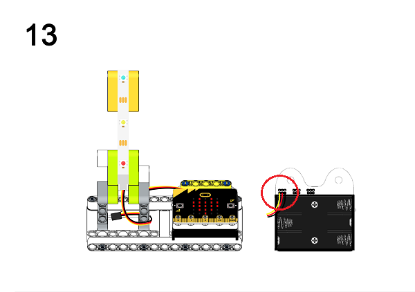
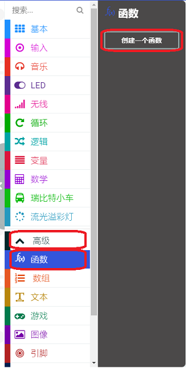
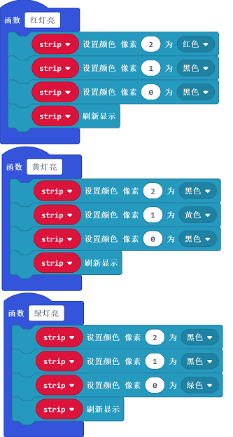

# Ring:bit六合一搭建套件案例01：交通灯

## 目的
---

- 使用Ring:bit六合一搭建套件制作交通灯

## 使用材料
---

## 背景知识
---

## 积木搭建
---

***注意：接线时黄色线需要连接在端口上方标有数字（0/1/2）的位置。

通过下面链接下载PDF文档即可获得详细的搭建步骤图
[Github下载 ](https://github.com/elecfreaks/learn-cn/raw/master/microbitKit/ring_bit_bricks_pack/files/Ringbit_Bricks_Pack_step_01_v1.1.pdf)

## 软件
---

[微软makecode](https://makecode.microbit.org/#)

## 编程
---

### 步骤 1
 在MakeCode的代码抽屉中点击“高级”，查看更多代码选项。

为了给Ringbit_Bricks_Pack套件编程，我们需要添加一个扩展库。在代码抽屉底部找到“扩展”，并点击它。这时会弹出一个对话框，搜索”Ringbit”，然后点击下载这个代码库。

*注意：*如果你得到一个提示说一些代码库因为不兼容的原因将被删除，你可以根据提示继续操作，或者在项目菜单栏里面新建一个项目。

### 步骤 2

在`当开机时`中插入`将strip设为流光溢彩灯连接引脚`积木块，设置为`P0`口。初始化灯带`3`颗LED（模式`RGB(GRB顺序)`）。

### 步骤 3

如图所示，在MakeCode的代码抽屉中点击“高级”，并选择“函数”，并点击“创建一个函数”。

### 步骤 4

如图所示，输入函数名“红灯亮”点击完成，创建一个函数，用同样的方法创建“黄灯亮”和“绿灯亮”函数。

### 步骤 5

如图所示，在“红灯亮”函数中设置第3颗LED灯为红色，其他两个灯为黑色；在“黄灯亮”函数中设置第2颗LED灯为黄色，其他两个灯为黑色；在“绿灯亮”函数中设置第1颗LED灯为绿色，其他两个灯为黑色。

### 步骤 6

如图所示，在“无限循环中”调用“红灯亮”函数，然后暂停3000ms；调用“黄灯亮”函数，然后暂停1000ms；调用“绿灯亮”函数，然后暂停3000ms.

### 程序

请参考程序连接：[https://makecode.microbit.org/_JvyADy1vH4y5](https://makecode.microbit.org/_JvyADy1vH4y5)

你也可以通过以下网页直接下载程序。

<iframe style="position:absolute;top:0;left:0;width:100%;height:100%;" src="https://makecode.microbit.org/#pub:_JvyADy1vH4y5]" frameborder="0" sandbox="allow-popups allow-forms allow-scripts allow-same-origin"></iframe>
  

### 现象

当电源接通后，红灯亮3秒，然后黄灯亮1秒，最后绿灯亮3秒。

## 思考
---

## 常见问题
---
## 相关阅读  
---
1868年12月10日，第一盏信号灯在伦敦议会大厦的广场上诞生，由当时英国机械师德·哈特设计、制造，灯柱高7米，挂着一盏红、绿两色的提灯--煤气交通信号灯（由值勤警察手动控制灯的颜色转换），这是城市街道的第一盏信号灯。不幸的是这盏面世23天的煤气交通信号灯突然爆炸自灭，使一位正在值勤的警察也因此断送了性命。从此，城市的交通信号灯被取缔了。
直到1914年，在美国的克利夫兰市才率先恢复了红绿灯（电气信号灯）。
1918年，美国底特律的交警威廉·波茨发明了第一盏由红绿黄三色组成的信号灯。

