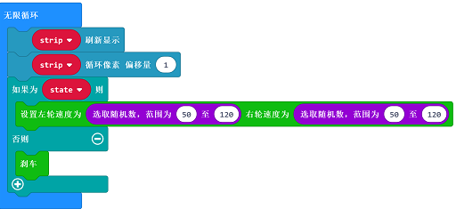

# 案例07 侧翻检测

## 目的
---

- 让Ring:bit智能车实现侧翻检测的功能。

## 使用材料
---

- 1 x Ring:bit Car 套件

## 硬件连接图
---
- Ring:bit扩展版的P1口连接左轮舵机，P2口连接右轮舵机。

## 软件平台
---
[微软 makecode](https://makecode.microbit.org/#)
 

## 编程
---
### 步骤 1
- 在MakeCode的代码抽屉中点击Advanced，查看更多代码选项。

- 为了给Ring:bit套件编程，我们需要添加一个代码库。在代码抽屉底部找到“Add Package”，并点击它。这时会弹出一个对话框。搜索“ringbit"，然后点击下载这个代码库。

注意：如果你得到一个提示说一些代码库因为不兼容的原因将被删除，你可以根据提示继续操作，或者在项目菜单栏里面新建一个项目。

### 步骤 2
---
- 从Basic中拖出一个`on start`积木块，为了让小车更加炫酷，调用小车的ranbowled发出渐变的彩色光芒，从Neopixel函数库中加入控制彩虹灯的set函数，设置彩虹灯的变化值为1-360。
然后初始化ring:bit扩展板的P1，P2口分别对应小车左右轮胎。

### 步骤 3
---
- 在variables函数库中设置一个名为state的变量，用来控制小车的运行状态。
然后从input函数库中，拖入和micro:bit状态有关的6种触发状态，当logo up触发时设置state变量为真值，其他的5种状态触发时都设置为假值。

### 步骤 4
---
- 在`forever`循环中设置彩虹灯发出七彩灯光，设置灯光颜色渐变。
根据state的值，控制小车的运行，当小车的车身状态为正常状态时，设置小车以随机方式运动。
当车身状态为翻转状态时，停止小车运行。

### 程序

请参考程序连接：[https://makecode.microbit.org/_asoLxTRz4Dg2](https://makecode.microbit.org/_asoLxTRz4Dg2)

你也可以通过以下网页直接下载程序。

<iframe style="position:absolute;top:0;left:0;width:100%;height:100%;" src="https://makecode.microbit.org/#pub:_asoLxTRz4Dg2" frameborder="0" sandbox="allow-popups allow-forms allow-scripts allow-same-origin"></iframe>
  
---

## 结论
---

- 小车正常运行，当小车翻倒后，小车停止运动。

## 思考
---

- 能不能借助一些其他的套件的传感器模块，让小车有更出色的发挥？

## 常见问题
---

## 相关阅读  
---

