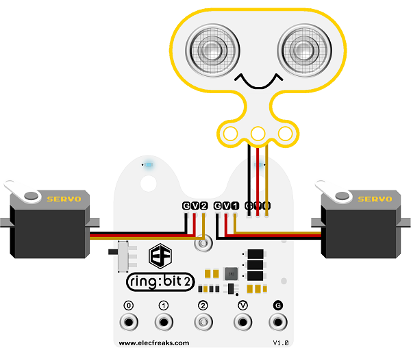
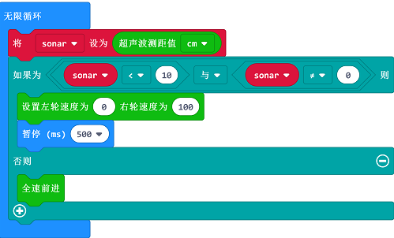

# 案例10 智能防撞小车

## 目的
---
- 使用Ringbit二代小车扩展超声波模块后完成智能防撞。

## 使用材料
---
- [Ring:bit Car 套件（淘宝购买链接）](https://item.taobao.com/item.htm?ft=t&id=608540718403)
- [micro:bit主板（淘宝购买链接）](https://item.taobao.com/item.htm?ft=t&id=562621059348)
- [Ringbit二代小车专用超声波模块Sonar:bit（淘宝购买链接）](https://item.taobao.com/item.htm?ft=t&id=608540718403)

## 硬件连接图
---
- Ring:bit扩展版的P1口连接左轮舵机，P2口连接右轮舵机，超声波模块连接到P0口。

## 软件平台
---
[微软makecode](https://makecode.microbit.org/#)在线积木块编程[https://makecode.microbit.org/#](https://makecode.microbit.org/#)

## 编程
---
### 步骤 1
- 在MakeCode的代码抽屉中点击Advanced，查看更多代码选项。

- 为了给Ring:bit套件编程，我们需要添加一个代码库。在代码抽屉底部找到“Extensions”，并点击它。这时会弹出一个对话框。搜索“ringbit"，然后点击下载这个代码库。

注意：如果你得到一个提示说一些代码库因为不兼容的原因将被删除，你可以根据提示继续操作，或者在项目菜单栏里面新建一个项目。

### 步骤 2

- 在`On start`积木块中插入设置左右轮舵机连接口积木块，端口号以实际舵机连接端口为准。
- 全速向前行驶。

### 步骤 3

- 在`forever`(永久循环)积木块中设置`sonar`变量，并且将超声波返回值赋值给`sonar`变量。
- 插入`if`判断积木块，判断`sonar`值是否小于10，并且不等于0。
- 如果是，设置右轮速度为100，左轮速度为0，延时500ms，完成左转避障。
- 如果不是，全速前进。

### 参考代码

请参考程序连接：[https://makecode.microbit.org/_RTwFcMeA1MMY](https://makecode.microbit.org/_RTwFcMeA1MMY)

你也可以通过以下网页直接下载程序。

<iframe style="position:absolute;top:0;left:0;width:100%;height:100%;" src="https://makecode.microbit.org/#pub:_RTwFcMeA1MMY" frameborder="0" sandbox="allow-popups allow-forms allow-scripts allow-same-origin"></iframe>
  
---

## 结论
---
- Ring:bit小车在前方10cm处有障碍时会自动左转避障。

## 思考
---
- 问:为什么要判断不等于0
- 答:超声波超出检测范围返回值也是0

## 常见问题
---

