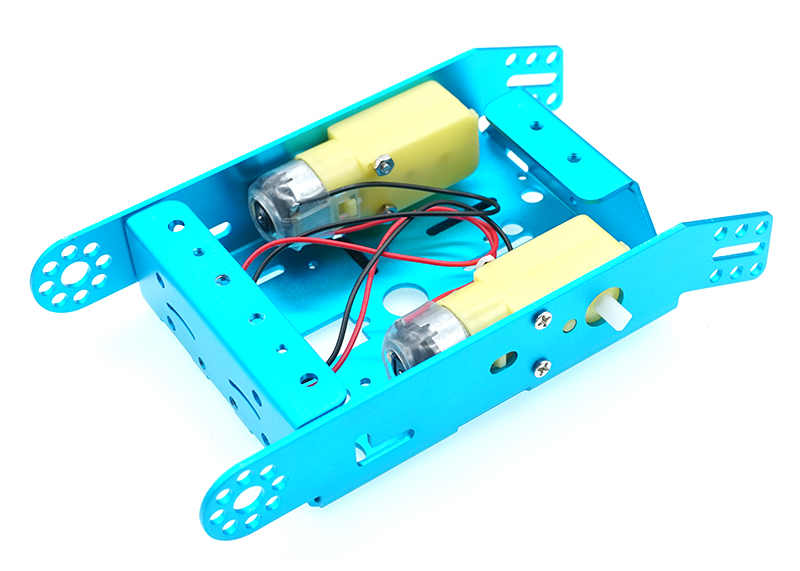
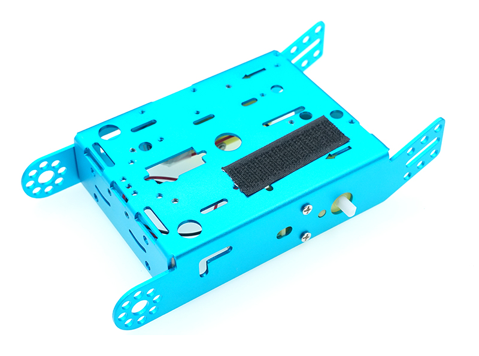
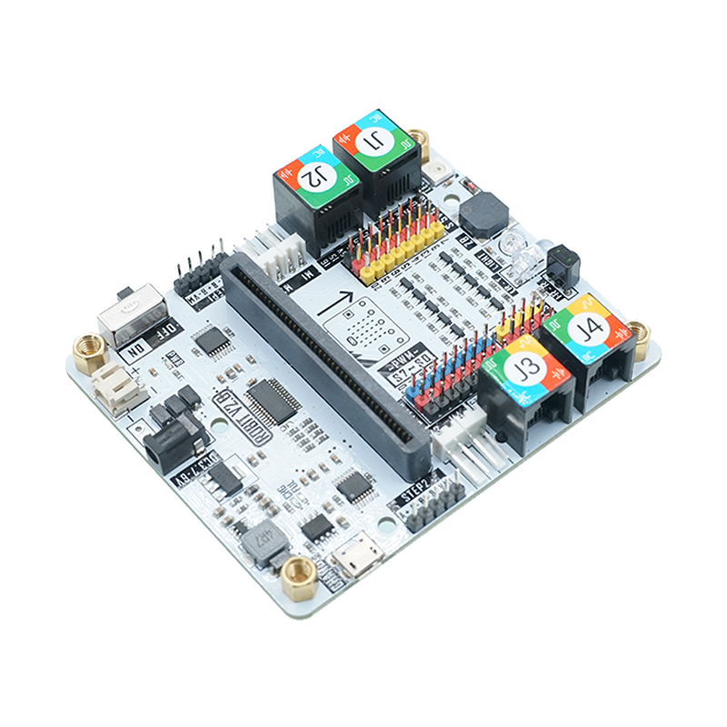
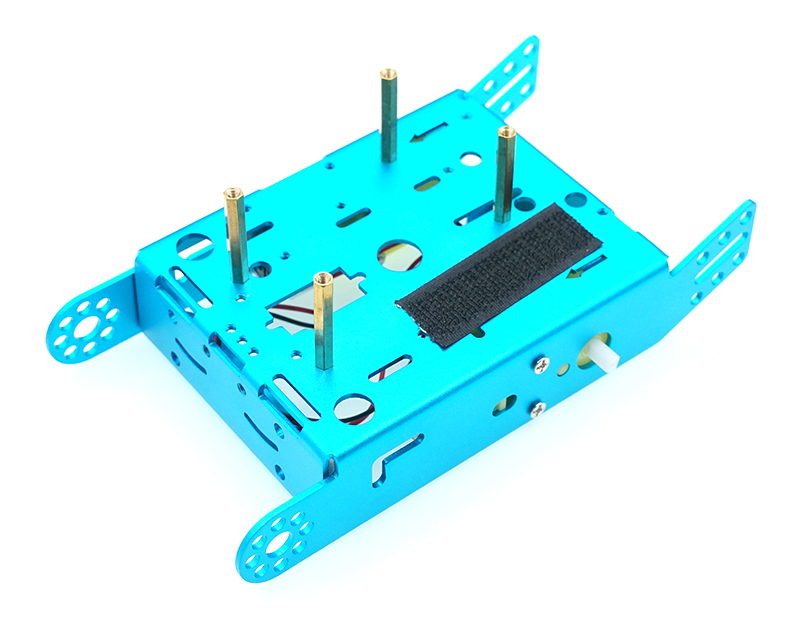
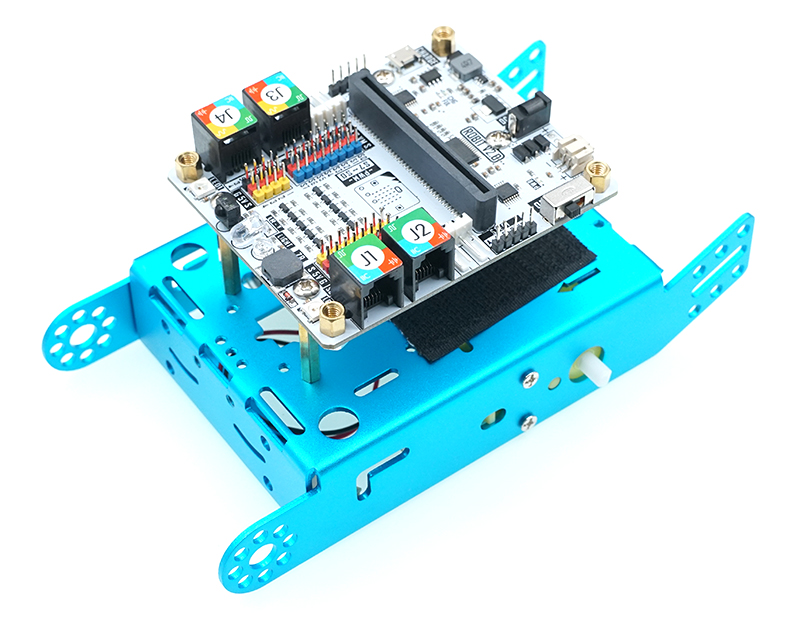
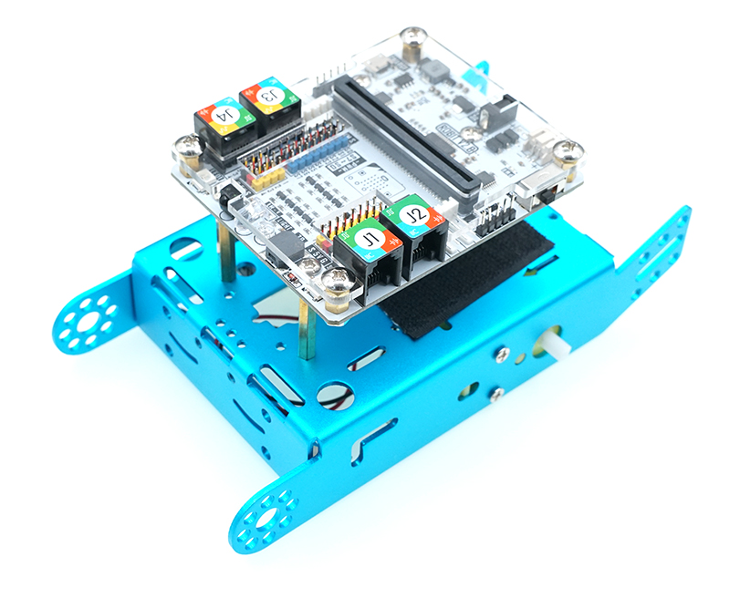
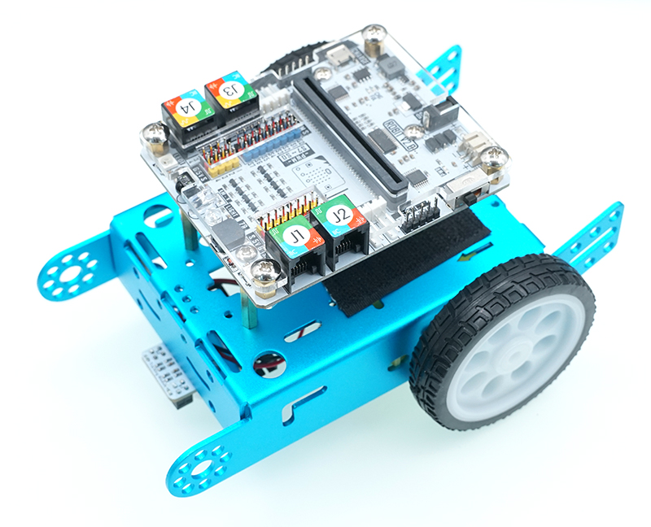
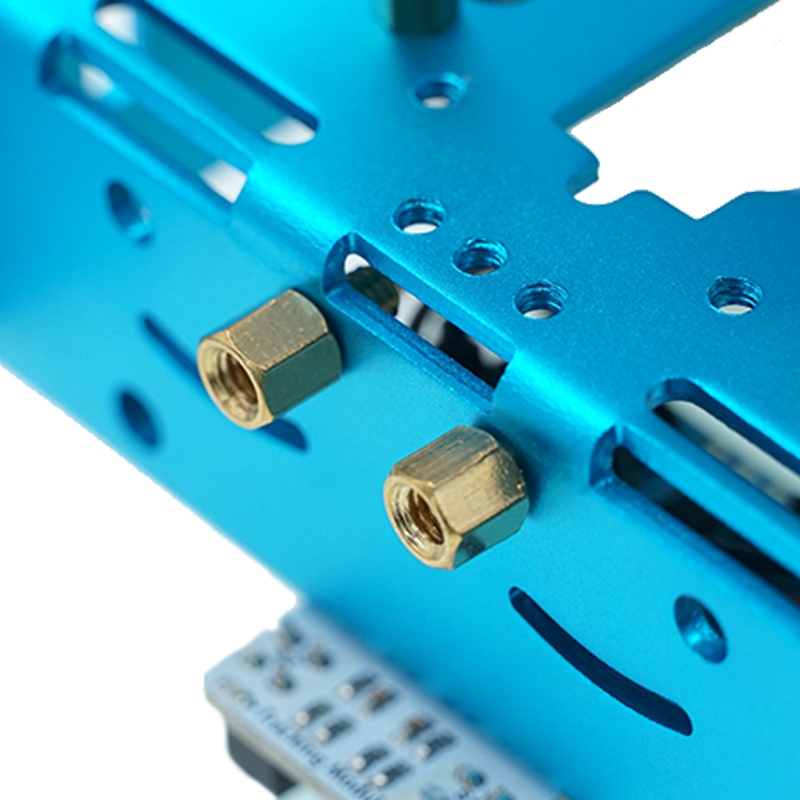
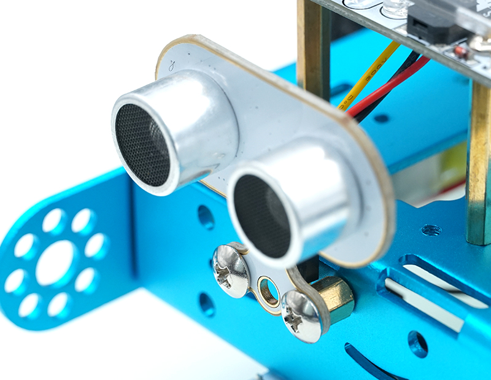
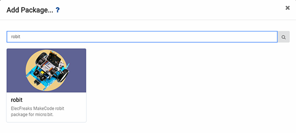

# robit智能小车介绍

## 简介  
---
robit smart car是基于micro:bit的一个智能小车,它的核心扩展板是robit。robit除了继承了Mbot上的RJ25接线端口、电机接口之外，还扩展2路直流电机接口、两路步进电机口（步进电机接口与4路直流电机接口复用），8路PWM信号输出接口，可以驱动舵机等PWM信号驱动的设备，板载8路G-5V-S数字信号OCTOPUS电子积木接口，4路G-5V-S模拟信号OCTOPUS电子积木接口。robit smart car可以实现Mbot的所有功能，可以说的上是基于micro:bit的Mbot的升级版。

### 特点
---
- 支持4路直流电机驱动，2路步进电机驱动。
- 8路PWM信号输出接口。
- 板载8路G-5V-S数字信号OCTOPUS电子积木接口。
- 板载4路G-5V-S模拟信号OCTOPUS电子积木接口。
- 直流电源供电输入电压：DC 3.7V-6V。
- 锂电池供电输入电压：DC 3.7-4.2V。

### 技术参数
---
- 品名：robit智能小车
- SKU：EF08195
- 版本号：V1.0
- 电机种类：TT马达
- 驱动轮数目：2 
- 巡线模块：有
- 超声波：有
- 电源：锂电池
- 净重：426g
- 组装后尺寸：170mm X 128mm X 98mm

## 零件清单
---
- 底盘 x 1
- Robit x 1
- 超声波 x 1
- 双路寻线模块 x 1
- TT马达 x 2
- 电池 x 1
- 螺丝包 x 1

## 底盘安装图纸
---
### 第一步：使用4颗M3*25沉头螺丝安装TT马达

### 第二步：将魔术贴的勾面粘在车架上

### 第三步：将4颗M4*6单通铜柱安装在Robit正面

### 第四步：在底盘上紧固四个M3×30单通铜管

### 第五步：用四个M3*5螺钉将Robit板固定到底盘上

### 第六步：用M4*5螺钉安装亚克力外板

### 第七步：使用2颗M4*10沉头螺丝安装万向轮和巡线模块 

### 第八步：安装轮胎

### 第九步：在车头位置装上2颗M4*6+6单通铜柱

### 第十步：使用2颗M4*5螺丝安装超声波模块

### 第十一步：将魔术贴的毛面贴在电池上

### 第十二步：将电池粘在转接板上，插在主板上

### 成品示意图
---

## 示例代码
点击  **“Add Package”**，输入 **“robit”** 点击搜索，添加robit的软件包

### 下面是上小车前进的示例代码，下载完成后，小车就可以前进了
[https://makecode.microbit.org/_7RrcC6R3T5MP](http://https://makecode.microbit.org/_7RrcC6R3T5MP)

## 文档
---

## 常见问题
---
