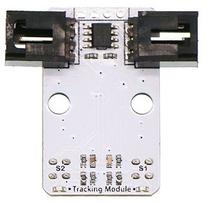
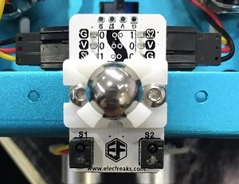
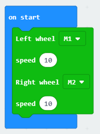
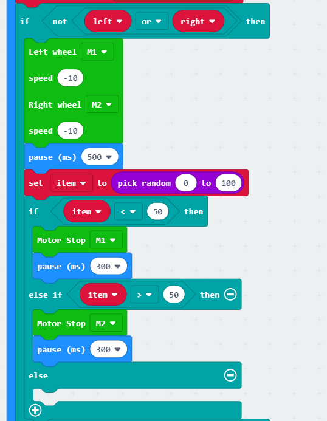

# robit智能小车案例02：边缘检测

## 目的
---

- 了解巡迹模块，认识巡迹模块。
- 使用Robit迷你小车上的巡迹模块实现边缘检测。

## 使用材料
---

- 1 x Robit智能小车

## 背景知识
---
### 寻迹原理 ###
- 该巡迹模块使用的为[红外线传感器](https://baike.baidu.com/item/%E7%BA%A2%E5%A4%96%E7%BA%BF%E4%BC%A0%E6%84%9F%E5%99%A8/9007351?fr=aladdin),模块由一个**发射端**和一个**接收端**组成，发射端发射红外线由地面反射回来由接收端接收。
- 遇到黑色地面或者其他吸收红外光材质的物品时，接收端无法接收到红外线，巡迹模块返回1。

### 双路寻迹模块模块 ###

- 两路巡线模块电子积木集成了两组反射式红外对管，可通过它来识别黑线。两个3P带锁杜邦接口和一个4P焊盘，能够直接用两个GVS线连接连接两个3P杜邦接口，接线十分方便。通常应用该模块来做巡线智能小车，我们可以任意设计黑线轨迹，通过编程使小车按我们设计的黑线轨迹行驶。

 

## 硬件连接图
---

如图所示，将双路巡线模块与Robit主板P13、P14口使用3pin杜邦线连接。

## 软件
---

[微软makecode](https://makecode.microbit.org/#)

## 编程
---

### 步骤 1
- 在MakeCode的代码抽屉中点击Advanced，查看更多代码选项。

- 为了给robit智能小车编程，我们需要添加一个扩展库。在代码抽屉底部找到“Extension”，并点击它。这时会弹出一个对话框。搜索“robit"，然后点击下载这个代码库。

注意：如果你得到一个提示说一些代码库因为不兼容的原因将被删除，你可以根据提示继续操作，或者在项目菜单栏里面新建一个项目。

### 步骤 2

在开机启动时初始化设置左右轮电机到M1，M2端口速度为10。

设置左右两个红外线传感器的返回值变量Left和right，读取P13和P14接口的返回参数。

如果左右红外线中至少有一个没收到反馈(检测到边缘)，设置左右电机速度为负数倒车。
随机生成一个0到100的数，如果小于50，停止电机M1完成右转向，如果大于50，停止电机M2完成左转向。

如果左右红外线传感器均未检测到，设置左右电机速度为10继续前进。

### 程序

请参考程序连接：[https://makecode.microbit.org/_gTCFqyau8Uud](https://makecode.microbit.org/_gTCFqyau8Uud)

你也可以通过以下网页直接下载程序。

<iframe style="position:absolute;top:0;left:0;width:100%;height:100%;" src="https://makecode.microbit.org/#pub:_gTCFqyau8Uud" frameborder="0" sandbox="allow-popups allow-forms allow-scripts allow-same-origin"></iframe>
  

**注意：** 可吸收红外光物体均视为黑线。

## 现象
---
Robit小车会检测到桌面边缘后退防止掉落。

## 思考
---
超声波测距显示距离为0有几种情况？

## 常见问题
---

## 相关阅读  
---

 
