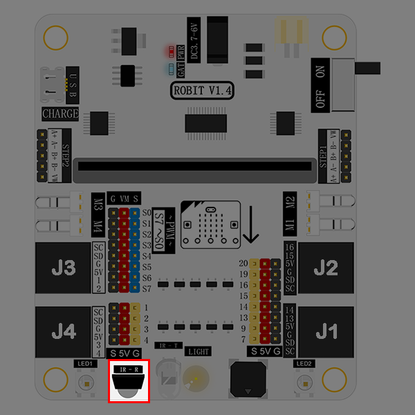
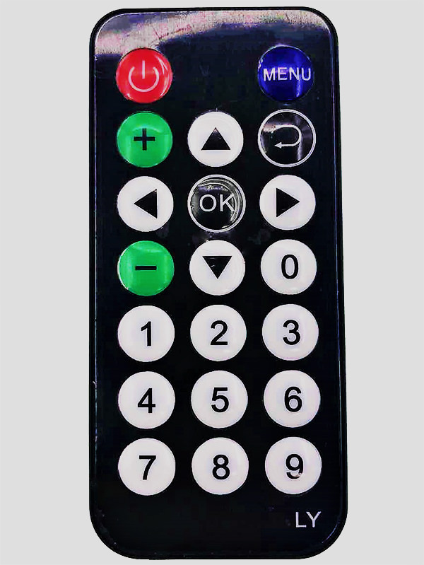

# robit智能小车案例06：反应力小游戏

## 目的
---
- 使用Robit主板上的红外线接收模块和红外线遥控器完成反应力测试小游戏。

## 使用材料
---

- 1 x Robit智能小车主板
- 1 x 红外遥控器

## 背景知识
### 光线传感器
---
[红外遥控](https://baike.baidu.com/item/%E5%85%89%E4%BC%A0%E6%84%9F%E5%99%A8/2054816)是一种广泛应用的通信和控制手段，由于其结构简单、功耗低、抗干扰能力强、可靠性高及成本低等优点而广泛应用于家用电器、工业控制和智能仪器系统中。通用红外遥控系统由发射和接收两大部分组成。应用编码/解码专用集成电路芯片来进行控制操作。

Robit主板上的搭载了一组红外遥控系统，有红外发射端和红外接收端。

## 硬件连接图
---
板载红外线接收传感器，连接在micro:bit的P8口。

带有上下左右和电源按键的红外线遥控器。

## 软件
---
[微软makecode](https://makecode.microbit.org/#)

## 编程
---
### 步骤 1
在MakeCode的代码抽屉中点击Advanced，查看更多代码选项。

为了给红外模块编程，我们需要添加一个代码库。在代码抽屉底部找到“Add Package”，并点击它。这时会弹出一个对话框。搜索“Robit"，然后点击下载这个代码库。

注意：如果你得到一个提示说一些代码库因为不兼容的原因将被删除，你可以根据提示继续操作，或者在项目菜单栏里面新建一个项目。

### 步骤 2

开机时初始化红外线接收模块为P8口，设置接收变量`receiver`,显示变量`show`，分数变量`score`，游戏轮数变量`num`。

设置当接收到红外信号为电源键按下时设置`receiver``score``num`为0，初始化游戏。如果接收到为上箭头设置`receiver`接收变量为1，下箭头同理。

创建永久循环模块，检查游戏轮数，如果等于5，一直显示游戏分数，为一轮结束。如果不等于5，则游戏尚未结束，将游戏轮数变量加1，显示321倒计时。

随机生成0到1的数字加1，随机生成两种情况，判断是否等于1，如果等于1，显示上箭头，将显示变量设置为1，延迟0.5秒。

然后判断接收变量和显示变量是否一致，如果一致，分数变量加1，将显示变量和接收变量归0，分数变量加1，显示√，延迟2秒。

如果不一致，将显示变量和接收变量归0，显示X，延迟2秒。

如果随机生成数字加1后不等于1，显示下箭头，判断流程同上，不做赘述。

### 程序
请参考程序连接：[https://makecode.microbit.org/_L9oPJWXxEJKh](https://makecode.microbit.org/_L9oPJWXxEJKh)

你也可以通过以下网页直接下载程序。

<iframe style="position:absolute;top:0;left:0;width:100%;height:100%;" src="https://makecode.microbit.org/#pub:_L9oPJWXxEJKh" frameborder="0" sandbox="allow-popups allow-forms allow-scripts allow-same-origin"></iframe>
  
---

## 结论
---
上电游戏开始，321倒计时后随机显示箭头发现，延迟0.5s判断是否按下相应箭头，如果在规定时间按下相应方向按键，则显示√，如果没有显示X，游戏共5轮，自动结束显示分数。
按下电源键重启游戏。

## 思考
---

如何添加更多反应按键？

## 常见问题
---

## 相关阅读  
---

