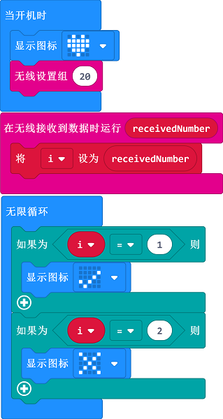

# 案例07：无线通信

## 目的
---
- 使用smart coding kit手表套件实现发送信号功能。

## 使用材料
---

- 2 x [手表套件Pro（淘宝购买链接）](https://item.taobao.com/item.htm?ft=t&id=582042009614)

## 软件
---
[微软makecode](https://makecode.microbit.org/#)

## 编程
---
### 步骤 1
- 发送端
- 当开机时显示开机图案
- 设置无线设置组
- 当按钮`A`被按下时无线发送数字1
- 当按钮`B`被按下时无线发送数字2

### 步骤 2
- 接收端
- 当开机时显示开机图案
- 设置无线设置组
- 将接收到的数字存入变量`i`
- 判断变量`i`的值，并显示相应图标

### 程序
- 发送端
- 请参考程序连接：[https://makecode.microbit.org/_ix81uXcAULqW](https://makecode.microbit.org/_ix81uXcAULqW)
- 你也可以通过以下网页直接下载程序。

<iframe style="position:absolute;top:0;left:0;width:100%;height:100%;" src="https://makecode.microbit.org/#pub:_ix81uXcAULqW" frameborder="0" sandbox="allow-popups allow-forms allow-scripts allow-same-origin"></iframe>
  

- 接收端
- 请参考程序连接：[https://makecode.microbit.org/_WpqdARYUXWMj](https://makecode.microbit.org/_WpqdARYUXWMj)
- 你也可以通过以下网页直接下载程序。

<iframe style="position:absolute;top:0;left:0;width:100%;height:100%;" src="https://makecode.microbit.org/#pub:_WpqdARYUXWMj" frameborder="0" sandbox="allow-popups allow-forms allow-scripts allow-same-origin"></iframe>
  
---

## 结论
---

- 当发送端按下按钮`A`或者`B`时，接收端显示`√`或者`×`的图案。

## 思考
---

## 常见问题

## 相关阅读  
---

