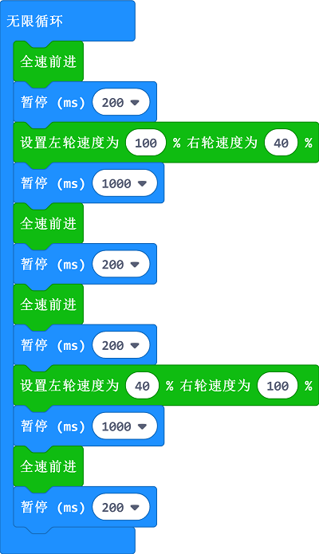

# 案例03:8字舞蹈
## 目的
---
- 让你的Cute:bot智能赛车沿着8字轨迹运行。
- Cutebot智能赛车是通过左右轮的速度差来完成转向的，是一个三轮车。

## 使用材料
---
- 1 x [Cutebot套件](https://item.taobao.com/item.htm?spm=a1z10.3-c-s.w4002-18602834180.23.78b86655ZP5Yg8&id=598365555295)

## 软件平台
---
[微软 makecode](https://makecode.microbit.org/#)

## 编程
---
### 步骤 1
- 在MakeCode的代码抽屉中点击高级，查看更多代码选项。

- 为了给Cutebot套件编程，我们需要添加一个代码库。在代码抽屉底部找到“扩展”，并点击它。这时会弹出一个对话框。搜索`Cutebot`，然后点击下载这个代码库。

注意：如果你得到一个提示说一些代码库因为不兼容的原因将被删除，你可以根据提示继续操作，或者在项目菜单栏里面新建一个项目。

### 步骤 2

- 在`当开机时`积木块中显示图标，选择一颗心；

### 步骤 4

- 在`无限循环`积木块中依次插入`全速前进`和`设置左右轮速度`积木块。
- 将8轨迹分为6段，先直行200ms，设置左轮速度大于右轮速度，完成右转1000ms，然后直行200ms，完成8字的上半段小圆圈。
- 同理，完成下半圆

### 程序

请参考程序连接：[https://makecode.microbit.org/_JwcXcFF0F82k](https://makecode.microbit.org/_JwcXcFF0F82k)

你也可以通过以下网页直接下载程序。

<iframe style="position:absolute;top:0;left:0;width:100%;height:100%;" src="https://makecode.microbit.org/#pub:https://makecode.microbit.org/_JwcXcFF0F82k" frameborder="0" sandbox="allow-popups allow-forms allow-scripts allow-same-origin">
</iframe>

  
---

## 结论
---
- 小车以8字的轨迹行进。

## 思考
---
- 如果想要让小车以一个正方形轨迹行驶，如何编程。

## 常见问题
---
## 相关阅读  
---
