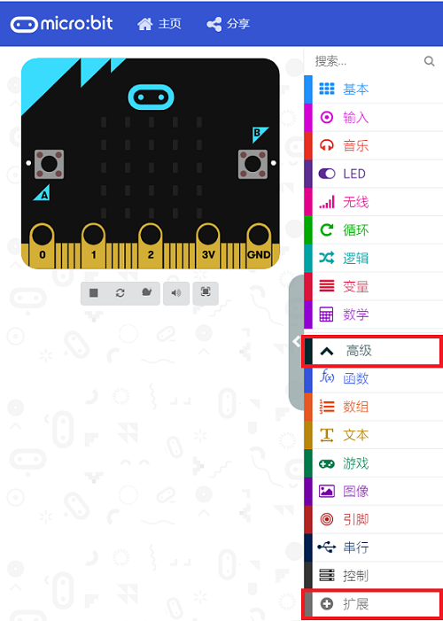
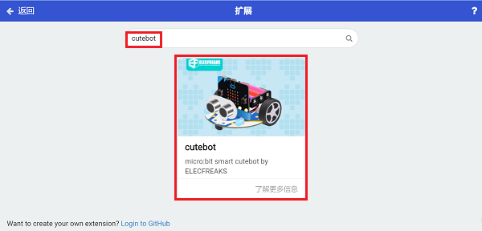
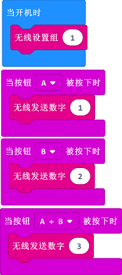

# 案例11:micro:bit远程控制

## 目的
---
- 使用另一块micorbit主板远程操控Cutebot赛车。
- 两块主板都需要编程

## 使用材料
---
- 1 x [Cutebot套件](https://www.elecfreaks.com/store/cute-bot.html)
- 1 x [micro:bit主板](https://item.taobao.com/item.htm?spm=a1z10.1-c-s.w5003-18615042388.1.410d58b3rNtft8&id=562621059348&scene=taobao_shop)

## 软件平台
---
[微软 makecode](https://makecode.microbit.org/#)

## 编程
---
### 步骤 1
- 在MakeCode的代码抽屉中点击高级，查看更多代码选项。

- 为了给Cutebot套件编程，我们需要添加一个代码库。在代码抽屉底部找到“扩展”，并点击它。这时会弹出一个对话框。搜索`Cutebot`，然后点击下载这个代码库。

注意：如果你得到一个提示说一些代码库因为不兼容的原因将被删除，你可以根据提示继续操作，或者在项目菜单栏里面新建一个项目。

### 步骤 2: 遥控器编程

- 在`当开机时`积木块中设置无线电组别为`1`；
- 当`按钮A按下`时无线发送数字`1`；
- 当`按钮B按下`时无线发送数字`2`；
- 当`按钮A+B按下`时无线发送数字`3`；

#### 程序

请参考程序连接：[https://makecode.microbit.org/_VbpXHCC4jW3T](https://makecode.microbit.org/_VbpXHCC4jW3T)

你也可以通过以下网页直接下载程序。

<iframe style="position:absolute;top:0;left:0;width:100%;height:100%;" src="https://makecode.microbit.org/#pub:https://makecode.microbit.org/_VbpXHCC4jW3T" frameborder="0" sandbox="allow-popups allow-forms allow-scripts allow-same-origin">
</iframe>

  

### 步骤 3: 小车编程

- 在`当开机时`积木块中插入显示图标积木块，设置无线电组别为`1`，一定要和遥控端设置为同一组别，否则无法匹配。
- 然后在`当无线接收到数据`积木块中插入三次判断语句，分别判断无线电接收值是否为`1`，`2`，或者`3`；
- 当无线电收到的数字为`1`时，左转；
- 当无线电收到的数字为`2`时，右转；
- 当无线电收到的数字为`3`时，直行。

#### 程序

请参考程序连接：[https://makecode.microbit.org/_MreDFh8se1LK](https://makecode.microbit.org/_MreDFh8se1LK)

你也可以通过以下网页直接下载程序。

<iframe style="position:absolute;top:0;left:0;width:100%;height:100%;" src="https://makecode.microbit.org/#pub:https://makecode.microbit.org/_MreDFh8se1LK" frameborder="0" sandbox="allow-popups allow-forms allow-scripts allow-same-origin">
</iframe>

  

## 结论
---
- 按下遥控端microbit的A+B按钮，小车直行
- 按下遥控端microbit的A按钮，小车左转
- 按下遥控端microbit的B按钮，小车右转

## 思考
---
## 常见问题
---
## 相关阅读  
---
