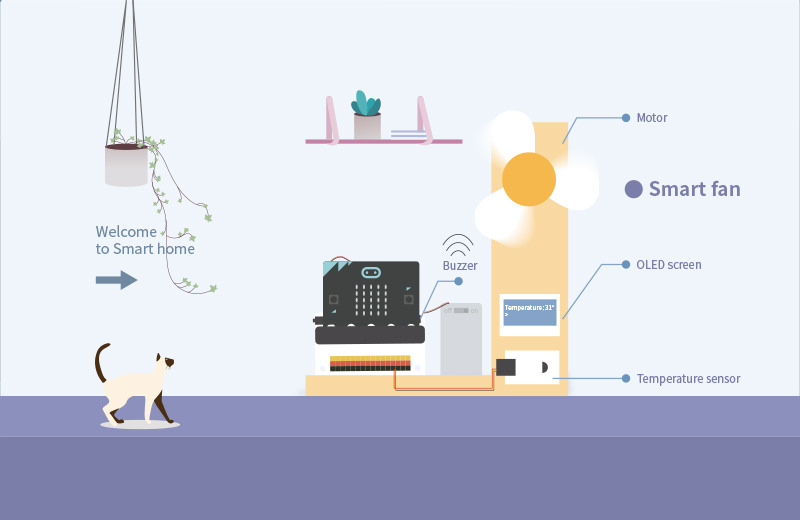
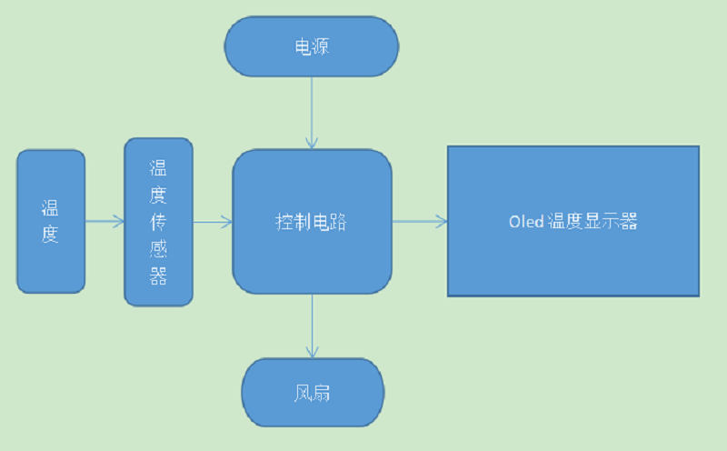
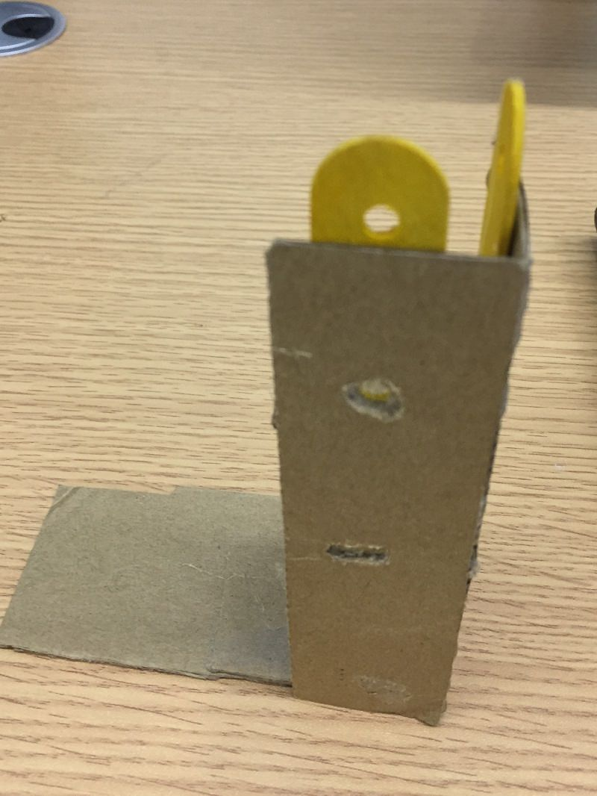
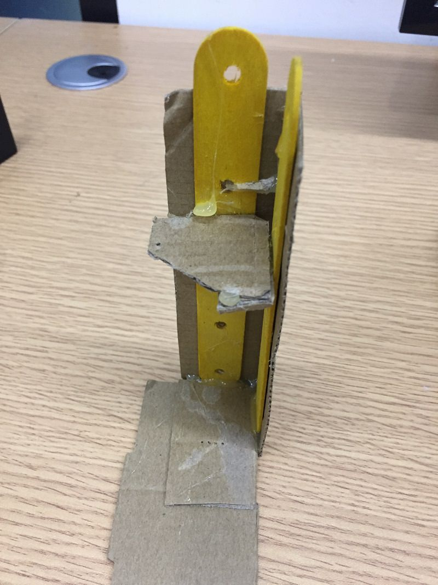
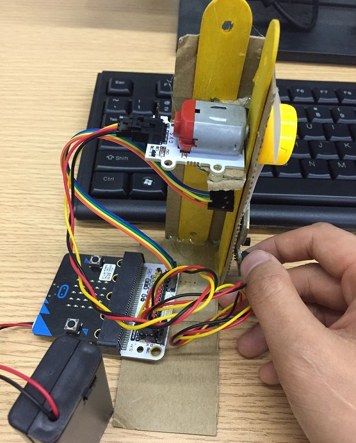
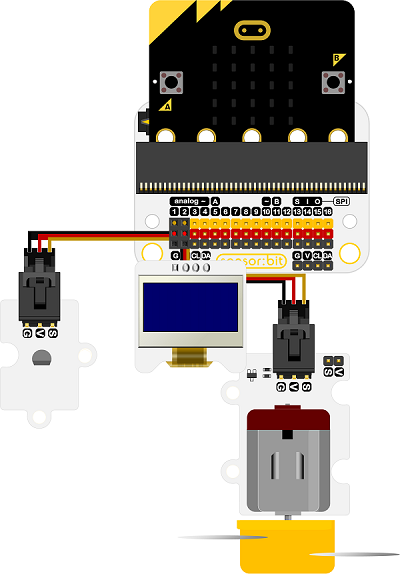
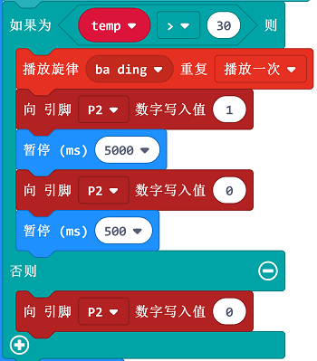
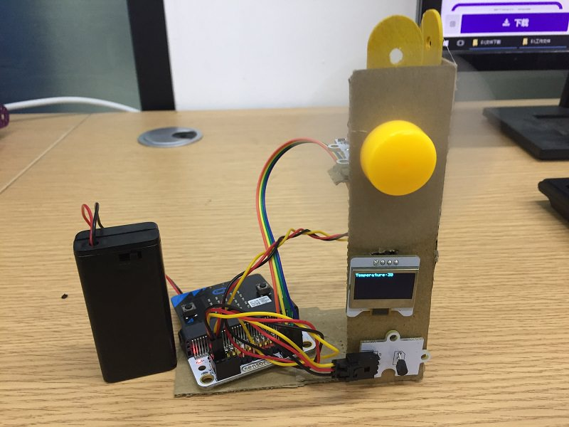
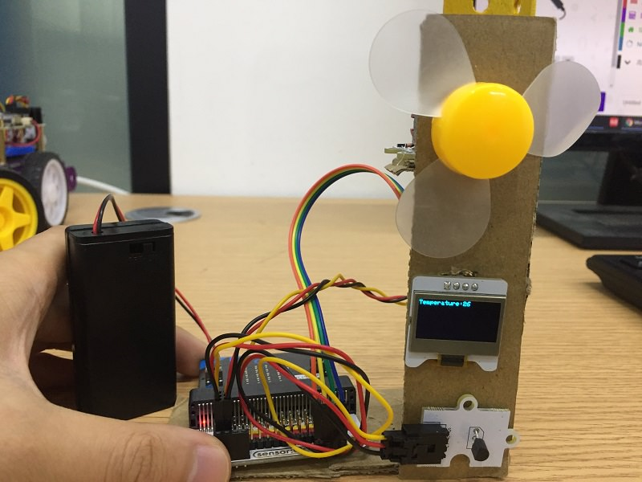

# 案例02 智能控温风扇

## 目的
---

- 制作一个智能控温风扇。

## 使用材料
---
- 1 x [智能家居套件（含主板）](https://item.taobao.com/item.htm?ft=t&id=609328225464)
- 1 x 瓦楞纸板
- 2 x 小木棍
- 1 x 胶水

## 背景知识
---  
###智能控温风扇的意义

-智能控温风扇是基于智能家居而产生的一个创意产品，从日常生活中感受科技的力量。

### 智能控温风扇原理
- 当室内温度超过30°，温度过高，影响人的正常生活，温度传感器将检测信号传输给micro:bit、，micro:bit传输信号向风扇供电，风扇将室内温度降低到30°以下后，停止转动，保证室内温度在一个合理的范围内。

## 结构场景搭建
---
准备一把美工刀和一些瓦楞纸板。

搭建成如图正面样式：

侧面

将元器件按如图摆放黏贴。

## 硬件连接图
---

注意：这里需要使用USB接口进行供电。

## 软件
---
[微软makecode](https://makecode.microbit.org/#)

IO口使用注意事项
## 编程
---
### 步骤 1
在MakeCode的代码抽屉中点击“高级”，查看更多代码选项。

为了给智慧家居套件编程，我们需要添加一个代码库。在代码抽屉底部找到“扩展”，并点击它。这时会弹出一个对话框。搜索“smarthome"，然后点击下载这个代码库。

注意：如果你得到一个提示说一些代码库因为不兼容的原因将被删除，你可以根据提示继续操作，或者在项目菜单栏里面新建一个项目。

### 步骤 2
在“基本”中拖出一个“当开机时”积木块，在OLED代码库中拖出 initialize OLED 积木块并设置为64 和128。

然后在“基本”中拖出一个“无限循环”积木块，在其中拖入变量积木块，添加一个代表温度的变量temp以及Smarthome代码库中的TMP36温度传感器积木块，将显示单位设置为温度而不是华氏温度，将绑定引脚设置为p1口。

### 步骤 3

现在我们来写关于OLED显示的积木代码模块。

拖入clear OLED display积木块用于将OLED显示器清空。

紧接着拖入show（without newline）string以及show （without newline）number分别用来显示“temperature”字符串以及temp这个变量的数值，这里使用without newline是为了在OLED显示器上能够换行显示这个字符串以及温度数值。

### 步骤 4

写入逻辑积木块，当温度大于30°时调用microbit来控制风扇的运转，那么temp也就是温度的值大于30°将会是一个判断条件，因此我们首先从logic函数库中拖入if else积木块，在判定条件中设置temp>30为判断成立的条件。

### 步骤 5

当温度大于30°后，所以我们添加“音乐”函数库中的“播放旋律”积木块，将提示音设置为ba ding，提示次数为一次，然后使用microbit发送指令给p2引脚连接风扇模块，设置风扇工作5秒钟后，停止工作5秒钟，然后继续由温度感应模块获取温度值后判定是否进入循环。
当条件判定不成立的时候一直保持风扇为静止状态。

### 程序

请参考程序连接：[https://makecode.microbit.org/_0k3HkV5DzWeq](https://makecode.microbit.org/_0k3HkV5DzWeq)

你也可以通过以下网页直接下载程序。

<iframe style="position:absolute;top:0;left:0;width:100%;height:100%;" src="https://makecode.microbit.org/#pub:_0k3HkV5DzWeq" frameborder="0" sandbox="allow-popups allow-forms allow-scripts allow-same-origin"></iframe>
  

## 结论
---
当温度大于30时，蜂鸣器发出ba ding，随后小风扇开始转动，达到给房间内降温的功效。

当温度低于30度时，小风扇停止转动，室内的温度在一个正常的范围。

## 思考
---
如何将调整风扇的速度，来控制给室内降温的速度。

## 常见问题
---
1.按照案例制作后，风扇不转动或者风扇不停转动？
- 只连接USB供电且不接入电池盒，此时读值正常，但是当温度值超过设定阈值时，风扇并不工作；
- 只连接电池盒不接入USB供电，风扇转动，但读取的温度值偏高
- 同时连接电池盒以及USB供电，风扇转动，读取的温度值正常
- 应在风扇停止转动时读取温度
- 使用了micro:bit V2，应该使用micro:bit V1，当必须使用micro:bit V2时，应该使用最新版本的sensor:bit，并使用扩展板上的USB接口进行供电。

## 相关阅读  
---
