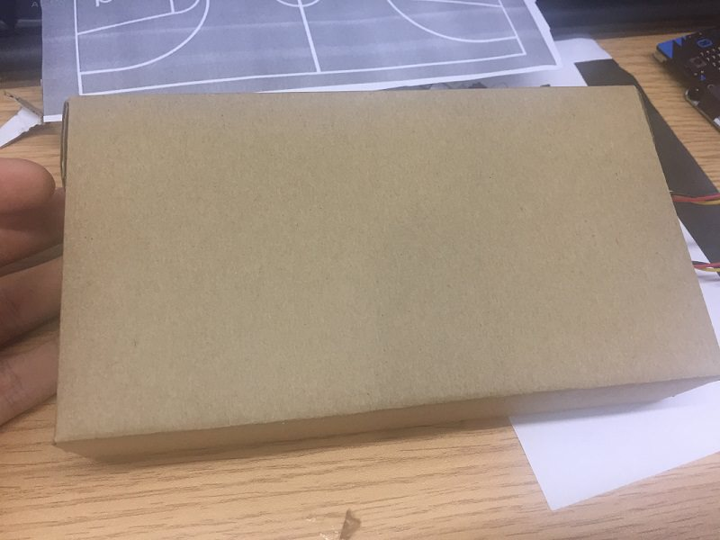
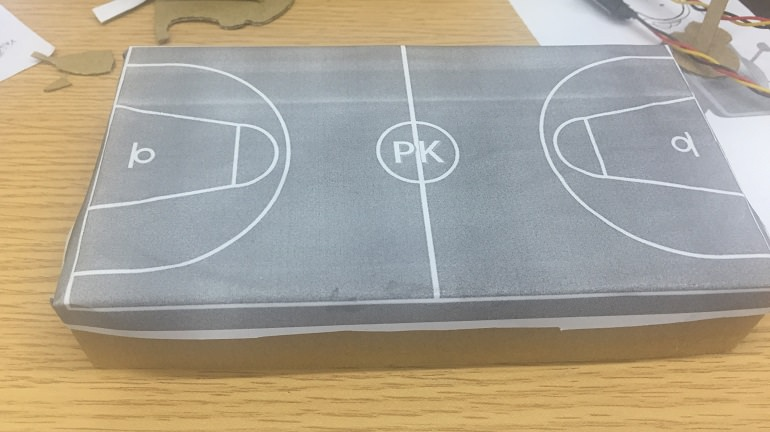
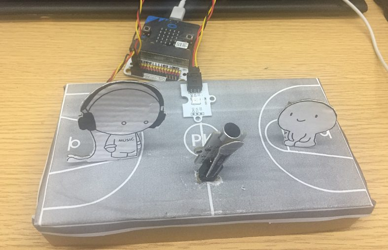
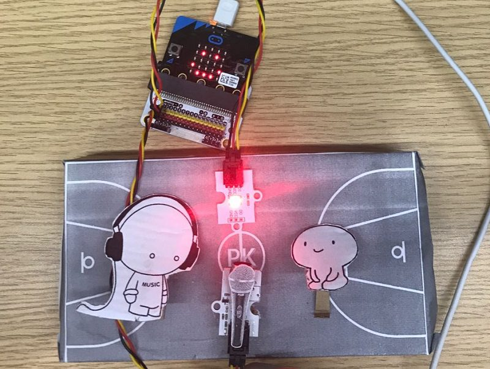
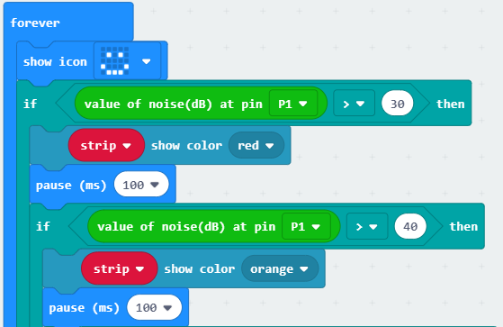

# 案例07 智能分贝测试器

## 目的
---

- 制作一个“智能分贝测试器”。

## 使用材料
---

- 1 X 智能家居套件
- 剪刀，胶水，白纸，喜欢的小人图片和一些瓦楞纸板

## 背景知识
---

- 模拟噪音传感器电子积木是一种能够感受外界噪声信号的电子积木。它可用于感知声音的分贝强弱。
- 彩虹LED电子积木是一种能变化多种颜色的LED灯，这篇案例我们会展示9种颜色。

### 什么是“智能分贝测试器”

- 通过声音大小，让彩虹LED电子积木发出不同颜色的光芒。

### “智能分贝测试器”原理

- 当模拟噪音传感器电子积木接收到人的声音，发送数据到micro:bit，micro：bit判断信号强弱，发出信号控制彩虹LED电子积木发出不同的色彩，随声音等级不同，分别显示红，橙，黄，绿，蓝，靛蓝，紫蓝，紫色，白，黑。

---
颜色 | 参数 
:-: | :-: 
红|30db
橙|40db
黄|50db
绿|60db
蓝|70db
靛蓝|80db
紫蓝|90db
紫色|100db
白|110db
黑|120db

## 结构场景搭建
---

- 准备剪刀，胶水和一些瓦楞纸板。
- 在纸板上贴好你准备好的小纸片，并将瓦楞纸板剪裁成需要的样子。

- 搭建成如图样式：

正面：

背面：

将元器件按如图摆放黏贴。

## 硬件连接图
---
P1口连接模拟噪音传感器电子积木
P2口连接彩虹LED电子积木

## 软件
---
[微软makecode](https://makecode.microbit.org/#)
 

## 编程
---
### 步骤 1
- 在MakeCode的代码抽屉中点击Advanced，查看更多代码选项。

- 为了给智慧家居套件编程，我们需要添加一个代码库。在代码抽屉底部找到“Extensions”，并点击它。这时会弹出一个对话框。搜索“smarthome"，然后点击下载这个代码库。

注意：如果你得到一个提示说一些代码库因为不兼容的原因将被删除，你可以根据提示继续操作，或者在项目菜单栏里面新建一个项目。

### 步骤 2

从Basic中拖出一个start积木块，然后从Neopixel函数库中拖入set to NeoPixel at pin with leds as积木块，初始化P2口的彩虹LED电子积木的颜色为RGB模式。

### 步骤 3
在forever循环中拖入一个基本块显示笑脸，即智能分贝测试器正常工作；
然后拖入一个判断语句，判断P1口的噪声监测模块传回来的值，对传回来的值进行一个判定；
当值大于30时（这里的30约等于室内安静的情况下的分贝值），拖入strip show color 积木块，将led彩灯显示为红色；
重复以上代码，将值改为40,50,60...每一个等级分配一个颜色，共9种颜色。

### 程序

请参考程序连接：[https://makecode.microbit.org/_EseVwohUtCKo](https://makecode.microbit.org/_EseVwohUtCKo)

你也可以通过以下网页直接下载程序。

<iframe style="position:absolute;top:0;left:0;width:100%;height:100%;" src="https://makecode.microbit.org/#pub:_EseVwohUtCKo" frameborder="0" sandbox="allow-popups allow-forms allow-scripts allow-same-origin"></iframe>
  
---

## 结论
---

- 不同的分贝值变化会让LED灯变换不同的颜色。

## 思考
---

## 常见问题
---

## 相关阅读  
---

