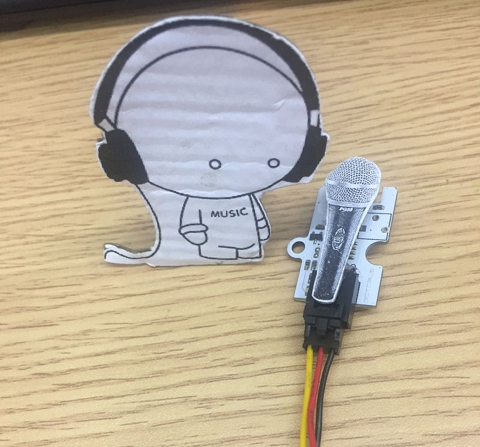
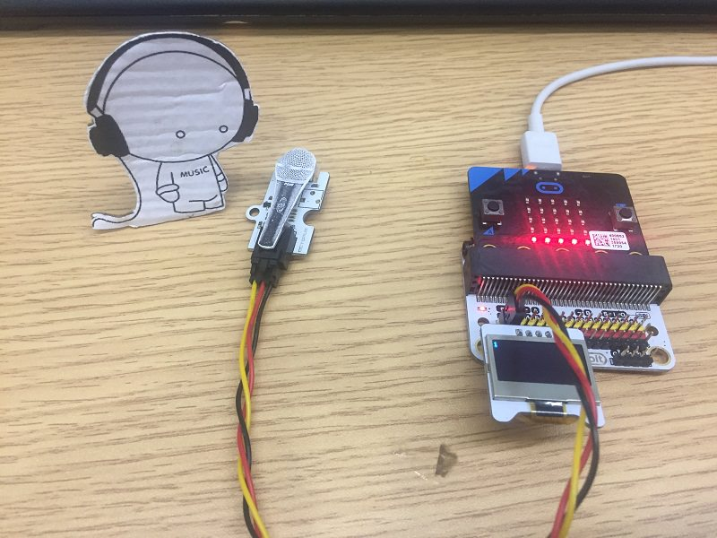
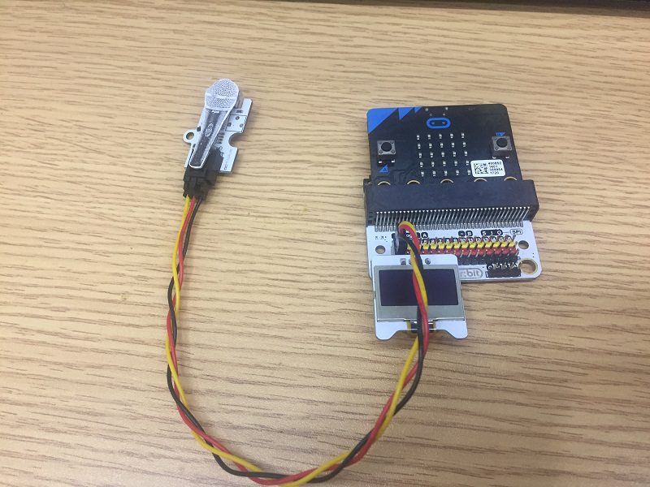
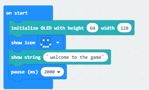
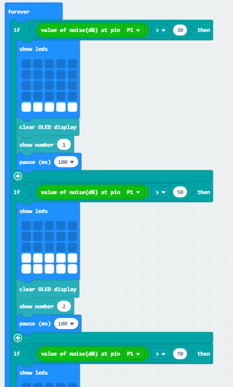

# 案例08 肺活量测试器

## 目的
---

- 制作一个简易肺活量测试器。

## 使用材料
---

- 1 X 智能家居套件

## 背景知识
---

- 模拟噪音传感器电子积木是一种能够感受外界噪声信号的电子积木，它检测的是空气中的振动情况，当你的肺活量越大，排出的空气越多，对空气造成的影响也就越大，检测空气的振动情况，空气振动的强弱作为肺活量测试指标。

### 什么是简易肺活量测试器

- 体检的时候用的肺活量测试计，可以测试人体健康，用micro:bit做一个简易肺活量测试器，时刻了解自己的健康状况。

### 简易肺活量测试器原理

- 模拟噪音传感器电子积木检测空气中的振动情况，根据振动情况给肺活量定一个等级，等级分为5级。

---

等级 | 参数 
:-: | :-: 
1|30db
2|50db
3|70db
4|90db
5|110db

## 结构场景搭建
---

- 准备剪刀，胶水和一些瓦楞纸板。
- 在纸板上贴好你准备好的小纸片，并将瓦楞纸板剪裁成需要的样子。
- 搭建成如图样式：

将元器件按如图摆放黏贴。

## 硬件连接图
---
扩展板P1口连接模拟噪音传感器电子积木
扩展板IIC口接OLED显示屏

## 软件
---
[微软makecode](https://makecode.microbit.org/#)
 

## 编程
---
### 步骤 1
- 在MakeCode的代码抽屉中点击Advanced，查看更多代码选项。

- 为了给智慧家居套件编程，我们需要添加一个代码库。在代码抽屉底部找到“Extensions”，并点击它。这时会弹出一个对话框。搜索“smarthome"，然后点击下载这个代码库。

注意：如果你得到一个提示说一些代码库因为不兼容的原因将被删除，你可以根据提示继续操作，或者在项目菜单栏里面新建一个项目。

### 步骤 2

从Basic中拖出一个start积木块，从OLED函数中拖入initialize OLED with 模块，初始化OLED显示屏。
然后设置一个笑脸显示在micro:bit上作为micro:bit专属开机动画。
在OLED显示屏上显示welcome to the game 表示肺活量测试小游戏正常开始。

### 步骤 3

在forever循环中，拖入一个判断语句，读取P1口噪声传感器模块的值，判断值属于第几等级。
对应不同的等级，micro:bit的led灯显示不同的柱状图，最高级时为满屏。
对应不同的等级，OLED显示器显示不同数字，最高级显示5。
复制前面代码，将5个等级的情况都一一判断，并做出不同显示。

### 程序

请参考程序连接：[https://makecode.microbit.org/_R8yPcAPMDJXM](https://makecode.microbit.org/_R8yPcAPMDJXM)

你也可以通过以下网页直接下载程序。

<iframe style="position:absolute;top:0;left:0;width:100%;height:100%;" src="https://makecode.microbit.org/#pub:_R8yPcAPMDJXM" frameborder="0" sandbox="allow-popups allow-forms allow-scripts allow-same-origin"></iframe>
  
---

## 结论
---

- 打开肺活量测试器，用嘴对噪声模块吹气，micro:bit检测到气流变化量，随气流的增加，柱状图上升，OLED显示屏显示相应的等级。

## 思考
---

- 除了制作肺活量测试器，使用智能家居套件，还能制作什么样的测试用具呢？

## 常见问题
---

## 相关阅读  
---

