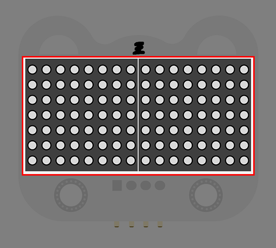
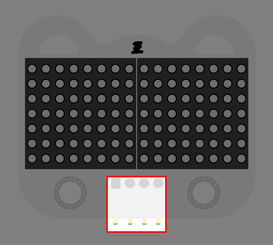
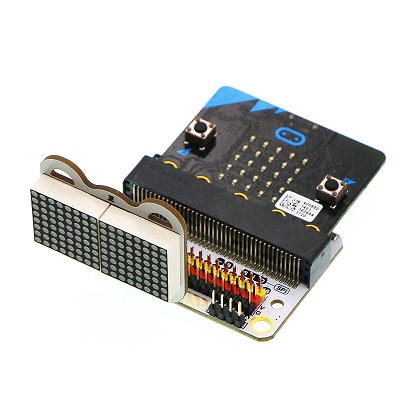
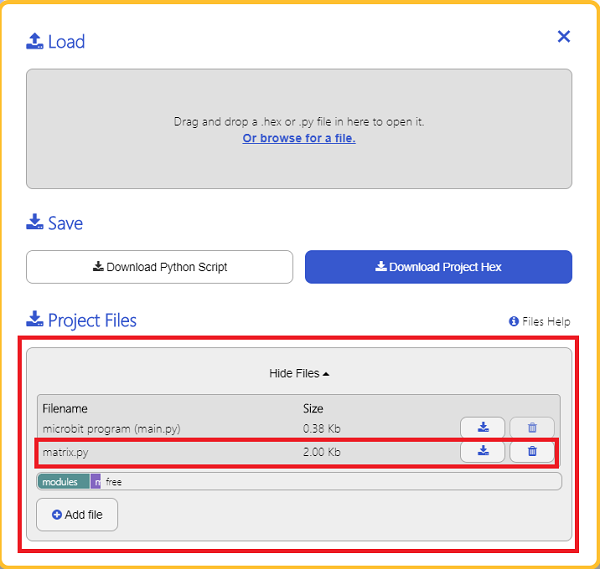

# 8 x 16点阵屏电子积木

## 简介
---

8x16 matrix module是一款可以显示数字、常用字母及符号的8x16点阵屏幕，支持屏幕滚动。采用IIC 总线协议控制，连接简单，控制方便。


## 特性 
---

- 采用高亮度、低功耗、工作可靠的点阵模块。
- 独具个性的外形及丝印设计。
- 连接简单、控制方便的IIC通讯方式。
- 3硬件地址位可自定义。

## 参数
---

项目 | 参数 
:-: | :-: 
品名|8x16 matrix module
版本号|V1.2
SKU|EF03418
工作电压|DC 3-5V
通讯方式|IIC接口
尺寸|37 x 43mm
净重|11.6g

### 外型与定位尺寸  


## 引脚接口框图

  

## 主要功能模块介绍  
---  

### 8x16点阵屏  

  
每一颗LED均可独立开启与关闭，常用来显示数字、常用字母及符号。

### I2C通讯接口 

  
通过I2C通讯方式与单片机进行通讯。

## 快速上手  
---  

### 硬件连接  

将micro:bit主板插入sensor:bit主板，将8x16 matrix module插入sensor:bit上的IIC通讯接口排母。


### 添加Package
- 在MakeCode的代码抽屉中点击“高级”，查看更多代码选项。

 

- 点击“扩展”，在弹出的对话框中搜索"https://github.com/elecfreaks/pxt-Matrix-8x16
"，下载8*16点阵代码库。
 


### 软件编程  

程序代码链接：[https://makecode.microbit.org/_R8RbWkh6pTP0](https://makecode.microbit.org/_R8RbWkh6pTP0)

你也能通过下列窗口直接下载代码
<div style="position:relative;height:0;padding-bottom:70%;overflow:hidden;"><iframe style="position:absolute;top:0;left:0;width:100%;height:100%;" src="https://makecode.microbit.org/#pub:_R8RbWkh6pTP0" frameborder="0" sandbox="allow-popups allow-forms allow-scripts allow-same-origin"></iframe></div>

### 结果  

点阵显示一个Emoji表情。


## Python 编程

### 步骤 1
下载压缩包并解压[Octopus_MicroPython-master](https://github.com/lionyhw/Octopus_MicroPython/archive/master.zip)
打开[Python editor](https://python.microbit.org/v/2.0)


为了给LED灯编程，我们需要添加led.py。点击Load/Save，然后点击Show Files（1）下拉菜单，再点击Add file在本地找到下载并解压完成的Octopus_MicroPython-master文件夹，从中选择led.py添加进来。




### 步骤 2
### 参考程序
```
from microbit import *
from matrix import *
matrix = MATRIX()
x, y = 0, 0
while True:
    for y in range(8):
        for x in range(16):
            matrix.set_matrix_draw(x, y)
    matrix.set_matrix_clear()
```


### 结果
- 循环点亮LED。


## 常见问题
