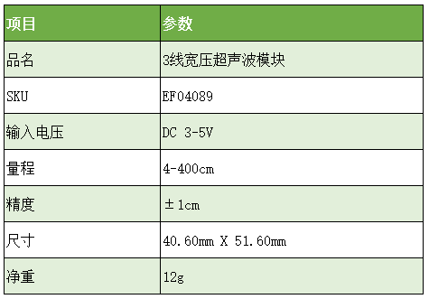
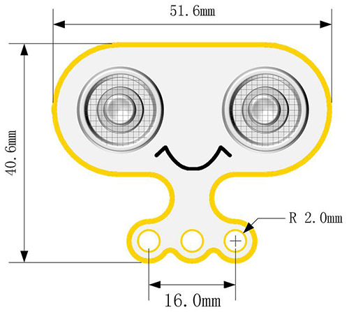
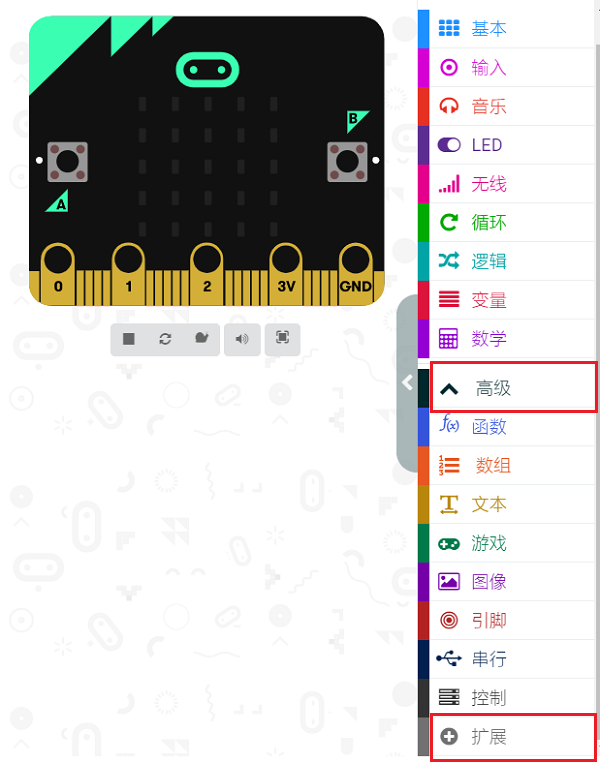
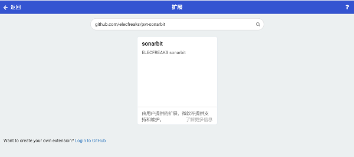

# 3线宽压超声波电子积木

## 简介
Sonar:bit是一个3线宽压超声波模块，它可以工作电压为3.0V-5V，3.3v或5V的单片机系统均能使用；它只需要3根线（G、V、S）就可以工作，比常规的4线超声波模块节省一个IO口。Sonar:bit量程为4cm~400cm，测量数据稳定准确，误差仅为±1cm。可应用于短距离测量、智能小车、机器人、Micro:bit、Arduino配套教学等场合。

## 特性
---
- 输入电压为3V~5V，micro:bit与arduino均能直接驱动。

- 标准的3线GVS接口，仅占用一个IO口。
## 技术规格
---

尺寸：

## 外形与定位尺寸
---

## 快速上手
---

### 所需器材及连接示意图
---

- 将sonar:bit连接到iot:bit的P1端口，micro:bit连接到电脑。 连接好后如图所示：

***以iot:bit为例***

### 步骤 1
 在MakeCode的代码抽屉中点击“高级”，点击“扩展”选项。

为了使用超声波模块，我们需要添加一个扩展库。在代码抽屉底部找到“扩展”，并点击它。这时会弹出一个对话框，搜索”github.com/elecfreaks/pxt-sonarbit”，然后点击下载这个代码库。

*注意：*如果你得到一个提示说一些代码库因为不兼容的原因将被删除，你可以根据提示继续操作，或者在项目菜单栏里面新建一个项目。

### 步骤 2
在`无限循环`中，通过显示数字显示超声波的返回值。

### 参考程序
请参考程序连接：[https://makecode.microbit.org/_eyU2yC79fXyc](https://makecode.microbit.org/_eyU2yC79fXyc)

你也可以通过以下网页直接下载程序，下载完成后即可开始运行程序。

<iframe style="position:absolute;top:0;left:0;width:100%;height:100%;" src="https://makecode.microbit.org/#pub:_eyU2yC79fXyc" frameborder="0" sandbox="allow-popups allow-forms allow-scripts allow-same-origin"></iframe>
  
---

### 结果
- 通过micro:bit主板的5x5LED矩阵实时显示超声波模块与物体之间的距离，单位为cm。
## 相关案例
---

## 技术文档
---
