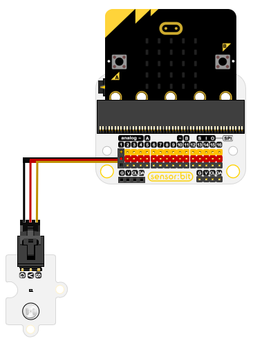
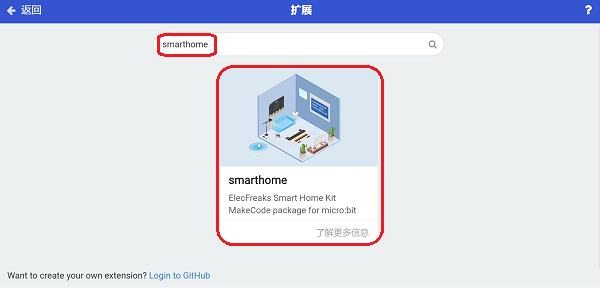
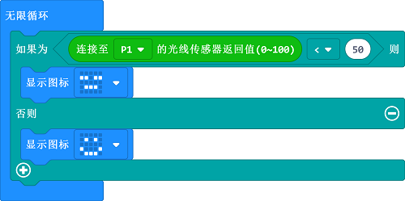
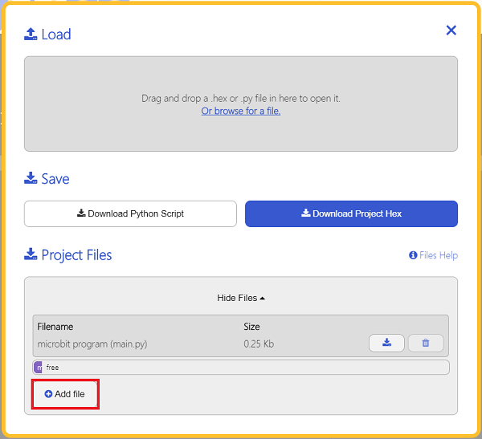
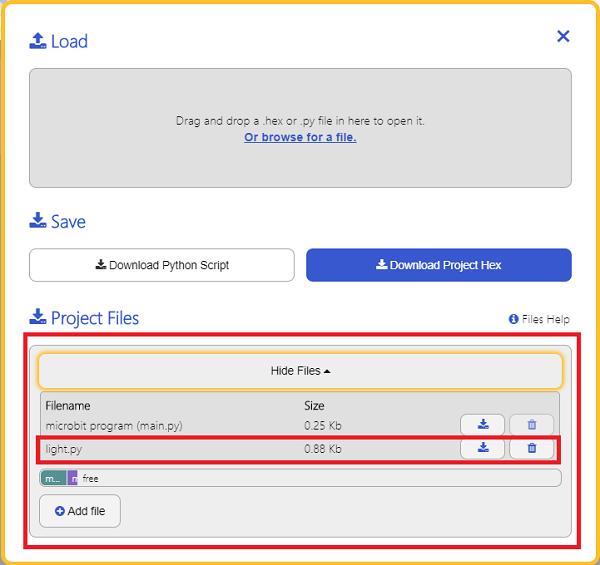

# 模拟透明光敏电子积木

## 简介
---
- 模拟透明光敏是可以检测光线的传感器。它们体积小，价格低廉，功率低，使用方便，不会磨损。


## 特性
---


## 技术规格
---

项目 | 参数 
:-: | :-: 
SKU|EF04092
电源需求|3V-5.5V
接口类型|模拟
引脚定义|1-Signal 2-VCC 3-GND
响应|快速响应和高灵敏度
电路|简单的驱动电路
稳定性|稳定耐用

## 外形与定位尺寸
---

 

## 快速上手
---

### 所需器材及连接示意图
- 如图连接扩展板的P1口。


### 如图所示编写程序
---
在MakeCode的代码抽屉中点击高级，查看更多代码选项。


为了给智慧家居套件编程，我们需要添加一个代码库。在代码抽屉底部找到“扩展”，并点击它。这时会弹出一个对话框。搜索“smarthome"，然后点击下载这个代码库。



注意：如果你得到一个提示说一些代码库因为不兼容的原因将被删除，你可以根据提示继续操作，或者在项目菜单栏里面新建一个项目。



### 参考程序

请参考程序连接：[https://makecode.microbit.org/_iMH0jK6quc2j](https://makecode.microbit.org/_iMH0jK6quc2j)

你也可以通过以下网页直接下载程序，下载完成后即可开始运行程序。

<div style="position:relative;height:0;padding-bottom:70%;overflow:hidden;"><iframe style="position:absolute;top:0;left:0;width:100%;height:100%;" src="https://makecode.microbit.org/#pub:_iMH0jK6q" frameborder="0" sandbox="allow-popups allow-forms allow-scripts allow-same-origin"></iframe></div>  
---

### 结果
- 当光线强度小于50，显示指定图标，否则显示一个笑脸图案。

## Python 编程

### 步骤 1
下载压缩包并解压[Octopus_MicroPython-master](https://github.com/lionyhw/Octopus_MicroPython/archive/master.zip)
打开[Python editor](https://python.microbit.org/v/2.0)


为了给光线传感器编程，我们需要添加light.py。点击Load/Save，然后点击Show Files（1）下拉菜单，再点击Add file在本地找到下载并解压完成的Octopus_MicroPython-master文件夹，从中选择light.py添加进来。





### 步骤 2
### 参考程序
```
from microbit import *
from light import *

s = LIGHT(pin1)
while True:
    display.scroll(s.get_lightlevel())
```


### 结果
- 在micro:bit的LED矩阵上显示光线传感器的返回值。


## 相关案例
---

## 技术文档
---
