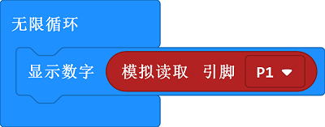

# 紫外线强度传感器电子积木

## 简介
---

Octopus Analog UV sensor (GUVA-S12SD)是我们OCTOPUS系列的紫外线传感器电子积木，它的基本设计是根据OCTOPUS电子积木系列设定的，它的外形、PCB固定孔、电子积木的接口的设定是相同的。

可以测量太阳光紫外线强度总量，线性电压信号输出，可用作紫外线测试仪，紫外线指数仪，火焰检测等。

## 特性 
---
- 为需要高可靠性和精准性测量紫外线指数（UVI）的场合所设计
- 采用3V供电，可支持micro:bit。
- 接线方便。

## 参数
---
- 品名：紫外线强度传感器电子积木
- SKU：EF04093
- 工作电压：DC 3~5.5V
- 连接模式：G-GND，V-VCC，S-信号引脚
- 测试精度：±1 UV INDEX
- 响应波长：200nm-370nm
- 响应时间：小于0.5秒
- 尺寸：38.9x23.5mm
- 净重：5g

## 外型与定位尺寸  
---

## 快速上手  
---  
### 硬件连接  

将模块通过带扣杜邦线插入octopus:bit上的P1引脚，将micro:bit主板插入octopus:bit。

### 软件编程  

打开makecode，模拟读取P1口，返回值为紫外线强度，显示在LED点阵显示屏上。

程序代码链接：[https://makecode.microbit.org/_4urWJCMeuh4L](https://makecode.microbit.org/_4urWJCMeuh4L)

你也能通过下列窗口直接下载代码

<iframe style="position:absolute;top:0;left:0;width:100%;height:100%;" src="https://makecode.microbit.org/#pub:_4urWJCMeuh4L" frameborder="0" sandbox="allow-popups allow-forms allow-scripts allow-same-origin"></iframe>

### 结果  

点阵显示屏显示当前紫外线值。

## 常见问题
