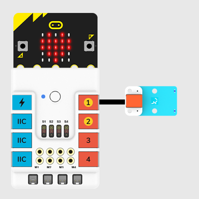

# 双路巡线模块

## 简介
两路巡线模块集成了两组反射式红外对管，可通过它来制作小车智能巡线项目。

## 特性
---
- RJ11端口设计，防止误插，易于使用。
## 技术规格
---

项目 | 参数 
:-: | :-: 
SKU|EF05019
接口|RJ11
接口类型|数字输出
工作电压|3.3V
有效距离|2~12mm
黑线|输出低电平
白线|输出高电平

## 外形与定位尺寸
---

## 快速上手
---

### 所需器材及连接示意图
---

- 如下图所示，将双路巡线模块连接到哪吒扩展板的J1端口。

## 编程
---

### 步骤 1
在MakeCode的代码抽屉中点击“高级”，查看更多代码选项。

为了给双路巡线模块编程，我们需要添加一个扩展库。在代码抽屉底部找到“扩展”，并点击它。这时会弹出一个对话框，搜索”https://github.com/elecfreaks/pxt-PlanetX“，然后点击下载这个代码库。

*注意：*如果你得到一个提示说一些代码库因为不兼容的原因将被删除，你可以根据提示继续操作，或者在项目菜单栏里面新建一个项目。
### 步骤 2
### 如图所示编写程序

### 参考程序
请参考程序连接：[https://makecode.microbit.org/_hy3VDtA3xAqE](https://makecode.microbit.org/_hy3VDtA3xAqE)

你也可以通过以下网页直接下载程序，下载完成后即可开始运行程序。

<iframe style="position:absolute;top:0;left:0;width:100%;height:100%;" src="https://makecode.microbit.org/#pub:_hy3VDtA3xAqE" frameborder="0" sandbox="allow-popups allow-forms allow-scripts allow-same-origin"></iframe>
  
---

### 结果
- 根据双路巡线模块检测到的不同状态，micro:bit上的LED矩阵会显示不同的图标。
## 相关案例
---

## 技术文档
---
